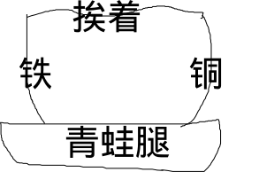
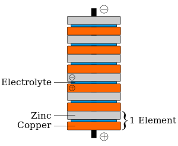
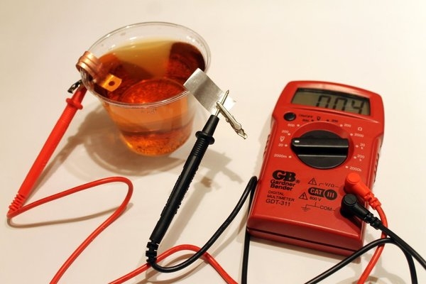

<nav id="table-of-contents">
<h2>Table of Contents</h2>

<ul>
<li><a href="#orgheadline6">1. 引言</a>
<ul>
<li><a href="#orgheadline5">1.1. 伏特电池</a>
<ul>
<li><a href="#orgheadline1">1.1.1. 历史</a></li>
<li><a href="#orgheadline2">1.1.2. 正电和负电？</a></li>
<li><a href="#orgheadline3">1.1.3. 伏特电池模型分析</a></li>
<li><a href="#orgheadline4">1.1.4. 更加现代的观点来分析</a></li>
</ul>
</li>
</ul>
</li>
<li><a href="#orgheadline7">2. 参考资料</a></li>
</ul>

</nav>

# 引言

电化学从历史上和电池（还有电解）是分不开的，从理论探讨上也和电池（还有电解）是分不开的，从应用上也和电池（还有电解）是分不开的。那么就让我们从分析历史上的第一个电池来作为旅程的开始吧。

## 伏特电池

### 历史

資料來源：陳為友、姜靜、馮學斌編著：物理學家和他的一個重大發現，凡異出版社。参考网页在[这里](http://memo.cgu.edu.tw/yun-ju/CGUWeb/SciKnow/PhyStory/Volta.htm) ，文字稍作修正。

1786年，意大利解剖学和生理学教授伽伏尼在解剖青蛙时，偶然发现蛙腿会发生痉挛的现象。1792年，伽伏尼进一步又发现，如果用一铜钩与铁板接触时，蛙腿也会引起痉挛。这实际上就是一个电池，蛙腿既是电解质，又是电流指示器。但是长期以来，人们已知道诸如电鯆等动物中存在动物电流，伽伏尼受了这些影响，也把蛙腿的痉挛归结为生物电。

伽伏尼的发现公布之后，引起了众多科学家对“生物电”的研究。开始的时候，伏特也同意伽伏尼的观点，称赞这一发现“在物理学和化学史上，是足以称的上划时代的伟大发现之一”。但随着研究进一步的深入，伏特对“生物电”的说法产生了怀疑。

早在1750年，瑞士科学家苏尔泽就发表过一篇论文，叙述了他的发现。他将银片和铅片的一端互相接触，用另一端将舌头夹住，舌头则感到麻木和酸味，既不是单片银的味道，也不是单片铅的味道。他想到，这可能是两种金属接触时，金属中的微小粒子发生震动而引起舌头神经的兴奋产生的感觉。为此，他又做了另一个实验来进一步研究这个发现。他将一个盛水的锡杯子放在银台上，只用舌头接触杯子内的水，并没有酸味的感觉；但当用手接触银台时，舌头就明显地感到酸味。苏尔泽的论文只是公布了他的发现，但没有讲清楚道理，也没引起其他人的多大注意。

伏特在研究伽伏尼的“生物电”的时候，敏感地联想起了苏尔泽的发现，并立即做了这个实验。他将一枚金币和一枚银币顶住舌头，当用导线将两枚硬币连接起来时，舌头明显感到了苦味。他又找来一根较长的导线将金币和银币连接起来，一端含在嘴里，另一端接触眼皮上部，他惊奇地感到，当刚一接触的瞬间，眼睛里产生了光的感觉。伏特想，金属不仅是导体，而且能产生电；电不仅能使蛙腿产生抽动，而且能影响人的视觉和味觉神经。

1793年12月，伏特在一封信中公开提出了反对伽伏尼“生物电”的观点。他一再强调电流在本质上是由金属的接触产生的，与金属板是否压在动物体上无关。他提倡用“金属电”代替“生物电”这个名称。他的这一观点引起了激烈的争论，有人支持，有人反对。

在这以后很长的时间里，伏特再研究“生物电”时，已经开始排除那些错误因素的干扰，而把物理因素放到了首要位置。他反复的想，为什么将两种金属接触青蛙腿和舌头都会出现电的效应？最后，发现了事物的共性：人的口中有唾液，蛙腿中也有液体，是不是也能产生电的效应呢？

首先，他自己设计了一个验电器，可以检验微小的电流。这就比看蛙腿抽动和用舌头感觉要准确的多。他拿来一个铜制圆片和一个锌圆盘，用导线将他们分别接到验电器上，又用一块布片沾满盐水夹在两个金属盘中间。伏特惊喜地看到验电器的显示，电流很强，而且是稳定的。他又找来大量的铜片和锌片，中间夹上含盐水的布片，交替地叠起来，两头引出电极。这时，电流更强了。他把两个电极靠近，结果“啪”地一声打出了电火花。

伏特非常高兴。他又用不同的金属做实验。他发现，一种金属，可以带正电，而与另一种金属结合时，又可以带负电。经过反复多次的实验比较，伏特给金属排出了序列：锌丶锡丶铅丶铜丶银丶金&#x2026;&#x2026;只要将这个序列里前面的金属与后面的金属相接触，前者就带正电，后者带负电，在序列中的距离越远，带电越多，产生的电流越强。

1800年3月20日，伏打在给英国皇家学会会长班克斯勋爵的信中写到：“无疑你们会感到惊讶，我所介绍的装置，只是用一些不同的导体按一定的方式叠起来的装置。用30片丶40片丶60片甚至更多的铜片（当然最好是用银片），将他们中的每一片与锡片（最好是锌片）接触，然后充一层水或导电性能比纯水更好的食盐水丶卤水等，或填上一层用这些液体浸透的纸皮或皮革等，&#x2026;&#x2026;就能产生相当多的电荷。”

这就是伏特电堆，世界上第一个电池。

### 正电和负电？

以下引用自( 張憲魁 《物理世界》第二冊) ，参考网页在[这里](http://www.lh604.net/f34malefemaleelec.htm) ，文字稍作修正。

人们对电现象进行观察研究的过程中，发现了一个很有趣的现象：两个相同的物体与其他某一物体摩擦后，这两个相同物体之间不是相吸而是相斥。比如两根玻璃棒用丝绸摩擦后，玻璃棒之间是相互排斥的。同时还观察到，同一个带电体如果与用毛皮摩擦过的火漆棒（有机物材质）相吸，它就一定与用丝绸摩擦过的玻璃棒相斥。

1733年法国人杜菲用实验发现，带电的玻璃和带电的琥珀是相互吸引的，但是两块带电的琥珀或者两块带电的玻璃则是相互排斥的。这些现象的原因是什么呢？他猜想很可能是由于相互排斥的带电体带的是相同种类的电荷，而相互吸引的两个带电体带的是异种电荷。也就是说，自然界存在着不同种类的电荷。那么存在几种电荷呢？如何进行电荷的分类呢？

杜菲根据大量的实验事实，经过比较分析，大胆地断定：电有两种：一种是与琥珀带的电性质相同，叫做“琥珀电”；一种是与玻璃带的电性质相同，叫做“玻璃电”。

由于“琥珀电”和“玻璃电”对其他带电体的作用恰恰相反──被“琥珀电”吸引的带电体一定被“玻璃电”排斥，所以人们就分别称它们为阳电（也叫正电）和阴电（也叫负电）。就好比我们人有男丶女之分一样。当时只是用阳和阴或正和负来说明两种性质不同的电，至于称谁为正电或负电，完全是任意的。

为了统一起见，到了1747年，美国的富兰克林便把丝绸摩擦过的玻璃棒带的电称为“正电”，用“+”号表示；把毛皮摩擦过的火漆棒（或琥珀）带的电称为“负电”，用“-”号表示。

现代已经没有所谓的正电或负电的说法了，这里所谓的正电是物质缺少电子造成的，而所谓的负电是物质富含电子造成的，电子的流动就是电流，电子带负电荷。而现代发现的质子等等则带正电荷。

### 伏特电池模型分析

首先我们来看伽伏尼接触到的现象，虽然研究的是电池，但电池只有在电路中形成回路才会发生电化学反应。这里铁和铜分别接触青蛙腿这部分是电池部分，然后铁和铜挨着象征中间连接了一个导线。大概如下图所示：

电流在整个电路回路中流动，而只要有电流流过青蛙腿就会发生痉挛。

而伏特电池组的情况如下图<a id="fnr.1" class="footref" href="#fn.1">1</a>所示：

伏特电池组由很多小电池组合而成，其中Copper是铜，而Zinc是锌，然后中间蓝色的Electrolyte是 **电解质** ，正对应前面的青蛙腿。而这里所谓的电池组实际上就是多个小电池正极和负极串联即可，这只是简单的电路知识了，以后在电化学中我们也只需要讨论单个电池的情况即可。

上面是把两个金属棒插入青蛙腿中，如果你愿意你也可以插入自己的大腿中，这样也将组成一个你自己的电池。当然你也可以选择插入盐水中或者海水中或者插入西红柿中或者插入稀硫酸中等等等等，这都属于上面类型的电池。这两个金属棒我们称作 **电极** ，然后电池有正极和负极，这个是根据电子的流动方向（有专门的电子仪器检测）来判断的。

你可以参照下图<a id="fnr.2" class="footref" href="#fn.2">2</a> 所示来制造一个自己的伏特电池：

所以伏特电池的最简单的模型就是两个金属棒，一个是 **正极** ，一个是 **负极** ，然后它们都插入 **电解质** 中，这就是一个电池了。只是具体要到实用的话就要考虑安全问题啊，电压大小问题啊等等等等了。我们继续看下面用更加现代的观点来分析伏特电池模型。

### 更加现代的观点来分析

# 参考资料

1.  电化学 作者：小久见善八[日] 郭成言[译] 版本：2002年

<h2 class="footnotes">Footnotes: </h2>

<a id="fn.1" class="footnum" href="#fnr.1">1</a> 
图片引用自wiki

<a id="fn.2" class="footnum" href="#fnr.2">2</a> 
图片引用自[这个网页](http://www.csmonitor.com/Innovation/2015/0218/How-to-make-your-own-battery-just-like-Alessandro-Volta)

