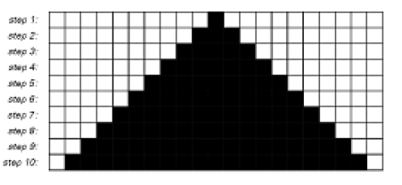
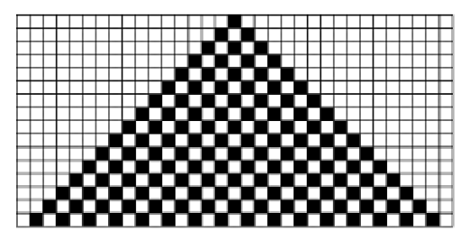
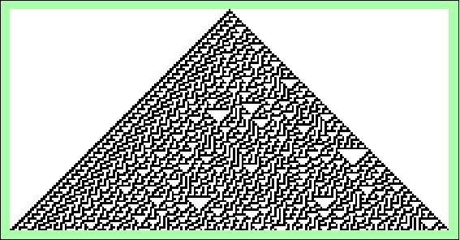
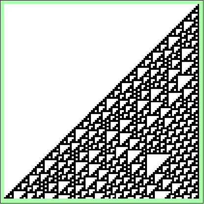

<nav id="table-of-contents">
<h2>Table of Contents</h2>

<ul>
<li><a href="#orgheadline1">1. 翻译者言</a></li>
<li><a href="#orgheadline2">2. 前言</a></li>
<li><a href="#orgheadline6">3. 一种新科学的建立</a>
<ul>
<li><a href="#orgheadline3">3.1. 基本思想概要</a></li>
<li><a href="#orgheadline4">3.2. 和其他领域的关系</a></li>
<li><a href="#orgheadline5">3.3. 我个人的科学史</a></li>
</ul>
</li>
<li><a href="#orgheadline10">4. 重要的实验</a>
<ul>
<li><a href="#orgheadline7">4.1. 简单的程序如何行为</a></li>
<li><a href="#orgheadline8">4.2. 新直觉的需要</a></li>
<li><a href="#orgheadline9">4.3. 为什么这些发现以前没做出</a></li>
</ul>
</li>
</ul>

</nav>

# 翻译者言

我英语水平并不高，因为这本书引发了我很大的兴趣，所以我试着将它翻译出来，肯定有的地方有蹩脚的感觉和有的地方甚至意思有误。不过大致意思肯定是没有错误的。图片图表部分没有办法，这个要靠读者自己对照PDF文件。我草草地看了几句话就感到他和我长久以来所抱有的想法竟如此的吻合，我慢慢地翻译，并感觉到正确的道路就在这里。所以我几乎是抱着愉悦和毫不费力的心情来看这本书的，同时希望能够获得更多有用的新颖的思想。

不错就是这个WOLFRAM，那个发明了MATHEMATICA软件的人，那个发明阿尔法搜索的人，大家等着看吧，这个天才将改变世界。随着我哲学的学习时间的延长，我发现哲学似乎已经很难引起我的兴趣了。那些话语也许根本就没有意义，而我也感到我该走向某个专门化的道路，接受某行业的一些假定和潜规则，至少干点有用的事情了。实际上我是比较赞同苏格拉底的那个观点的，那就是那些专家们以为自己有所知，而真正的哲学家比如说想苏格拉底的则只是发现了自己仍然一无所知。看看现在的数学物理学甚至到文学等等，都似乎也来也专门化，彼此之间沟通越来越困难了。尽管他们彼此每个人都面临着自己行当里最基本的逻辑上的矛盾，比如说物理学中的量子力学竟然把一个测不准原理放在中心地位，而近代数学的中心却是关于一个不可证明问题的哥德尔不完备性定理，而原先的乐观主义者们最终热情不再，现在似乎科学界开始流行起了这样的观点，那就是越来越觉得这个世界太过于复杂，而真理也许并不存在。

而这个WOLFRAM仍然抱有一般人难以长期存有的那种热情，坚信世界的终极理论就将显现，坚信人工智能存在的可能，坚信人不光可以做上帝所做的任何事情，还能做上帝没有做过的事情。在这个世界巨大的复杂性面前，无知者不去询问，浅尝辄止者自鸣得意，而深究者为之深深困惑。但这个WOLFRAM，在这个世界的巨大复杂性面前并没有退缩，为之工作了二十多年，并深信不疑自己已经找到了一条出路，那么这是怎样的一条道路呢？让我们拭目以待吧。

这是我几年前的翻译工作，可能以后都没有时间再做这个了。

# 前言

还是二十年前，我做出了一个刚开始看上只是一个小小的发现，我的一次计算机实验向我显示了某些东西并不如我之前所预期的。随着我研究的深入，我越来越察觉到现有科学的基础出现了裂痕，而一种新科学的眉目已在显现。

这本书是我将近二十年的工作关于一种新科学的总结，我从没有想过我会做这么久，但是我的发现比我之前可能想到的更多。事实上我几乎接触了现存科学的一切领域，只有少数例外。

在早些年，我如同一般科学家所做的那样，在科学文献上发表自己的工作进展。尽管我写的东西好像是被很好地接受了，但是我渐渐认识到技术性文件分散在各个不同的领域的杂志里面，恐怕不能很好地传达那个我想建立的新的科学思考模式。

所以我决定保持沉默，继续工作，直到让一切都以一种连贯的形式呈现出来。十五年后，这本书就是我要的结果。我希望我所做的一切都能尽可能广泛地与科学家们和非科学家们分享。

老实说，在现代，非科学家们已经不能读到这样一种关于新科学的书了。随着科学的进步，它越来越倾向于发生某些小踏步的前进，这种前进的解释依赖于先前的进展的某些专门的技术性的知识。

但是要发展一种新科学，如同我将要在本书中描述的，那么我没有别的办法，只有大踏步地前进。所以我终于中止了东拼西凑的方法，而是最终发展了一些新的思想和方法，这些与之前的关系甚少。

我可以用一种更加容易的方法，用一种新的技术形式主义来发表我所做的，但是取而代之的，我是努力用极简单的语言和图片来让事物清晰的完全的得到解释。

但是不幸的是，毫无疑问这儿有些假定（特别是关于现存科学的），那就是他们已经有了本书所需要的一些技术知识。也许，只是一点点，但是我还是担心这会阻止读者们去学习的更多。但是更多的我是希望人们能够读的足够的长并开始惊奇于这本书所说的东西。

首先他们可能会认为某些部分是不可能正确的，因为这从现存科学来看是奇怪的东西。确实我只是根据我二十年的工作得到了这些，也许甚至我自己都对本书的某些部分会抱有些许怀疑。

但是本书中所涉及到的计算机实验在现代任何一台计算机上都能得到检查，而且本书中所涉及到的论点虽然不是那种概念上的简单，但也不需要非常专门和特别的知识。

它确实花了我很多年的时间去表达这个我所达到的结论，而且我也希望我在表达上所做的一切都能让别人更容易些。但是我并不期待着这个过程会很快，也许真正的吸收本书更多的是要直觉和想象。

但是做为重要的第一步，我相信就是去认识到它所涉及到的东西。尽管它几乎涉及一切，而这本书做为第一本建立一种新的思考模式的书，它需要的是用它自己的术语来思考问题，而不能把它填充在现有的框架内。

这对我来说是一项挑战，就是把我二十多年工作试图捕捉的那些东西表达在一本可控大小的书里面。所以我努力压缩书的内容，本书的一页甚至一个段落都可能写成一本书。

在这25万大小的正文部分里面就是我的思想的核心，当然也包括一些我是如何接近这个思想的一些发现。最后25万字大概最后三百页里面是关于一些历史的和技术的注解，当然还包括一些发现的摘要。注解从849页开始。

通过本书我最关心的就是基础科学的基本原理问题，但是本书的一些基本的东西，包括包括一大系列的运用——概念的或者是实际的——都能得到发展。

毫无疑问有些运用马上就会来，但是有些可能要花上几十年才能显现。当然了，随着时间流逝，我希望本书的某些观点不光会漫延到科学领域漫延到技术领域，也会渗透到某些领域的基本思考。最终它的方法成为教育系统的一个基本组成部分，就如同现在的数学。而最后本书中那些令人惊奇觉得怪异的东西会变成平凡的甚至是老生常谈的东西。

但是对于我来说最重要的还是发现的实际过程。因为我知道再也没有什么比这更能深深激荡我心，那就是对于某些新的基本的真理的第一瞥。现在我已经完成了建立一个新的思考模式的工作，就在本书中我希望和读者一同分享这个发现的喜悦和兴奋。

Stephen Wolfram

2002年1月15号

# 一种新科学的建立

## 基本思想概要

三个世纪前，科学被一种戏剧性的新观念所改良，那就是数学方程式能够用来描述自然世界。在本书中我的目的就是要开启另一个这样的改良。就是这样一种新科学，它基于很多的一般类型的法则并能具体到简单的计算机程序。

二十年来我的大部分工作就是要建立这样一种智力新结构，但是我被它的结果所震惊了。因为我发现我发展的这种新科学使得很多以前基本的争论问题的解决成为可能，而这些在现存科学是从未成功解决的。

如果理论科学的是完全可能的，那么不同级别的系统也将遵循这样明确的法则。然而过去精确的科学都被假定为是基于传统数学的。恩，最关键的就是要认识到如同在本书中我为了发展一种新科学所做的，这个没有任何理由让我们相信自然世界只是遵循着这些传统数学法则。

在历史早期可能会很困难去想象很多的一般类型的法则像什么样子，但是现在我们被计算机所环绕着，而计算机的程序的有效地执行大量的各种各样的法则。我们实际运用的程序基于极其复杂的法则是指明了要做某一个特别的任务，但是程序原则上遵循任何明确的法则的。本书中我要描述的新科学的核心就是程序由极简单的法则组成是可能的。

一个人可能会这么想——刚开始我也是这样——认为由极简单的法则组成的程序它的行为也会相应地变得简单。我们日常建造事物的经验给了我们这种直觉那就是认为创造复杂性是非常困难的，它需要法则计划也相应的非常复杂。但是我十八年前的一个关键发现就是我们对于这个世界的程序的直觉并不是正确的。

我做的就是一个感觉最基本的易想的计算机实验：我拿了一系列最简单的程序然后系统地运行他们看看他们的行为，然而我发现的——让我惊奇的——就是尽管他们的法则非常的简单，但是他们的行为远远不能用简单来形容了。确实，这一些最简单的程序的行为几乎可以和我所见过的一切复杂行为相媲美。

我花了十年多的时间来理解这一结果，然后认识到这个结果是多么的基本又是多么的深远。回想过去我觉得几个世纪前没有发现这个结果是没有道理的，但是渐渐我认识到它将成为理论科学发展史上一个重要的发现。因为它除了开启一个新的宽广的探索领域外，还意味着对于自然过程和在别处如何工作的彻底的再思考。

也许立即它将产生一个戏剧性的重大变革，变革的就是我们长久以来认为是自然界的伟大的神秘之处的，而那个秘密，它能够允许自然界毫不费力地制造对我们来说看上去如此复杂的东西。

毕竟，在自然界我们更愿意看到的是像正方形和圆形这样的我们认为简单的东西，但是实际上自然界给人影响深刻的一点就是横跨物理的生物的等等系统的我们不断面对的那种巨大的复杂性。确实对于这种复杂性贯穿大部分历史的为大多数人们所赞同的就是这种观点——它已经远远非人力所能及——所以必是超自然存在的杰作。

但是就作为我从简单程序制造出巨大复杂性这一发现来说它立即告诉我一个相当不同的解释。毕竟，可以把自然界看做典型的程序，它遵循自己的行为从而产生在人的眼中看上去的那种复杂性。但是这种复杂性并不同于人造品的那种复杂性，人造的东西总是倾向于让我们能够简单的使用并满足人的某种特定的需要。

有的人可能会这么想，过去几个世纪建立起来的现存科学将会准备解决复杂性问题，但是实际上他们不能。的确他们过去所做的就是定义不同的范围从而避免接触到复杂性问题。因为他们的基本观点就是用数学方程式来描述行为，就好像是行星的那种简单运动。他不可避免地要失败当这种行为更复杂的时候。或多或少的，像基于自然选择观点的生物学也存在着这样的问题。就作为我在本书中基于程序方面的思考发展起来的新科学第一次对于复杂性问题能够做出有意义的表述。

现存科学过去几个世纪所强调的东西在找寻他们的基础部分时正在将这个系统崩溃，所以尽可能详细的分析这些基础部分，特别是在物理学中，它的充分成功成为了我们日常生活基本组成部分而被我们熟知。但是这些基础部分一起工作产生了上述我们所感到的那种神秘感的大部分。在本书中我发展出来的新科学的框架它最终将可能解决这些问题。

做为现存科学传统有的人可能会期待着解决这些问题将会依赖于所有的细节，对于不同类型的物理学生物学和其他系统都会有所不同。但是在这个世界的简单程序中我发现相同的基本行为模式在细节上一次又一次的独立出现。而这些给我们的建议就是一个相当的普遍的原则决定了上述行为而且不仅能够期待着用于简单程序也包括这个自然世界的所有系统。

在现存科学不管什么时候遇到了什么复杂的现象总会被认为是基于某种复杂的机制。但是我的关于简单程序能够制造出巨大复杂性这一事实已经清晰地显现它并不正确。确实在本书的下面部分我就要展示一些非凡的简单程序，看上去它们似乎已经捕捉到了这个机制的必要组成部分，而这个机制与所有领域的重要现象相联系，这些现象在过去看起来是如此的复杂是不可能允许简单的解释的。

在科学史上一种对于长久以来没有解决的问题的新的思考方法看来并不寻常。而我惊奇的就是现存科学如此多的中心基础问题我都能够用这种从简单程序思考角度入手的方法来得到解答。比如说，长达一个世纪以来，这儿一直有种混乱是由热力学行为在物理学中所掀起的，而从我对于简单程序的研究我发展了一种相当直接的解释。同样在生物学，我的发现第一次提供了一种关于如此多的生物体所展现出来的复杂性的明晰的理解方法。确实，有越来越多的证据显示用这种简单程序的思考方法将使得建构一个统一的真实的基础性物理理论成为可能，这个理论将包括空间的时间的量子力学的等等所有我们宇宙已知的特性将会显现。

当数学被第一次引进到科学中去后它提供了一个抽象的框架，在这个框架中科学结论将会被描绘出来而不需要直接参照物理真实。尽管在过去几百年中数学它本身也在发展，而却继续专门化直到成为某些特别类型的抽象系统——更多的是起源于算术和几何。但是在本书中我要描述的新科学它将介绍一个更加一般和抽象的系统基于一些特别的不管是什么本质的必要的法则。

有的人可能认为这样的系统如果要有意义和一般性的表述将会非常多样化。但是关键的一点让我为了新科学能够建造出一个统一的框架的就是所有系统的法则都能相应地看做程序，而他们的行为也会相应地看做计算。

传统的直觉可能会建议要做更多的复杂的运算就总是需要更多的复杂的基础性法则。但是计算机开始的一项革命就是这样一个给人影响深刻的事实，那就是通用系统内部基于的法则能够建构得有效地进行任何可能的运算。

这种普遍性的开端通常被假定为高度精密的和专门的系统比如说电子计算机。但是本书的一个令人惊奇的发现就是这样一个普遍的事实，这儿有很多这样的系统他们的法则几乎简单的只有不过一句话。这种普遍的现象立即就告诉我们它是多么的常见和重要——包括抽象的系统和自然界——超过我们之前所能想的。

基于我的很多这些发现都把我领向了一个更广泛的结论，简而言之我把它称作计算等值原理：也就是不管一个行为它是不是很明显的简单——本质上是对于任何系统——它都能被相应地看做某种等值的复杂的数学运算。这个非常基本的原理对于科学和科学思考都有着空前的一系列的意义。

做为开始，它立即给出一个基本的解释那就是为什么简单的程序却能显现出对我们来说的复杂性。因为像其他的过程我们的知觉和分析都能被看做某种运算。尽管我们会觉得这样的计算比简单的程序会更复杂，计算等值原理告诉我们它们不是的。这种等值我们是做为观察者而它们不是，所以我们的观察使得那些系统的行为对我们来说显得好像很复杂。

一个人总是能够原则上找到某个特定系统，它的行为只是做一次实验和观察发生了什么。但是理论科学历史上的伟大成功总是特定的找到一个数学公式而不是让他们自己预测结果。尽管这种方法很有效而且能够大大削减关于该系统工作的运算。

计算等值原理现在告诉我们这种方法只适用于某些特定的系统的简单行为。对于其他的系统将要倾向于尽我们所能做的让它运算复杂和精密，即使用上我们全部的数学和电脑。这意味着这样的系统是计算不可约的——所以要达到有效的唯一途径就是找出他们的行为跟上他们的步子，和他们付出一样多的计算努力。

所以这就意味着理论科学的一个基本限制，但是这儿仍然存在某些不可复归的由时间完成的东西。这就导致了一种解释关于我们做为人类——尽管我们可能要遵循确定了基本的法则——能够保持某种意义上自由意志。

从历史上来看很多重要的科学的一个特点就是它们显示了一种新的方法说明了我们做为人类并不特殊。同样的计算等值原理也一样显示了这点。因为它告诉我们就作为计算而言——包括智力——我们最终并没有比任何一个简单的程序自然界任何一种系统更复杂一些。

但是从计算等值原理还显示了一种新的统一：从很多不同的系统，从简单的程序到大脑到我们整个宇宙，这个原理显示这儿有一种基本的相同使得他们有某种相同的基本现象发生，允许相同的基本的科学概念和方法被使用。这就是我在本书中所要描述的新科学最终所显示出来的强大威力。

## 和其他领域的关系

数学。数学通常被认为是一种关于自身的无限制的一般的抽象系统。但是本书将要显示还有很多其他的抽象系统基于简单的程序，而传统数学并没有考虑他们。因为这些系统在建构上有很多比传统数学简单的方法，这就使得用合适的方法来更有效地更深入地研究他们成为可能。

他们中的有一些是某些现象的非常清晰地例子而被现代数学所发现。但是还可以发现一些更有趣的现象。大多数立即清晰地显示这是一种更高级别的复杂性行为而他们基于的法则却比我们在标准数学教科书上读到的简单得多。

这种复杂性导致了一个基本的限制，这个想法的证据已经成了传统数学的中心。1930年哥德尔不完备性定理已经显示了这种限制的某些迹象。但是他们总是认为这和大多数实际数学并不相关。

而本书的发现就是要告诉大家这只是一次极大的反思，关于我们现在认为数学的范围是如此的渺小。确实本书的核心可以被看做是对于一个主要的普遍的数学的介绍——用的就是新的观点新的方法和新领域的探索。

本书我发展出来的框架将要显示用某些基本的可计算的术语来进行数学操作使得解决现存数学的基本重大问题成为可能。

物理学。传统数学接近科学在物理学上已经取得了历史上的巨大成功——而现在它几乎完全假定为任何严格的物理理论都应该基于数学方程式。然而随着这种接近这儿还是有很多通常的物理现象说得非常的少。但是随着我们接近用简单程序的方法来思考那么它最终将使得做出某些重大的进步成为可能。确实在本书中我们将要看到一些极端简单程序似乎捕捉到了很多物理现象的本质，而这些现象在以前看来是那么的神秘。

做为理论物理学的现存方法总是倾向于考虑连续的数字和微积分——或者有时是概率。但是在本书中大多数系统仅仅只是一些简单的离散的元素它们遵循着确定的法则。这种结构的基础有种巨大的简单性最终使得说明很多基本的新的现象成为可能。

对于物理系统通常的模型总是理想化了的，它们能够捕捉一些细节但是忽视了其他的。过去做的最多就是去捕捉那些确定的简单的数字关系——为的就是比如说绘制成一个光滑的曲线。但是在本书中我发展出来的基于简单程序的新模型，它使得捕捉各种复杂的特性成为可能，而那些特性只能通过明确的行为图像来认识。

未来的物理学无疑将取得一个伟大的胜利，那就是找到我们这个整个宇宙的真实的基础性理论。尽管这有点乐观主义，传统的方法使得这个似乎不大现实。但是基于我在本书中发展出来的方法和直觉我相信会有很大的可能性发现这种理论。

生物学。大量关于生物体的细节已经被认识，但是一般性的理论却很少出现。生物学的经典领域就是由自然选择推动的进化，这个基础性理论导致了这个观念，那就是一般对于活着的系统的观察应该是基于其进化史的分析而不是其他抽象的理论。这其中的部分原因就是因为传统数学模型看来是不大可能去描述我们在生物界中看到的那种复杂性。但是本书的发现显示简单程序能够制造巨大复杂性。所以事实上它的结果就是这样的程序能够制造出生物体的那些特征——比如说它似乎已经接触到了基因程序如何去生成实际那种生物体结构的内在机制。所以这意味着我们可能去制造一大系列的关于生物系统的模型——尽可能地去模拟他们的操作本质，比如说医学用途。做为简单程序它们有些一般性的原则，这些原则可以应用到生物体——使得去建构一个新的抽象性的生物理论成为可能。

社会科学。从经济学到心理学这儿有很多具有争议性的假定——毫无疑问是从物理学的成功而来的——源自一个稳固的理论必须使用数字、方程式和传统数学的公式表示。但是我怀疑人们不用本书中发展起来的新科学的话是否有这样好机会去发现社会科学现象中的某些内在机制。毫无疑问基于我的想法在社会科学中的运用一定很快就会出现各种各样的声明。确实从本书中而来的一种直觉可能立即就能解释某些现象，而这些在过去看来是相当神秘的。但是本书的一个非常的结果就是不可避免地在科学方法的运用上存在着某种基本的限制。这儿将会有新的问题形成，不过那需要时间，在一般性的理论变得清晰之后，这时取而代之着人们将不可避免地依赖于特定案例的细节判断。

计算机科学。纵观计算机科学简短的历史，它几乎完全单独的只研究为了某个特别的任务而建立起的计算系统。而本书的一个核心思想就是试图思考更加一般的科学问题，这是关于任意的计算系统的行为。而我所发现的很多都不同于现存计算机科学中人们所期待的。计算机科学对于系统的传统研究总是倾向于让它建构得非常的复杂——产生出非常简单的易识别的行为为了满足人们的特定的需要。但是本书要显示的就是即使最简单的程序也能产生出巨大的复杂性。用可运算的术语人们将会发展出一种关于自然运算的新的直觉。

一个戏剧性的结果就是关于可运算的概念范围的扩展——尤其包括关于自然界关于数学的任何基本问题。另一个结果就是关于计算机科学现存问题的新视野——特别是它将做为一种最终的资源来进行各种基本的计算任务。

哲学。从历史各个时期来看关于宇宙的和我们在其中所扮演的角色的问题看来只有通过哲学的一般性的争论来解决。尽管通常是由科学最终提供哪些确定的内容。而且我相信在本书中的新的科学将会解决那些从古至今的基本的问题。这些问题中有认知的最终限定，自由意志，人类情况的独特性和数学的必然性。它们很多都是在哲学中探讨的。但是不可避免的它都被现在对于事物如何运作的直觉所引导。但是由本书而产生出来的一种新直觉，使用这种新直觉就使得人们能够第一次试着解答那些长久以来存在着的问题——特别是沿着一条非常不同的路线期待着找到以往一般性的哲学问题的基础。

艺术。似乎大自然很容易就制造出了哪些伟大的美的形式。而我们过去的艺术更多的就是试图去模仿这种形式，但是现在，随着简单程序法则的发现，我们能够捕捉到自然界各种复杂行为的内在本质机制，那么我们就能够想象用这种程序的抽样来探索大自然的这种一般结构形式。传统的科学直觉——包括早期计算机艺术——都使我们假定简单程序总是生产出的图片是过于简单和死板，那么这样的图片也当然引不起人们的艺术兴趣了。但是通过阅读本书这样一个事实显得清晰了，那就是一个程序由极其简单的法则构成也能够生成具有强烈美感的图片——有的时候让你想到大自然，但更多的是你前所未见的东西。

技术。尽管它很成功，但是大自然还是有很多东西，看上去比我们制造出来的任何东西都更复杂和精密。但是本书的发现显示用各种法则具体到简单的程序我们就能够捕捉到大自然的内在机制。所以从这里我们就能够想象一种新的技术，它能够像大自然一样有效地完成那些复杂精密的东西。传统工程学的经验告诉我们一个一般性的假定，那就是要实现如此复杂精密的任务它的内部法则不管怎样都相应地要非常复杂。但是本书的发现显示情况并不是这样，事实上是极其简单的基础性程序——比如说可能对于原子级别的某种直接操作——通常都是需要的。我在本书的焦点是科学的基础，而我有点怀疑由于我所引起的这种戏剧性改变在未来几十年内是否会发生在基础领域——而我们的基本能力就是拿宇宙所提供的和运用它们来为自己造福利。

过去的一些首创。我在本书的目的是很广和基础性的，所以这儿当然地存在着一些早期的尝试，来完成它们中的某些。但是没有本书提供的观念和方法，这儿就会有些基本的问题对于目前所做尝试最终会成为一个不可逾越的障碍。

人工智能。当电子计算机首次被发明时，这种想法被广泛地相信着那就是电子计算机不久将会获得像人类一样的思考能力。于是从1960年左右开始人工智能领域在理解人类的思考过程和将其实现到计算机的目标的指导下成长起来。但是结果被想象的要难得多，最终形成了一些副产品，一些小小的基础性的进步。从某种层面上讲，最基本的问题总是如何去理解大脑中的那些看上去简单的部件能够导致我们思考上的如此的复杂性。而现在从本书发展出来的那个框架可能对于这种理解具有某种意义上的基础。确实由本书建构起来的那些理论的和实际的想法，我猜想的那种神奇的进步可能最终使得我们能够创造出某种技术性的系统，使得它们具有类似人类思考的能力。

人造生命。从机器诞生起，人类就憧憬着这个领域，就是使得我们可能去仿造现存的生命系统。而活跃期主要是在二十世纪八十年代中期到九十年代中期，人造生命领域主要关心的就是如何让电脑程序能够去模拟生物体系统的那些特征。但是通常的假定就是必须让程序做的非常的复杂。而本书的发现显示，那些非常简单的程序就已经绰绰有余了。而这样的系统使得那些行为的内在机制更加的清晰——并且可能更加接近现实生物体所真实发生的情况。

灾变理论。传统数学的模型通常都是基于非常连续的量。但是大自然更多的是间歇式的改变。灾变理论流行于在二十世纪七十年代，灾变理论关心的是即使在传统数学模型中，确定的简单的不连续的改变还是会存在着。在本书中我根本没有做连续性的假定——而我研究的这些行为类型比灾变理论中的更加复杂。

混沌理论。混沌理论的研究是基于对于确定的数学系统他们的行为依赖于初始条件的非常敏感的细节。最早注意到这种现象的可以追溯到十九世纪早期，而在二十世纪六十年代到七十年代伴随着计算机的模拟开始异军突起。它的主要意义就在于指出了对于初始条件的任何细节的不确定，最终将使得预测该系统的行为成为不可能。相反的通常的观点却宣称，这个事实并没有暗示行为不可避免地复杂。实际上，它所显示的仅仅只在初始条件的细节非常的复杂的情况下，这种复杂性才会最终在大范围系统的行为中显现。但是初始条件非常的简单，从本书所看到，没有任何理由认为行为也会相应地变得简单。实际上初始条件非常的简单它们也能够制造出巨大的复杂性行为。而我争论的就是我们在大自然中看到大部分那些明显的复杂性，都是和上述现象（即由简单到复杂）相联系的。

复杂性理论。八十年早期我的发现使得我产生了那种想法，那就是复杂能够被作为一种基本的独立的现象来研究。慢慢的这种观点流行起来。而大多数科学工作的结果都出人意料地和我早期的发现相吻合，如果将这些发现放在现存科学的框架内，那么这些结果对于一般性的基本问题就很难取得什么进展。而我在本书中所描述的新科学一个特征就是它最终使得对于一般的复杂现象和它的起源都会有个基本的了解。

计算复杂性理论。主要是在七十年代发展起来，计算复杂性理论试着表示这样一个特征，那就是实际操作的确定的计算任务会多么的困难。它具体的结果都是基于非常特别的程序拥有着复杂的结构和非常简单的行为。本书中所描述的新科学探索的则是更加一般级别程序——对于很多计算复杂性理论中长久存在的一些问题给了一些新的启发。

控制论。从二十世纪四十年代起控制论就认为基于对电子机器的类比可能使得人们能够去理解生物系统。但是因为它需要传统数学中的分析方法有效，这使得它很少成功地捕捉到典型的生物系统的复杂行为。

动态系统理论。它是数学的一个分支大约开始于一个世纪前，动态系统理论主要研究这样的系统，它随着时间而变化并遵循着确定的数学方程式——用传统的几何学的和其他的数学方法去表征这样的系统的可能行为模式。但是我在本书中所争论的就是实际上很多系统的行为它们本质上就过于复杂而用这种方法是不能很好地捕捉的。

进化论。达尔文的关于自然选择学说的进化论通常被假定为可以解释我们在生物系统中所见到的那些复杂性——而事实上近年来这个理论还被扩展地运用生物学以外。但是为什么这个理论意味着复杂性是被生成的在这一点上还不是很清晰。确实在本书中我将展示在很多方面它都倾向于反对复杂性。不过本书的发现所建议的一个新的完全不同的机制，我相信它才是我们在生物界看到的那么多巨大复杂性案例的内在机制。

实验数学。通过计算的数据来探索数学系统这个想法已经有很长的历史了，而且随着计算机和Mathematica软件的出现它变得越来越普遍了。但是几乎没有例外的，它在过去所应用的系统和问题总是首先被其他的数学方法所研究——所以它非常的依赖于通常的传统数学。而我在本书中所用的方法就是把计算机实验做为一种基本的手段来探索更多的一般的系统——这些还从未在传统数学中出现过，而且他们也通常都是用现存数学方法很难被处理的。

分形几何学。直到最近，科学和数学所探讨的不同种类的形状都是规则的和光滑的。但是打开从最近的二十世纪70年代起，分形几何学强调的是一种嵌套式形状的重要性，它包含着任意的复杂碎片，分形几何学认为这种形状在大自然中更为普遍。在本书中我们将会遇到相当数量的系统制造出如此的嵌套式形状。但是我们还会发现更多的系统制造出的形状它更加复杂而且也没有嵌套式结构。

一般系统理论。在二十世纪60年代特别流行的一般系统理论主要关心的是研究那些由元素组成的大的网络——通常理想化为人体的组织。但是它缺少点什么东西使得它就像我在本书中用到的各种方法一样，没办法做出任何确定的结论。

纳米技术。从二十世纪九十年代迅速成长，纳米技术的目标就是要完成技术系统在原子尺度上的应用。但是到目前为止纳米技术仍然蜷缩在非常熟悉的机械和设备中。而本书所显示的就是告诉我们这儿有很多不同的系统，它们基于简单的结构，但是仍然能够完成非常精密的任务。它们之中的有些系统看起来非常适合在原子尺度上的运用。

非线性动力学。数学方程式拥有线性性质使得它很容易解出答案，所以这个领域在纯粹和应用数学都有广泛的运用。非线性动力学研究的是一些更加复杂的方程式。它现在最大的成就是就是soliton方程式，小心的操作这个方程式可以导向我们很熟悉的线性特性。而我在本书中所探讨的系统拥有十分复杂的行为，但是却不需要这个简单的特性（线性性）。

科学计算。科学计算领域过去通常研究的就是把传统数学模型——更多的是不同的液体和固体——应用到计算机上去，然后建立一种数学上近似的框架。一般它并没有从复杂问题上有所解脱，甚至在一些极简单的现象上也要做近似的处理。而我在本书中所介绍的模型并没有这样的近似处理，但是它可以让我们每一个人轻松地去理解那些复杂现象。

自组织。在自然界这种现象很常见，开始是一片混乱和无序，但是突然它们自己自发地制造出了某种明确的结构。这一定义松散的领域也就是自组织就是试图理解这种现象。但是过去它用的是传统数学的方法，当然结果就只是给这种简单结构的形成做些调查统计罢了。而本书的思想，它使得我们甚至可以去理解更复杂的结构是如何形成的。

统计力学。大概从它一个世纪前发展过来，作为物理学的一个分支统计力学主要研究和试图理解一些大的系统的平均行为，这些系统由很多的气体分子或者其他的什么组成。作为具体的实例，这些系统的行为通常很复杂。不过通过很多例子的平均，统计力学试图避免掉这样的复杂性。作为和现实接触的情况，他们有一条定律叫热力学第二定律，也就是熵增定律。不过一个世纪以来，试图理解这个让人不安的定律却是困难重重的。而使用本书的观点，我相信这儿终将会有一个框架让这些问题得到解决的。

## 我个人的科学史

我记得很清楚，现在还能想起来，就在1972年的那个夏天，我产生了在本书中所探讨的这种科学问题的浓厚兴趣。当时我是12岁，我买了一本物理书（见右图。这个书中所讨论的问题激发了我的灵感和兴趣。——统计现象）。对于它封面的那种随机化过程非常的感兴趣。但是离本书中我所能给出的数学解释还很远，我决定试着用计算机来模拟这种过程。

我那个时候的电脑用现在的标准来看是非常原始的那种。所以没有办法，我只好学习那本书中所讨论的那种非常简化的过程。刚开始我是怀疑的，我怀疑我建构的这种系统太过于简单而不可能把所有我想要的那些现象都表现出来。经过很多次编程之后我给自己的这个怀疑下了定论，这是正确的。

后来结果是，我在哪本书所看到的只是很多系统中的非常特别的一个——元胞自动机。它并没有成为非常重大的技术上的转折点，让我产生这样的意愿，那就是做尽可能地接近物理真实的模拟。那更可能是1974年，那个时候我已经发现了我在本书中所讨论的一些重要的现象。

然后就是在那个时候，我决定集中我的精力于科学领域的一个最基本的部分：那就是理论粒子物理学。在接下来的几年，我也确实试图在粒子物理学和宇宙学上有所突破。不过之后我开始怀疑在这些领域遇到的重要的基本的问题都是彼此独立的最深奥难解的细节问题。

事实上我开始意识到这儿有很多问题即使是关于日常生活中的一些现象也是没有答案的。比如混乱的流体的复杂图案谁能给出它的基本起源？像雪花这样复杂的图案是怎么制造出来的？是什么基本的机制让植物和动物成长为如此复杂的形式？

让我惊奇的，这些问题几乎无人涉及。起初我以为运用我在理论物理学中学到的复杂的数学手法能有助于这些问题的解决。不过很快事实就告诉我对于我所研究的这些现象，运用传统数学的结果是非常非常的困难甚至是不可能找到答案。

那么我该怎么办？大约在1981年作为我研究物理学的副产物，我开发了一个大型的软件系统，这个就是现在备受尊敬的软件Mathematica里的先驱部分。在智力层面上这个工程最困难的部分就是设计一种符号化的语言。也正是在开发这个语言的过程中，我开始有点清晰地看到，早期的少量操作如何最终成功地成为大范围的复杂的可计算的任务。

所以我想到也许自然科学也有相同的类似：这儿可能存在着我能找到的早期的合适的情况，然后最终能够成功捕捉到大量的自然现象。那个时候我的想法还不是十分清晰，不过我相信我已经开始想象是否能够建造一个计算机程序来模拟大部分的自然界系统。

这里有很多良好建立的数学模型为了这些系统的独立部分。不过两个实际的问题挡在那前面作为模拟的基础。首先模型都是很复杂的，使得有限的电脑资源很难包括我们想要模拟的全部部分。第二即使对于某个现象我们能够如此模拟，但是我们也不确定它是不是真的就是那个结果，因为我们运用的那个模型很可能只是为了运用于电脑而简化处理了的。

不过我开始认识到对于我所研究的很多现象，对于个体的尽可能精确的模型并不是问题的关键。自然界有很多事实显示个体的细节有的时候并不是问题的关键，比如说空气和水在流动中都能发生相同的图案。把这个想法确定下来之后，我决定了我不是要建立一个具有物理真实细节的模型，而是要建立一个尽可能简单的模型-它们是如此的简单就好像计算机里的程序那样容易建立。

刚开始，我不知道它会如何工作，我不知道我需要的那个程序会是如何的复杂。事实上以前我看到的很多不同的简单的程序都只产生极其简单的行为，和大自然的那种相去甚远。

但是在1981年的夏天，我做了一个当时认为相当简单的计算机程序想看看所有这一特定的程序是如何行为的。从这个实验中我并没有期望得太多。不过它的结果是如此的出人意料之外和激动人心。随着我对它的了解，它们使得我改变了整个科学视角，从而形成了这本书中所描述的那种智力结构。

右图是我早期实验的一个典型输出的再现。这图案是原始的，不过它不同于我过去所见到的一切东西。刚开始我并不相信它们的正确性，不过之后我开始相信了——我意识到这是一种不同寻常而又出人意料之外的现象：那就是从简单的程序式的行为能够制造出巨大的复杂性。

但是为什么如此基本的东西以前没有被发现呢？我查阅文献，和人们交谈，发现这个系统和人们所说的“元胞自动机”很像。不过尽管很接近，但从没有人像我一样做过这些实验。

我仍然觉得那些基本的现象不知怎么的但应该就是以前的那些已知的科学法则的结果。不过我从混沌理论和分形几何这些学科中得到帮助，它们对于一些特殊现象的观点，使得我对于那整个现象的研究是前所未有接近了。

我早期关于元胞自动机的研究让一些科学社团兴奋起来。大概二十世纪八十年代中期，很多应用也被发现了，在物理学上的，生物学上的，计算机科学，数学和其他的领域。确实我研究的一些现象那时正开始作为复杂系统理论研究的基础。

不过我一直都在问自己一些更基本的问题，大约1985年的时候，我开始认识到我发现的只是很多更激动人心更基本的现象的一小部分。不过要理解我的发现却是很困难的，要在直觉上有个大大的跨越。

不过我已经看到在那前面有着非同寻常的智力成果。所以我的第一个想法就是组织一些科学社团去利用它。于是我成立了科研中心，开办了杂志，印刷了一系列要解决的问题，努力工作去试图告诉人们那个方向的重要性。

尽管已经变得兴奋——由于它潜在上的一些应用——这儿看起来从传统数学和直觉上很难有所突破。不久之后我认识到如果这儿要有什么戏剧性的进展的话，我承载着使命要去完成它。所以我决心要建立最好的工具和最好的基础。这样的话这个我认为必须完成的研究就能更有效地进行了。

在80年代早期，我实际操作遇到的最大的阻碍就是做计算机实验用的都是一些低水平的工具。不过到了1986年我有了一系列新的思想，我知道建造一个统一的系统来做所有技术上运算时可能的了。而这从来没有一个东西像它那样，我决定建造它。

它就是Mathematica。

用了5年的时间来建造它，开公司运营它，这把我的精力完全吸进去了。直到1991年——不再是一个学者，而是一个成功企业的CEO——我又有可能回到本书所讨论的问题中去了。

装备上了Mathematica，我开始试着做各种各样的新实验。结果是引人入胜的——短短的几个月我做的关于这种简单程序行为的新发现就比过去十年所作的全部还要多。我早期的工作已经向我显示了这种非同寻常的现象的起源。但是现在新的实验让我能够看到这种现象的全部力量和一般性。

随着我方法和直觉的改进，我发现的速度也持续增长，在两年的时间里，我已经试图让我在简单程序时间的探索上达到一点，我积累的那卷真实的信息甚至会让很多长久良好建立的科学领域感到嫉妒。

还在早些时候我就试图建构出一些基本的法则。随着我进展的深入，越来越多的法则被确立了。我就越来越相信这些法则的力量和普遍性。

当八十年代早期刚开始的时候，我的目标就是试图理解具有复杂性的现象。但是到九十年代中期，我已经建构出了整个智力结构，它能提供很多基本原理，实际上将来可能成为新科学的基本。

这是让我兴奋不已的时刻，很多以前我都没有接触的领域但是现在我却能去探索。它们每一个都有自己独特的特征。但是使用我发展出来的全局性框架，我渐渐都能给出本质的而且在我看来是那么明显的解答。

首先我关心的是那些现存科学的新问题，这些问题并没有放在现存科学的中心位置。不过渐渐我认识到我建立的新科学对于现存科学的一些基本问题也能给出基本的新的解答。

所以大约在1994年，我决定系统地研究传统科学的各个领域。对于这些领域的基本问题我长久以来就抱有这浓厚的兴趣。不过我总是倾向去相信那些传统的智慧。但是当我在我的新科学的背景下来研究它们的时候，我开始依稀看到那些传统智慧的大部分都不是正确的。

最典型的问题就是这儿总有着个核心问题传统科学总没有得到很好的解决——这些领域成长着但是不知道怎么的避免着它。一次又一次的我兴奋不已因为我从我的新科学角度出发马上就能做出重大的进展——甚至是那些长达几个世纪以来就悬而未决的问题。

给出我所建构的全部框架，很多事情我发现最后会变得令人心平气和的简单。不过要达到这点需要大量的非凡的科学工作。因为它并不是简单的几步特别的技术步骤，更确切的说，在每个领域，它都需要发展出有足够广度和深度的理解力来找出真实的本质特征——而这个将是基于我的新科学的视角的再思考。

做这个确实需要科学的各个领域的具体经验。这个过程有点像我花了那么多时间去设计Mathematica一样：刚开始是详细地制定技术想法，然后渐渐看到如何才能捕捉到它们的本质是如此的简单。事实上我在设计Mathematica的时候无数次地如此去做，可以说是很大一部分让我拥有这样的信心，对于自然科学的其他领域也如此去做。

回想起来我做出的这个前所未有的结论多少有点怪异。不过在研究科学各个领域的历史之后我发现，它们是如何被引入歧途，就是因为缺少重要的方法和直觉。而这些在我发展的新科学已得到显现。

当我八十年代早期做出关于元胞自动机的重要发现的时候，我怀疑是不是什么重要的东西要开始了。而现在我毫不怀疑那个重要的它将成为事实。事实上这二十年来我做出了我从没有想过的那些新的发现。这种新科学我花费了如此多的时间去建构现在看来将成为未来智力发展的最中心最重要的方向。

# 重要的实验

## 简单的程序如何行为

科学的某个新的方向被某些核心的观测或者实验发起，而本书中所讨论的那种新科学它所研究的就是简单程序的行为。

作为我们使用计算机的经验，我们所遇到的程序的设计大多是为了完成某个特定的任务。不过我大概二十年前就怀有的那个关键性观念——最终导致了本书的那个新科学的——正在试着解答如果只是些简单的随意挑选的程序，并不为了任何头脑中的目的打算而设，那会有什么情况发生呢？

过去理论科学中占支配地位的传统数学方法并没有给我们多少帮助。但是有了计算机之后，开始做一些实验来考察它变得非常的简单。每一个人只要建立一系列的简单的可能的程序，然后运行它们然后再看看它们是如何行为的。

任何程序都可以看做是由一组的法则组成的，这些法则指导着程序的每一步进程。这儿有很多方法来建立这些法则——事实上我们在本书中将看到一些。但是现在，我将讨论它们中的一个特别的类别叫做元胞自动机的东西。这种特别的简单的程序就是我八十年代研究的开始。

元胞自动机的一个重要特性就是它们很方便地已一种可视化的形式表现出来。下面一张图片就显示了一个元胞自动机10步内的进程。

元胞自动机由一排排的细胞组成，它们每个可以画上黑色或者白色。每一步都由确定的法则得出，给定细胞的颜色由上一步的细胞和它即时的左边和右边的细胞颜色同时确定。

下面这张图片就给出了元胞自动机的一个法则。细胞总是被指定为黑色，不管它上一步的细胞或者它的邻居是不是黑色。                     

上面的图画就显示了如果中心只有一个黑色的细胞，按照这个法则简单增长的图案，它们都是填上黑色。但是如果对法则稍作修改，一个人马上就会得到另外一个不同的图案。

作为第一个例子，封面上的那个图画就是显示的就是按照以下法则运行的结果，这个法则是如果上一步的邻居都是白色那么它也是白色——即使它之前的颜色是黑色。不是制造出一种图案它们统一的都是填上黑色，而是给出了一个图案它们依次在黑和白之间交换，就好像方格板子一样。

这个图案又一次非常的简单，我们可能会假定像这种类型的元胞自动机在选定法则下，制造出的图案总是很简单的。但是现在我们要开始那第一个惊奇了。

下面哪种图画中的图案是相同类型的元胞自动机，不过有点小小的改动。这一次法则指定细胞是黑色的——只要上一步左边的或者右边的细胞是黑色的但是不是全部是黑色的就可以的了。现在这儿的图案就不是那么简单了。

如果一个人运行这样的法则运行很多步，就像下面图片所显示了，这时一个相当复杂的图案已经开始显现。不过人们还是可以看到这个图案还是相当有规律的。即使它很复杂，人们还是可以看到它实际上是由很多嵌套的三角形片段所组成，所有的部分都是这种形式。就如同图画中所显示的，每一个这样的小片段基本上都是整个图案的小小复制品，还非常有规律地嵌套在里面。

到目前为止我们看到的这三种元胞自动机，它们产生的图案最终都是非常有规律的。第一个是一个简单统一的图案，第二个是一种重复的图案，第三个有点复杂但仍是一种嵌套图案。这时我们就可能去假定运用所有可能的法则制造出的图案都会简单的用以上这三种行为模式来说明。

不过一个奇异的事实将会显示那是错误的。

下面这张图画就显示了这样一个例子，它运用的法则——我称之为法则30——和前面说的类型差不多。有如下描述：首先看每个细胞和它右边的细胞是不是都是白色的，如果上一步是的话，那么取黑色，而不用管那个左边的细胞是什么颜色。除此之外的所有情况都取和左边细胞相反的颜色。

这张图画显示的就是开始中心有一个黑色的细胞然后一次又一次运行这个法则的结果。人们会看到这里有着惊人的结果——这个可能是我做过的最令人吃惊的科学发现了。不是得到简单的有规律的图案如同之前我们所期望的，元胞自动机制造出的图案看上去极端的复杂和不规律。

但是这样的复杂性是如何产生的呢？我们去建立这样的系统的时候并没有什么直接的用途。我们只是简单地运行了一些元胞自动机的法则，然后从一个简单的初始条件即一个黑色的细胞开始。
当然尽管如此，图片所显示的却是巨大的复杂性行为已经开始显现。事实上这只是一个非常基本非常一般的现象，这种现象就是我在本书中所发展出来的一种新科学的核心。一次又一次的我们将很多类似的东西：即使这样的系统基元运行法则是简单的，即使这样的系统的起始初值条件是非常简单的，这样的系统的行为仍然是高度复杂的。我将要讨论的就是这是一种基本现象最终导致了我们在大自然中所见的那种复杂性。

下面两页显示的是如果继续将(rule30)30号演化法则推到更多步数的结果。人们可能会猜测这个系统之后的1000步内也许会最终分解出点什么简单的东西。不过下面两页告诉我们并没有这样的事情发生。

ArrayPlot[CellularAutomaton[30,{{1},0},100]]（法则30，背景0，起始条件1个黑格。100步。）

虽然某些规律能被看到。比如说左边，这儿有些明显的对角线条纹。从头到尾点缀着的是很多不同的白色的三角形和其他一些小结构。尽管给定的法则是如此的简单，人们可能会期待它的极富规律性。所以人们会认为我们没有看到规律性是因为我们视觉上的缺陷。

但是结果是即使是用最复杂的数学上的和统计上的方法来分析都没有让情况更好一点。比如说，人们可以看到从最初的那个小黑块一直往下的颜色序列，在最初的一百万步内，它从未重复过。事实上像这样的实验我做过很多，结果就是这是一种完美的随机性，几乎没有什么重大的偏差。

在某种意义上，这样的随机性也有某种简单性。虽然人们无法预测某一步将会发生什么颜色，但是人们还是比如说马上就知道黑色和白色平均起来出现的几率是相当的。

不过结果显示这儿有些元胞自动机的行为事实上是非常的复杂的——在它们里面甚至连这样的平均数都变得很难预测。下面的图片给出的就是一个相当有趣的例子。法则形式一样，只是稍作修改。我称之为法则110，新细胞的颜色是黑色在每种情况下，除了它之前的细胞和它的两个邻居的颜色都是一样的情况，或者左边是黑的，之前的它和它右边的都是白的。

用这样的法则获得的图案显示了一种奇异的规律性和不规律性的混合。总体上来看差不多，这儿有一些非常规律的背景外观，它们由一系列小小的白色三角形组成，大约每七步重复一次。而从左边开始，有一些对角线条纹，八十步发生一次。

但是从右边看，图案就不是那么有规律了，在起初的不到一百步内，这儿有些区域看起来似乎是完全随机的。但从底部看，剩下来的就是三种简单重复图案的复制品。

ArrayPlot[CellularAutomaton[110,{{1},0},100]]（在mathematica上运行这个命令。）

但是随着步数的增加，从左边看的那些对角线条纹开始变得更加的复杂起来。而且更多种类的局部结构被制造出来。

有一些结构保持固定，就像上面这张图画那样的。但是有一些却已不同的速度向左或者向右移动。似乎这些结构各自独立地简单地工作着，但是随着步数的增加，它们之间的相互作用使得情况变得非常地复杂起来。（我看了会儿，头都疼了。。。）

结果是很难预测的——甚至是大概——这些元胞自动机具体如何行为。

是否所有的结构都被制造出来，然后彼此之间互相消灭掉，最终制造出某种简单的图案。或者越来越多的图案被制造出来直到整个图案变成随机。

唯一解答这些问题的途径就是去看，看看这些元胞自动机运行到足够的步数后会如何。结果是，这里有很多例子在这里，到2780步的时候已经很清晰了：一种结构存活了下来，这种结构和从左边开始条纹相互作用，制造出一种行为每240步重复一次。

人们对于简单程序能够制造出远远超过简单行为那样的现象应该是没有疑问了，前面的那些例子将会永远打消人们的那些错误的想法。的确，看着那些图片一步步发展下去真的只能用诡异来形容了，元胞自动机基于如此简单的法则却能制造出它们。

人们可能会想，事实上在元胞自动机中这些细胞都遵循着相同的法则不知道怎么的可能会做相同的事情。取而代之的，它们似乎在做不同的事情。有一些，比如说，是有规律的背景的一部分，有一些是些局部的结构。那么是什么使这个成为可能，尽管各自不同的细胞遵循相同的法则，不同的构造的细胞有着不同的序列的颜色一起能够制造出各种各样的不同的行为。

看着那些原始的元胞自动机法则，人么可以并不能预见到所有的这些。但是通过适当的计算机实验，人们很轻易地就能知道实际上发生了什么——从而可以有效地来探索这整个由简单程序出发而造成的种种不可思议的新现象。

## 新直觉的需要

前面章节的图片向我们简单显示了这样一个事实，那就是只需要几个简单的法则就能制造出巨大的复杂性。而这个一开始是很难相信的。因为它们和我们由平常事物的工作方式而形成的直觉是相冲突的。

我们的日常经验总是让我们这样期望一个东西它看上去很复杂肯定是由很复杂的方式建构起来的。所以，比如说，如果我们看见一个复杂的机械装置，我们通常会假定要建造这样的装置通常会非常的复杂。

而前面章节的叙述已告诉我们这样的假定是完全错误的。那些图案确实基于非常简单的法则，——仅仅开始于一个单一的黑块，然后重复运用简单的元胞自动机法则。而这个方案显示的是巨大的复杂性。

那么是什么让我们的常规直觉失败了？最重要的一点是看起来我们的常规直觉主要是来源于建造东西或者制造机械——而在那些领域人们是避免接触到上面谈论的那些系统的。

我们首先是设想一个我们想要的行为，然后试着设计某个系统把它制造出来。为了确实做到这点，我们总是严格把自己限定在那样的系统中，即可理解可预测的系统。如果我们不能预测某个系统的行为，那么我们也就不能确定那个系统会做我们想要的。

但是不像工程领域，大自然的操作可不在这样的限定之下。所以这儿没有任何东西阻止这样的系统出现，就像前面章节所显示的。事实上本书的一种非常重要的结论就是像这样的现象在大自然中是非常普遍的。
但是现在的情况是，我们通常理解事物的基本法则和全部的行为模式的都是这样的领域，在那里我们建造东西和制造设备。我们还没有前面章节部分所叙述的那些系统的一般直觉。

那么我们日常经验的某些方面是否能对这些系统的现象给点提示。或许最接近的就是考虑计算机运作的某些特征了。

因为我们知道计算机能够处理很多复杂的任务。但是实际上从硬件来说一个典型的计算机仅仅能处理的就是上十种的逻辑和算术的和其他的一些指令。作为一个扩展，如果处理上更大数目的指令人们就能得到各种复杂的行为就如同元胞自动机所作的。

但是这里有很大的不同，由计算机执行的单独的机器指令是很简单的，但是一系列这样的指令也就是程序则可能是非常长和复杂的。确实——和工程上很接近的——实际开发软件的经验就是让计算机做点复杂的事情那么相应的程序也必须编的非常的复杂。

像元胞自动机这样的系统它基于的法则也可以粗糙的类比为计算机中的机器指令。而初始条件可以看做是程序。但是我们在前面看到的是元胞自动机不光法则简单而且初始条件也是非常的简单——仅仅由一个小黑块组成——但是它仍然能够制造出巨大的复杂性。（我认为这似乎比反了，元胞自动机的小黑块是硬件，而法则是软件。但是也不确切，这确实是个非常粗糙的类比。）

所以实际的计算机操作给了我们这样一个提示，这整个现象看起来更加的宽广和强有力。其中最令人困惑的一点是它似乎能从无到有。

我们建立的元胞自动机简单的难以形容，而它所制造出的复杂图案拒绝任何简单的描述。

人们可能期望用现存的直觉来理解这个重大的现象。但是实际上看起来日常经验的任何分支都无助于此。所以我们没有别的选择，只有发展出一种新的直觉。

最好的办法就是让我们去接触大量这样的例子，到目前为止我们还只看了全部元胞自动机中的少许的例子。下面的章节我们将看到更多例子，全部的元胞自动机和其他各种各样的系统。吸收了这些例子之后，一个人最终就会发展出一种新的直觉，他会认为我发现的这些基本的现象是明显的和不可避免的。

## 为什么这些发现以前没做出

下面的内容有点琐碎。

想看这些rule法则具体生成的样子可以在mathematica下用这个命令查看：

    Manipulate[ArrayPlot[CellularAutomaton[n,{{1},0},{100,All}]],{n,0,255,1}]

其中的n就是rule编号。