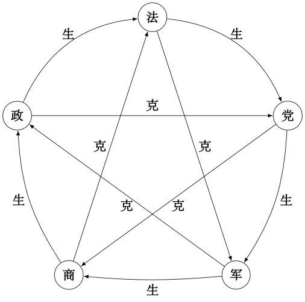

<nav id="table-of-contents">
<h2>Table of Contents</h2>

<ul>
<li><a href="#orgheadline1">1. 从三权分立说起</a></li>
<li><a href="#orgheadline2">2. 法律系统</a></li>
<li><a href="#orgheadline5">3. 论新型科举制度</a>
<ul>
<li><a href="#orgheadline3">3.1. 专门的人才教育学校</a></li>
<li><a href="#orgheadline4">3.2. 弹劾和监督</a></li>
</ul>
</li>
<li><a href="#orgheadline6">4. 富人势力</a></li>
<li><a href="#orgheadline7">5. 工农阶层</a></li>
<li><a href="#orgheadline8">6. 正义之剑</a></li>
<li><a href="#orgheadline9">7. 经济的相互制衡</a></li>
</ul>

</nav>

# 从三权分立说起

孟德斯鸠从法律出发提出了三权分立学说，以致今日人们已经达成共识，没有三权分立的国家必然是伪法治国家。

立法、司法、执法三大权利分开并相互制衡，其中立法由人民选举出来的人才组成，而司法由专业的法律人才组成，执法则是由现任政府各个职能部门执行。三权分立对于旧时代的皇权一家独大的局面无疑是划时代的进步，但在现代已经某一些方面照顾不周了。

首先是三权分立并没有对如何安置军队做出说明，所以虽然孙中山建立了民国，而视图建立三权分立的民主共和国，但军权没有正确安置最终让民国的事业化为泡影，至于其他国家军队的强力干政让他们的政治走向了深渊的例子也是很常见的。

其次三权分立并没有对资本这个强大的势力如何处理做出分析，当时人们还无法想象一个人或者一个公司会如此的有钱，甚至干预市场和左右政治，而今天资本这个势力——甚至连今日之美国——也没有提出良好的遏制方案。

三权分立思想并不要求一定要多党竞争，考虑到中国自古有文人不党的传统，欧阳修写了《朋党论》企图扭转这种局面，但是中国文人性好公义喜内敛这个事实恐怕具有更深层的人性在里面，所以不可执意要违逆。

政治的艺术就是中庸调和的艺术。权利就是社会某一方势力力量的体现，我不认为存在没有力量的权利，有，就算表面有也是虚假的。我的五权分立的出发点就是对应社会的五大势力：经济，法律，政府，党派，军队。这五大势力对应人自身的追求，代表着人对于，钱，理性，才识，关系，强力的追求。同时我喜欢从这五大势力对应中国的五行相生相克之理架构出一种新的更美的国家制度形式。

# 法律系统

将法律系统提出来单独作为一股势力就是为了做到司法独立，但是立法权显然不能给法律系统。立法权是如此的重要，以至于不是任何势力所能驾驭的。也就是立法将是五大势力投票表决出来的结果。

具体参与表决的成员是谁由各势力自己内部决定，会议控制的只是五大势力均等的比例。

因为立法需要五大势力的联合权衡，所以必须是很重大的事情，为了避免这种麻烦，需要增大地方的自治权限和司法的职能范围。只有那些非常重大的涉及国家根本大法——宪法——的问题才开启五大势力的会议程序，其他问题或依赖地方自治或依赖法律系统的自由发挥。

地方自治理想的完整最小单位是市，但考虑到目前中国地区发展的不均衡性，可先放权到省。也就是只有和国家和宪法相关的问题才上升到国家五大势力会议上，其他或自己内部五大势力权衡，或国家司法等系统处理。为了防止权利滥用，我在这里说详细一点，和国家相关但和宪法相关的问题由国家级别的系统处理，和宪法相关并和国家相关的才有国家级的五大势力会议表决权衡。除此之外一切问题省内部解决。

一般的理解法律系统或者称之为司法系统只机械的处理法律案件即可，但实际情况他们的权利可以适当放大。

首先检察机构具有主动出击对社会某些组织（主要是大型组织）进行检察看看其内部行为是不是合法的权利。

其次审判机构除了依靠宪法和其他法律之外，还具有一定的解释法律甚至宪法的权利，好方便案件的审判。

对于法律系统我决定少说点，因为西方思想家对法律体系的架构在我看来就是金恪铁律，我们多学习他们的见解就是了。而今日之中国的法律体系徒有其表，本质还是其他势力未受到约束而对法律体系产生了腐蚀，一句话，我们需要真正的司法独立。

# 论新型科举制度

一个国家最重要的是什么？是人才。我国自古以来制度不断创新，其中很大一个课题就是围绕着这个命题展开：如何才能选出真正的人才！今日之中国弃先人几千年探索于不顾，一心要模仿西方的所谓的民主选举，最后画猫不是猫画虎不是虎，不过东施效颦罢了。

对于一个国家一个民族来说，人才是宝，有德有才有公义心正义感的人弃置不用实在是这个国家这个民族最大的损失，没有之一。就好像牛顿、爱因斯坦这样的人之于科学，几百年才出一个，而对于我们这个国家和民族所需要的政治人才，也是如此的珍贵，浪费一个就少一个，没有替代。正如基督所言：他们是世间的光，是人民的盐。

我自问如何选出人才，参照中国古代的科举制度，我发现一个不容置疑的事实，比如建立一个新型的科举制度，筛选出人才，大才等。我无法想象一个文盲一个什么都不懂的人能够管理好国家，正如柏拉图所言，国家管理是一项专门的技能，我们需要的是这方面的人才，而不是盲目照搬西方的所谓民主选举，然后弄一群什么都不懂的人上去参政议政，最后不过是做做样子罢了。

那么今日之公务员考试如何呢？首先那是一个被政党势力污染了的考试，其次我觉得那考试根本就没有考出执政能力出来。

我首先明确的是基本素质入门考试，这个考试的细节后面再详细讨论。

而后面当然还有考察和等级制度，但不是考试了，也不局限于舞文弄墨的纸上功夫了，而是一个基于地方的民主的选举弹劾制度。

地方的人才就可以管理参与当地的政治事物了，小到街区卫生工厂环境问题大到当地总的政策方针皆可。每过一年将进行一次选举总结会议，毫无建树的有降级的危险，而行为有严重劣迹的将会被弹劾，被弹劾的惩罚除开其他法律责任（那是法律系统管理的），就政府这一块的惩罚，最严重的就是终生被弹劾永远没有参政资格了。

人才对当地政府做出贡献会有实际的奖励制度，而三年优秀的人才可以晋升为大才，大才在当地政府可以担任某一常任政府官员了。大才和人才就是在这点上有区别，其他会议讨论上是没有任何差别的，都是为了解决实际问题而工作，绝不应有所谓的身份尊贵或者意见的大小之类。当然这有点理想化了，所以为了培养有素质有独立人格的人才，下面我提出专门的人才培训学校的必要性。

## 专门的人才教育学校

最早的学校，柏拉图的学院其实就是柏拉图为了实现自己的政治理想而建立的；孔子的私塾也是。而学校制度发展到今天，为了适应我们未来的美好社会政治制度，同时又不和目前分工越来越细的趋势相违背，我觉得建立专门的人才培训学校是必须的。但是这个学校只管教育，而基本素质入门考试的考试权则并不能下放给这个学校。

这个考试权至关重要，比如法律化制度化程序化。所以这个考试权将给法律系统。再建立了公平的考试制度之后，我需要提醒人们一点的是，这个考试只是一个基本素质的入门考试。

那么这个学校的主要教育内容是什么呢？可能很杂，因为人才需要基本的科学素养，这种科学素养好方便他们建立理性的逻辑思维和关于世界的大局观；同时人才需要良好的文字功底和口才，这样文学方面的培养也是必要的；同时人才对政府的构成职能，当地的历史文化等都要了解；而且还要有很多的实际社区活动和群众交流实际的当地经济文化等等各种信息的研究和考察。

但是有一点是要确认的，那就是学校的教育绝对不可以有任何政治思想的灌输，而只能鼓励学生自己思考寻找真知。

那么我们有了具有独立人格的人才，他们有才有德有公义心和正义感，是否就能够彻底杜绝了政府结构的堕落和腐化呢？让我们做最坏的打算吧。

## 弹劾和监督

这里主要分析人才集团的可能的整体堕落和腐化，底层的人才有良好的法律程序的参政议政程序，相互的监督弹劾还是能够起作用的。

首先人才们不可从商，人才们不可组成政党，人才们不可进入军队，人才们不可进入法律系统。这在很大程度上制约了人才们的堕落腐化之路，那么人们就会问了，如果一个人才不想从政了，想从商什么的可以吗？可以，但是他以后就要做到终生不得从政了。五大势力保持绝对的独立可以起到很大程度上的相互制约的作用，但是背地里的堕落和腐化呢？

虽然前面我们谈及了教育，谈及了人才的内部监督弹劾机制，谈到了其他四大势力的监督，但是我仍然不放心。然后我对人才集团提出以下几点：

1.  财产完全公开
2.  工作信息完全公开
3.  不和工作相关的生活信息媒体有调查和了解的权利

我知道这确实条件有点苛刻，但是人才就是世间的光，他们本就没有什么见不得人的东西。如果人才忍受不了这样的公开，他们有选择退出的权利。

# 富人势力

中国有句话叫“在商言商”，这是对的，但不尽然。这里我将有钱人或公司作为一股势力提出来就是明确地表示他们是一股势力，他们在政治上有自己的发言权，但需要受到约束。

那么如何判定那部分人才是有钱人呢？这个和后面的工农阶层是对应，一句话，就是非常有钱的人。

个人资产达到什么地步就称之为富人了呢？我觉得这里不好讨论得太细，但我们会确立一个根据实际情况出发的标准的。还有富人势力的认定需要那个富人主动公布全部或部分资产来申请，申请有什么好处？好处就是成为了国家政治五大势力的一部分，具有了一定的干政议政权利。

富人的认定还可以被动被认定，一旦人们确定他的资产超过某个数值之后就将确立他属于富人势力。那么被认定之后有什么坏处呢？他不得结党，不得成为人才参政，不得和军队人员来往，不得和法律系统的人来往。

这里你就看到了将富人作为一股势力明确提出来既给了他们一定的参政议政的权利也给了他们很多约束。

# 工农阶层

无钱无才的人他们有结党的自由，在五大势力里面，他们是唯一一个可以自由结党的势力。他们有结党表达自己诉求的权利。

而且他们结成一股势力之后还有了一定的对国家政治的干预能力，但请注意我并不像说欧美多党竞争的花架子。有的时候他们只是在折腾，毫无意义的折腾。

请允许我把他们称之为底层人民吧，但他们作为一股势力一点也不弱势，只要他们懂得团结，这也是给予他们结党自由的原因。我从来不相信慈善的政治，在这里我就是认为他们一点不比其他势力差，而且他们的声音都值得任何其他的势力来倾听。

但是为什么我不喜欢多党竞争这样的虚伪的花架子呢？因为我真的不认为任何人都有管理国家的权利，他们作为一个政党有自己的声音有自己的权利去争取，但也要听听理性的声音（法律），也要听听智慧的声音（人才）等等。

民主的暴民化也是我们要小心的。

# 正义之剑

军队作为强力我将之成为正义之剑，因为正义绝对不能软弱，正义需要力量。而军队就扮演这个角色，我们的社会需要这样强而有力的正义之剑这样罪恶才能得到惩处，正义得到伸张。

关于军队的权利和约束前面谈及一些了，这里再来谈谈如何安置好军队这个强权的怪物，使用好这个双刃剑又不伤及自己。

首先警察归政府管，武警归法律系统管，民兵归政党管，也就是说军队永远只是对外的，不对内。这样说的意思就是向军队里的军人传递一个明确的信号，无论发生什么事，你的枪口都不能对着自己国内的人民，记住，无论发生什么，任何时候。你们的职责只是保家卫国抵御外患。这里说无论任何情况的意思是，就算国家发生了分裂，你们也保持中立，而不能将枪口对准人民。

其次为了保证强力是正义之剑，国家将允许枪支自由买卖，这样五大势力实际上都有了自己一定的武装力量，因为富人可以雇佣保镖。这从某种程度上克制了军队势力的堕落和腐化。可是还是不够的。

最最关键的是，对于所有武装力量的数量，包括警察，武警，民兵，军队，富人的保镖数量都将定期审核抽查，有一个数量比，国家的军队数量严格控制，不会超过其他四个势力的总和。这样如果将来军队确实发生了叛变，那么其他四股势力可以联合将其打败，我相信凭着军队的良知存在和其他四个势力的团结和人民自发的武装支持，打败那支叛变的军队还是没有问题的。

而且一个国家军队的强大更看重的是质量，所以这里控制本国军队数量也不会损失本国的国防力量的。

对于这五股势力有一条严厉的刑法，任何一股势力私自扩充武装力量，其背后主使人将会受到非常严厉的惩罚。

# 经济的相互制衡

最后我谈一谈经济上的事，无疑这是一个很重要的课题。

首先国家应该将轻徭薄税视作基本国策，不折腾，小政府。

工农阶层不用缴税（明税）富人阶层负责所有税收。为了保证法律系统的独立性，税收上来之后归法律系统按照程序分配给军队一点，自己使用一点，然后剩余的交给政府分配。这样就是为了让军队服从法律，否则法律随时让军队断粮。

政府的使用要开诚布公，主要是各个人才的收入等。在这里要提到的是一些基本的科学研究机构内部的科学人才，一些国立学校的教师人才他们都算做政府公职人员分配这些税收。

税收政策的具体细节要经过五大势力的讨论，我在这里强调一点，工农阶层不用缴税（明着的税）不代表他们没给国家做出贡献，实际上他们为国家缴的税绝对不少。最后税收政策要富人阶层和实施上的配合。

这里明确提出国家的税收由富人阶层提供，一是因为富人赚得钱大部分也是国家集体共同劳动的成果，他们理应多出；二是让人们知道富人阶层为国家的税收贡献的大部分力量，他们是值得我们尊敬和肯定的。

这里简单的关系是：

