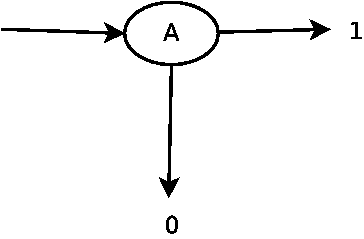
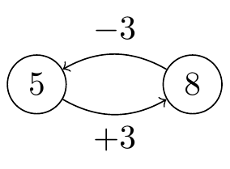

<nav id="table-of-contents">
<h2>Table of Contents</h2>

<ul>
<li><a href="#orgheadline3">1. 早先我对逻辑的沉思</a>
<ul>
<li><a href="#orgheadline1">1.1. 什么是一（或者模板论？）</a></li>
<li><a href="#orgheadline2">1.2. 模板是如何被创造出来的</a></li>
</ul>
</li>
<li><a href="#orgheadline4">2. 数学上的一</a></li>
<li><a href="#orgheadline6">3. 加法</a>
<ul>
<li><a href="#orgheadline5">3.1. 加法的三种算法</a></li>
</ul>
</li>
<li><a href="#orgheadline8">4. 进位和数序</a>
<ul>
<li><a href="#orgheadline7">4.1. 看时间</a></li>
</ul>
</li>
<li><a href="#orgheadline9">5. 减法负数和零</a></li>
<li><a href="#orgheadline10">6. 分数</a></li>
<li><a href="#orgheadline12">7. 单位</a>
<ul>
<li><a href="#orgheadline11">7.1. 数钱</a></li>
</ul>
</li>
<li><a href="#orgheadline14">8. 更大的数</a>
<ul>
<li><a href="#orgheadline13">8.1. 递推</a></li>
</ul>
</li>
<li><a href="#orgheadline16">9. 乘法和除法</a>
<ul>
<li><a href="#orgheadline15">9.1. 使用计算器</a></li>
</ul>
</li>
<li><a href="#orgheadline17">10. 简单代数</a></li>
<li><a href="#orgheadline18">11. 参考资料</a></li>
</ul>

</nav>

# 早先我对逻辑的沉思

> 世上本没有什么对与错，是人把它分了出来。——莎士比亚

形而上学的哲学体系在寻求一个逻辑学上的起点，希望由一些基本的法则和逻辑推出整个世界；而科学大致类似也在寻求一个基本的公式，借由这个公式和逻辑推出整个科学体系。但是认识论告诉我们人类所看到的世界都是人脑自身对某些基本感知信息组装出来的，说得再确切点人所感知的世界只是人内心架构出来的一个世界，人类的一切理论知识体系等等都是人类自己创造出来的东西，没有任何证据去保证他们就是真理就是事实。

在认识论我们提到只有实证才能表明这些理论在某种程度上贴近事实或者能够帮助人们更好地理解这个世界，但是不能断言宇宙的本质就是如此。正如我们前面谈及的从怀疑论的角度出发，认为目前我们这个世界就是《黑客帝国》中的“matrix”也是无法反驳的，或者认为我们这个世界是一场如影泡梦也是无法反驳的，只是所以这些断言宇宙本质的理论本身既无法反驳也没有对我们更好地和这个世界互动有所教益。

在对于这些理论的批判上，一个极端的怀疑论者也是游刃有余的。不过我现在要提出的是另外一个大家有点不愿承认的事实，那就是在我看来逻辑本身都成问题。是否真的存在着某一个神圣的逻辑在主宰着我们的宇宙，还是逻辑本身只是我们头脑中的一个产物。我们在前面已稍微提及人脑的逻辑本身也是人脑在模拟外部世界（为了更好地和外部世界互动）虚构出来的副产物，逻辑也许就反映了外部世界各个信息包之间的在联系方式上的普遍形式规律。我以前做过一些思考，不过在我看来这些东西都不太成熟，所以这些内容我在这里只简单提一下吧。

我认为人脑的结构能够在某种程度上反映出外部世界信息交互的本质，因为那些不能很好模拟外部世界的大脑是会被淘汰掉的。我认为人脑中每一个神经元都代表着外部世界的一个信息包，每一个信息包都存储着两种信息：第一种信息是自身的状态信息，第二种信息是和其他信息包发生相互作用而拥有的联系信息。

信息包是信息化世界的重要组成部分，信息包的第一个基本特征是可以做为人认识世界进行判断的模板。在这里有一个基本的东西，即任何判断基于模板。我们只有心中有“苹果”，才可能说某事物是“苹果”或像“苹果”。

所以信息包起初是个独立的存在，在人头脑中成了模板。在具体描述信息包的属性上，我采取的是一种审慎的态度。我没有断言其信息编码一定遵循着某种模式或者某一信息包的状态是稳定的。相反，我认为基于世界的多变性，我们心中的模板也具有某种自动性，即不断与外界输入信息发生某种作用来修改自己，这种趋势可能最终达到某种平衡。

不管其内部过程如何，我们的逻辑的基础必然要求存在这样的模板，然后与外来输入信息进行比较操作，相同或类似则是“是”，不同或差异很大则是“否”。当然我们可以从中引出可能或“相似度”的概念。

从这里我们可以看到，正是基于人脑中的神经元在某种程度上反映出外部世界的信息包，我们才有了逻辑上得核心概念：基于模板的比较判断。大致如下图所示：

基于这个，我看到将一些神经元信息包组合起来，他们中有些组合模式反复的出现，而这就是集合中的相交相差相补等等概念的来源。

并且我提出了一种不同于逻辑推理建立各个信息包之间的联系的方式，这个方式其实早就存在，而且是早期动物行为模式革新的关键，那就是做梦！做梦就是各个信息包之间的随机联接，究竟这种随机联接随机联想在人的创造力中占据着何种地位不得而知，但是我知道，光靠瞎想是不会创造出多少有价值的思想的。

那么真实情况是怎样的？我不知道。但请记住古老哲人的那句话是相当有道理的：“一切起源于一。”

## 什么是一（或者模板论？）

> 道生一，一生二，二生三，三生万物。——老子

我们的头脑能够对“一”进行思考只可能是我们的头脑本身存在着“一”的模板。“没有”永远都不能产生“有”，“有”可以产生“没有”。关于这个“一”，从古至今有无数哲学家为之思考，描述用语不尽相同，但大体说的是一个道理。比如量与质的分析，比如整体与部分。

我们很自然地认为“整体大于部分”，以及“a=a”。如果我们从表面上的这些符号语言深入到我们头脑内部的活动的话。“一的模板”将会是一个非常有价值的概念。实际上这并不新鲜，有点类似于柏拉图的“理念”。但是范围扩大，这里所说的“一的模板”可能是数据，也可能是操作。柏拉图所描述的有点类似于抽象名词，而这里所讲的甚至包括感官神经的工作原理。

模板有点像个信息包，有“一”性或者说是“质”性，还有与其他模板之间的从属关系。

任何哲学都会围绕着“一”展开，或者说是“有”，或者说是“质”，或者说是“是”，或者说是“存在”。而我则更愿意用“模板”这一词，因为由此将进入我们逻辑学的最基本的判断操作。判断在人思考过程中的重要性是深入骨髓的。是表示参量的命中，否表示参量的不命中。从理论上讲，“是”和“否”两者似乎就可以描述我们的宇宙了，但实际上形而上学是温床上的哲学家，是一个生活的看客。因为如果他们真实体验生活的话，将会对这一句话怀有万分的感慨：我们是生活在一个可能的世界中的。

宇宙总会用各种各样的方式来嘲笑那些妄加断言的人，宇宙以其那大海般的胸怀一次又一次地告诫着我们：我包含着你，你不可能比我更聪明。因此有这样一派哲学，叫做怀疑派。但是哲学家不是生性喜好怀疑，只是事实太难以断定了。

世间并没有“一”，是我们创造了“一”，也是我们人创造了模板。在一的模板被创造时，可能也就被创造了。“一”是模板的完全相符，那么“零”就是该模板的完全不相符。“可能是”表示模板中相符程度较高，“可能不是”则表示模板中不相符程度较高。世间万物都不一样。宇宙是第一模板，我们人类的思考从本质上讲就是一种对于第一模板的模仿和学习。因此我们人类思考最本质的一部分就是创造模板。

这样我们就有了判断：是，否，可能。是与否归根结底也是可能状态中的一种：即百分之百是或者百分之百否。所以我们有a（参数）。a表示“一的模板”，而这参数则表示可能性。我们知道是否会让我们快速判断。通常我们人类思考会省略掉可能性的计算。也就是a（）。只要我们牢记我们是生活在一个可能世界中的，去掉那个标记，单谈是否也不是不可了。

可能的一端是肯定，另一端并不是大家所想的否定，肯定是与肯定不是同属于肯定。可能的另一端是遗忘。从这里我们看到记忆信息之可能属性也不是由什么神秘的东西产生的，是由其自身本质属性所决定的。信息自身属性包含记忆性同样也包含可能性。从某一种层面上讲：记忆次数等于可能程度。

## 模板是如何被创造出来的

那么我们接下来进行下一个问题：模板是如何被创造的。正如前面所述及的，模板被创造的过程决定了该模板的属性。任何智能生命体其最本质的部分仅仅只是做为一种信息存储体，而不能再给他赋予某种神圣的东西。这种信息存储也不是某种神圣的东西，其深刻地根植于宇宙的状态性。而宇宙的状态性也不是某种神圣的东西，他来源于这样一个假定：如果宇宙发生了某种变化，那么我们只可能从其内部找原因。用另外的话语表述就是：如果不是因为宇宙自身，外部也没有相应的作用，那么我们应当认为宇宙是不变的。这也正是宇宙具有记忆性最本质的部分。

同样的问题我们可以反过来思考，如果宇宙没有外部原因，而宇宙仍在不断变化，事实正是如此。那么我们只能从宇宙内部找原因。一个有内因的对象是实体，可以自动，有其本质的一部分。那么我们应当认为这一对象具有自主选择的能力，他具有头脑！这也正是那句话的含义：从某种意义上讲，石头和人是没有区别的。

所以我们在考察一个对象时，如果外因相同（或者没有外因干扰），他做出了不同的反应（也就是变化），那么就说明他具有智能。而如果他不变，则说明他具有记忆性，是一个信息存储体，而通常我们认为记忆性是智能生命体最基本的属性。这两者是矛盾的，同时又是真实的。从这里我们看到就不变的信息部分宇宙具有记忆性，就变了的部分宇宙具有智能或者选择性。

在对宇宙第一模板的考察中，我们对于其对象的记忆性并不感到十分惊奇，形而上学在哲学史上最先发展起来也说明了这点。但是人们对于宇宙的对象具有自动性这一事实却总是不愿意承认，人们更愿意把所谓的“自由意志”赋予给人类，使得人类在考察事物时是做为一个主体而存在。而对于非人类，有时甚至扩大到非己，都是把他们做为一个客体来考察的。我们可以说石头落地是由于受到了重力的作用，但是又有谁这样说过：石头落地是他的灵魂发生了一些变化所以他才落地的。

我们的思考只有一个目的，那就是创造出尽可能接近宇宙真实情况的模板。把宇宙信息化之后接下来流露出的一个道理适用于万事万物。我称之为万物同理律。那就是万事万物都有记忆性和遗忘性。这个就是前面讲的“a（参数）”中的参数。这个参数你可以理解成为宇宙中唯一的能量。在信息学中这个参数称之为可能性。可能性世界中的两端一个是记忆性，一个是遗忘性。

-   **记忆性:** 记忆做为大脑的一种功能这是众所周知的，主体世界的记忆性以其信息的高度集中和直观展现在我们面前，而客体世界的记忆性却是主体世界记忆性最本源的东西。在没有外力的作用下，石头保持其原有状态，在物理学上有个“惯性”的东西。在信息学中我们把这种状态保存性称之为记忆性。

-   **遗忘性:** 首先做为记忆性的反面遗忘性他必须存在。不深入理解遗忘性就不可能理解宇宙的自动性。通常在这种基础上，他们都会得出这样一个结论：既然宇宙是信息的全部，那么我们的宇宙的那些变化一定是某种震荡；既然我们的宇宙是信息的全部，那么我们的宇宙实际上是不变化的；既然我们的宇宙是信息的全部，那么时间原来也是一个假象。我的一个大胆的推测就是宇宙中一切自动性或者一切变化的动力本源在于其对于信息具有遗忘性。

这里就产生一个问题，如果信息的遗忘（我想起物理学的熵增定律）是宇宙中所有信息的一个本质，那么是不是宇宙中所有的信息最终都会湮灭。显然事实不如这样的，首先信息的遗忘大多是某个信息的某个部分的遗忘，而其反面就是创造出了新的信息！所以信息的遗忘既是原信息的死亡也是新信息的诞生，而不是信息的湮灭。其次我在这里有个揣测，那就是宇宙中信息的复制成本很低，也就是如果某个信息的复制速度（或者次生代繁衍速度）是大于其信息的湮灭速度的，那么这个信息的总含量也是不降反升的。最后物理学的熵增只是大环境下所谓无序能量的增加，但是问题是如果宇宙的本质就是无序能量的海洋，几乎接近于无穷大，那么会如何呢？这就造成这样一种现状，无序的无序不就是有序！也就是针对无序信息的遗忘就可以产生某些有序的信息，针对有序信息的遗忘可以产生无序。所以最后结论是麦克斯韦妖可能真的是存在的，它也是一种熵增现象，也就是对无序信息的遗忘，无序的无序，就是有序。

这样熵增定律仍旧成立，而且宇宙就是那个无序的极大极大的混乱熵海洋，那么熵增首先对现实宇宙来说可能效果极其微弱，就好比无穷大上面再加上了一个1，其次熵增并不能做到系统走向无序，正如我们在总论中回顾我们的宇宙历史所看到的，恰恰相反，宇宙生出了各种各样的粒子，各种各样的无机物有机物各种各样的生命，如果将来人类进入星际文明，我们有理由相信，宇宙将会变得越来越有序。而这并不违背熵增原理。

抱歉这里引入了这么抽象的纯哲学的讨论，至少就我的希望是大家对模板这个概念有了深刻认识之后，这样就能对数学里面的“一”这个概念有更深刻的认识，我只是尽量把我的思路说出来，绝不半点隐瞒。 为的是后面我在说什么，脑子里在想什么的时候，确保大家都能够清楚我想表达什么吧。当然很可能只是我的一厢情愿罢了。。

# 数学上的一

刚开始要说明的是我们心中的模板，也就是从日常生活出发，从周围的自然环境中吸取过来的各种具象信息。比如说一棵树，五个手指等等。

起初并没有1或者2这样的东西。人们已经认识到了事物的数量性质，但只是根据比较关系粗糙地表述如下：“一只手一样多的”（5）或者是“人身上一样多的”（20）。有一些原始部落他们甚至只有一和二这样的概念，而一则是表示为比如说一个苹果之类的具象信息。

从个人身上体验的周围环境的具象信息抽象上升到简单的1的概念是一个很漫长的过程。于其中的个人系统最先完成这个工作，将左手手指数和右手手指数的对比（模板相似判断）以及诸如此类相似的事物，人的头脑自觉地提炼出了这些信息包的相似信息。有人可能说1是人自身头脑的创造，但是人并不需要干这么惊天动地的事情，平白无故的创造概念。从原始部落把数字“一”表达为“一个苹果”可以看出，甚至他们连名字都不想给它再另外取一个，而直接用一个大家都很熟悉的名词代替。整个事情最有意思的部分是人类社会公共系统对于“一”这样的概念的交流问题。早期个人和个人之间是某一个个体提醒另外一个个体，让另外一个个体被迫从事某个头脑活动。比如像3个土豆一样多的。这个过程有点类似于货币的产生，慢慢的，一个大家都熟悉的“通用货币”得到大家的肯定，于是这样整个部落都这样表述：“3个土豆的”苹果。

个体们先完成了一个工作，即取各模板相似信息从而形成新的信息包，方便以后的组合操作来形成新的信息包。最漫长的是公共系统对于这样概念的普遍承认。虽然各个体内关于“一”的信息彼此具体组成并不相同。但重要的是关系而不是对象。“一”中所蕴含的最重要的信息就是模板的相似判断操作。

现在我们有了“一”或者“二”或者“五”或者“二十”等等。早期人类的数字我估计并不是依序连接着的 <a id="fnr.1" class="footref" href="#fn.1">1</a> ，而只是简单最常用的几个词。

# 加法

加法实际上并不困难，它在人的头脑中的具体操作就是信息包之间的组合关系。一个苹果组合一个苹果就是两个苹果。所以 *一* 信息包所包含的“属性” *二* 必然同样包含。

在教加法的第一个阶段是和教数字一起进行，第一个阶段的完成是教到20以内的加法。

## 加法的三种算法

其实8+7有三种方法：

第一种方法是死记硬背：8+7就是等于15，没有那么多为什么。条件反射罢了。

第二种方法是8+7，我在心里默默的搬手指头，因为我知道物质不灭，7减少了一个，那么减少的那个是跑到8那边去了。于是我心里默默地念到：  
9 10 11 12 13 14 15  
1 2   3   4   5   6  7   
7 6  5    4   3  2   1

在进行这个算法的时候我运用了两个法则：第一个法则我面前有一堆糖果，这堆糖果的数目不以我数数的方式而改变，所以我数1 2 3 4 5 6 7 或者7 6 5 4 3 2 1都是一样的，第二个法则就是前面提及的物质不灭法则。

8+7还有第三种方法，类似的还有很多。就是将8+7化为 8+2+7-2，这样8+2等于10，7-2等于5，这种方法其实就是前面第二种方法的升级版，而这个升级版方便快速运算就是要找一些大型模板进行对比。在这里这个模板就是10。

# 进位和数序

在教完20以内的加法之后，就要开始教一个新的东西，那就是进位和数序思想。这个东西正常人学完20以内的加法之后都会自然有这个概念，所以教学上就要实时跟进进行讲解。

现在以数核桃为例，先把核桃分成一堆一堆。比如说以十个为一堆，而我注意到英文中的twelve和thirteen。所以我怀疑英国人习惯以12为一堆。然后他们表达25是2堆一个。印度人我怀疑他们习惯以10为一堆。我们注意到一堆这样的概念和前面讲的有的部落将二十表述成为“像一个人那样多的”是很类似的。所以进位思想并不神秘，很根本和前面的1之类的数字几乎是同时形成的。

实际上如果我们有了进位思想和数序思想，后面的数都是被创造出来的。而且我们发现从应用角度来说有了这些已经完全足够日常生活了。也就是说1，2，3这样一直数到10我们这样教给小学生的不光是一个一个的数，而且是一系列的有先后顺序的数。我不知道小学的时候老师们有没有教过2>1之类的东西，或者潜移默化的让学生们那么认为这些数有次序。但我认为更可能的是学生们基于日常生活的经验个体头脑很自然地得出了这个结论。那就是数序。

我们知道1已在个体头脑中存在而不能传授，它是关于某信息的质的模板。所以像1+1=2这样的东西是如此的本质，以至于我只能说我们目前讨论的只是公认的符号系统。而1+1=2这样的东西必然是根植于每个个体头脑的内在操作模式的。

所以我并不知道8+7等于多少，因为我没有记住。但是我知道数数。所以到目前为止我的结论是1，2，3一直数下去这样的自然数序列是先验存在本质上附着于我们的头脑中的。而更大的数之间的加法法则以及有的时候仅仅为了方便运算的乘法规则都是基于这个自然数序而被发现的真理，或者说是被强加给我们要我们死记住的东西。

## 看时间

不一定要谈及进制，进位应用的一个实例就是让学生们学会看时间。

# 减法负数和零

关于减法我在这里提出一种新的说法，那就是减法有两种理解方式，我以为小学阶段不太适合这样教，那就是教减法是加法的逆运算——这是减法的第一种理解；第二种理解方法的关键在于如何理解负数和零。

比如说5-3，小学的教法应该是这样的：5+(-3)，有什么区别？这个要从负数的起源说起，负数和零都是印度书记员为了记账方便速写出来的， 而对于小学生怎么跟他说，你这里有5个本子，我借走了3个本子，你还剩多少本子？最好的办法是告诉他如果有人借走了你的本子，那么你的本子就变少了，为了记忆方便，你写到-3。然后5+(-3)就等于2，你数一数你还剩下多少本子？

其实减法严格意义上来讲不是加法的逆运算，所谓运算是指对某个物体进行操作，某个物体变成了某个样子，而所谓的逆运算指如果对后面那个物体进行了某个操作，它又回到原初的样子。常规的理解5个本子和3个本子相加也就是组合到了一起就是8个本子，那么对8个本子实施逆运算，8个本子能够分成5个本子和3个本子吗？

正如上图所示，等学生学会简单的减法之后，适时就可以引入逆操作或者逆运算的概念，这个时候负数的概念应该引入进来，然后正数的概念应该引入进来，然后减去多少才是逆运算。而教给小学生逆操作这么似乎有点复杂的概念（其实很基本）就是为了他们快速将减法消化吸收掉，并和之前学的加法的知识融合在一起。

当然这个时候零也就要引入进来了，甚至可能的话自然数这个概念都可以教给他们了。

# 分数

分数，人们自然联想到除法。但是实际上分数是可以脱离除法的概念存在的。类似前面谈及减法的两种理解形式，分数也有两种理解形式。第一种是分数作为一个独立的数而存在，1/3不是1除以3就是三分之一个饼干，1/2不是1除以2就一半的西瓜等等；第二种就是将分数和乘法除法联系起来讲，这个概念就要拖到很后面了。

在这里我先批评一下现在的小学教学过早引入十进制小数概念的问题。我认为这个概念甚至到初中都没有必要引入进来。一个小学生当面对1/3这样简单的问题，因为你们的所谓的除法运算法则就不得不面临这样一种窘境。0.3333&#x2026;&#x2026;这是个什么东西。怎么写也写不完啊。我在教一个小学生的时候他就问了我这个问题。我认为小学甚至初中都没有必要教十进制小数的概念和那个所谓的除法法则。除法就是分配问题。你有6块蛋糕，分给3个人。每人分两个。我们就教孩子们书写6/3.然后教他们约分法则即可。告诉他们分子和分母彼此约到不能在约为止，然后把个整数提出来。就是形如这样的东西：12又1/3.我们要知道即使到了牛顿时代，人们上算天下算地也就是用得这种东西。三分之一就是三分之一，它是确定无疑的三分之一。不是什么0.3333&#x2026;之类的东西。

那么这个所谓的0.333&#x2026;是怎么出来的呢？实际上这里涉及到单位的定义和测量问题。比如说一个长棒，我要测量它的长度。那个我首先必须建立起一个度量单位。也就是那个所谓的1.然后用这个度量单位去测那个长棒。然后说那个长棒有几个（自然数）那个度量单位长，但是呢大多数情况下那个长棒还剩下一点。然后呢我们把那个度量单位缩至1/10。也就是那个0.1。再去度量那个长棒。然后又得到一个数值。比如说那个长棒是1/3长，那么第一次度量失败，第二次度量得到3，第三次度量得到33等等。这就是我们通用的十进制小数的来源。但是这里有个问题，那就是度量单位是任意给定的，所以我完全可以用1/3作为度量单位，然后得到那个长棒的长度为一个单位。

我们选用十进制小数法则仅仅是方便，然后好让人家比较大小。比如1/7和2/9彼此间的大小就不是那么明显。小学生学分数，知道分配，知道比较各分式大小等即可。

我之所以对这个问题如此强调，就是因为现在的小学过早的让学生们接触到这么一个怪数。怎么数也数不完，就好像哪个数根本就不确定<a id="fnr.2" class="footref" href="#fn.2">2</a>，或者永远都不可能确定。老实说无论是那个正常人都讨厌这种想法。而要破除这种想法就必须提到上面讲的测量过程的问题。那对于一个小学生是不是要求太高了点。

# 单位

从上面的分析可以看到，任何一个数量都包含两部分，一是相对大小，二是比较单位。很后面适当的时候就可以引入小数的概念了，毕竟小数在生活中普遍应用着，小数概念的引入的同时单位的概念也就可以引入进来了。

从上面我们还看到一个非常有意思的现象，那就是度量单位的选择不同，有的无限数可以转化为有限数。这再一次告诉我们这样一个事实，一，数是相对关系。二，数，即使是那些看上去如此复杂的数，比如 \(\sqrt{2}\) 或者 \(\pi\) 。他们都是确定无疑的。

## 数钱

作为单位应用的一个重要例子就是数钱。

# 更大的数

从早先的自然数序开始，有兴趣的人们肯定会想，再后来呢？再后来呢？我以前教过一个小学生，我发现像他们这个年龄段的孩子对于那么大的数都有一种非常的好奇心。在他们看来那么大的数真是不可思议啊。想到1亿这样的东西简直无法用言语来表达了。我认为小学教学要特别注意培养小学生的自然数序观和进位思想（或者叫做分堆思想吧）。

从自然数的数序出发孩子们已经开始渐渐接触到更大更大的数这个概念了，而在引入小数之后他们也开始接触到无限这个概念了，无限确实是一个很讨厌的概念，现代人很多都把握不好，我还不太确定是不是该跟小学生讲无限的概念，但有一点是确定的，那就是简单的递推思想可以引入进来了。

## 递推

从自然数序出发小学生已经具备了简单的逻辑推理能力，虽然这里不涉及无限的概念，不过一般的递推思想的介绍我们还是应该思考一下该怎么介绍给他们呢？

最后说一些题外话，在后面快要进入微积分的时候（初中就可以开始了）就要开始讲递归，循环和无限的概念了。这些讲解可以通过一些有意思的思想悖论和有意思的故事的形式展开。虽然小学的时候已经开始教如何使用小数，但是小数的正式引入还是要等无限的概念引入之后才能加入进来，然后实数轴的概念就可以跟进了。

# 乘法和除法

可能你们注意到了有理数的乘法和除法概念我一直还没提，因为乘法是加法的多次重复操作，这实际上要等到前面的递推概念引入进来之后才能引入乘法和除法。目前小学过分强调死记硬背乘法口诀表，作为二十一世纪的公民，还是让我们做出一些改变吧。

## 使用计算器

在教乘法和除法的时候就可以引入使用小型计算器的课程，我以为让同学们真正理解乘法是加法的多次重复迭加比被那些无聊的乘法口诀表要有意义的。而要做到这点，需要我们花点心思通过其他例子和生活的体验让学生确切理解递推思想。

# 简单代数

现在我们看到了数学的一个变化，从脱离日常生活，到自身的运算法则发展，到作为符号系统的创新。1不再是哪个通用货币，表示某个数量。1仅仅只是作为一个符号而存在了。如同x一样，符号，书写，是人类有史以来最伟大的创举！x不仅可以表示某个数，x可以是一个人，可以是地球或者什么东西。也就是说从此人们思维上开始出现了这样的跨越，去操作一个对象，仅仅只是作为一个抽象的对象而存在，当然了x也可以是某个对象和某个对象之间的某种联系。这里面的内容太丰富了。或者我们说x就是某个信息包某个模板，人类头脑中的最终操作符，是对象，是关系，是一切！

well，现在简单的代数概念可以引入进来了。

# 参考资料

-   书籍：古今数学思想第一册，M·克莱因。高观点下的初等数学第一卷，F·克莱因。

<h2 class="footnotes">Footnotes: </h2>

<a id="fn.1" class="footnum" href="#fnr.1">1</a> 
此处指如同现在数字体系一样连接得那么有次序。

<a id="fn.2" class="footnum" href="#fnr.2">2</a> 
就作为数学思想确实有的数学家认为有的实体的某些属性就是不确定的，就是不断趋近于某个值的，这个比较艰深了，如果我们愿意接受现有的时间观念的话，还是认为单个时间点下的物质的属性具有状态性吧，这样对于我们理解宇宙会显得简单得多，至于也许有的事物内部确实存在这种变动趋势，认为这个物质自变而且其变动趋势根据我们的观测大致可以推测如此，这对于理解世界是没有任何信息损伤的。

