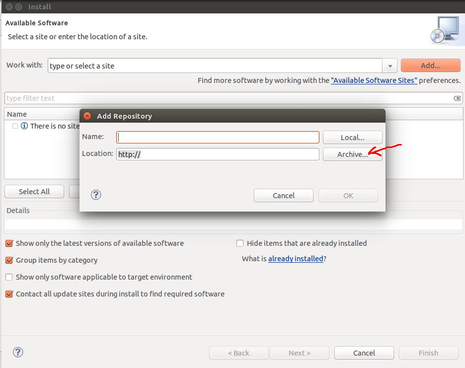
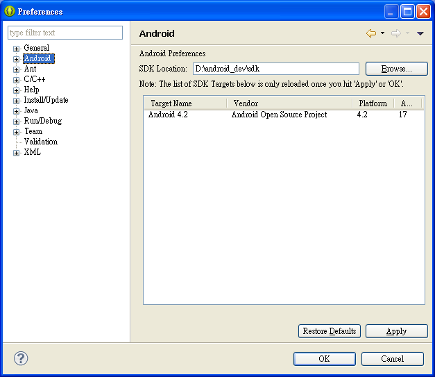
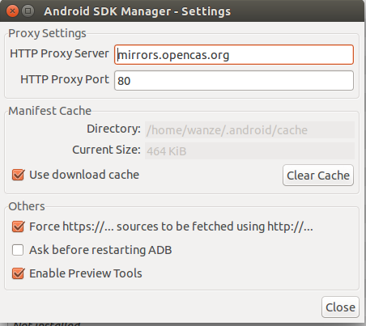

<nav id="table-of-contents">
<h2>Table of Contents</h2>

<ul>
<li><a href="#orgheadline1">1. 安装和配置</a></li>
<li><a href="#orgheadline2">2. 参考资料</a></li>
</ul>

</nav>

# 安装和配置

安装jre和jdk就不用多说了，在ubuntu下安装eclipse之后自动就会将jdk也装上去了。

在你准备配置android开发环境之前，因为国内GFW的关系，强烈建议读者先看看 [这个网页](https://github.com/inferjay/AndroidDevTools) 。具体内容可能有点杂，ubuntu下下载android sdk，解压，然后eclipse那边需要安装 adt 插件。adt插件的下载参看 [这个网页](http://my.oschina.net/roaminlove/blog/40384) 。具体就是 `http://dl.google.com/android/ADT-12.0.0.zip` ，到 `http://developer.android.com/tools/sdk/eclipse-adt.html` 来查看最新的adt版本和相关说明。然后修改后面的版本号即可:

    http://dl.google.com/android/ADT-23.0.7.zip

下载下来之后到eclipse的这里:

点击Archive选择下载的zip文件安装之。安装完之后重启eclipse就会有提示，你还没有设置android sdk，把之前你下载的android sdk解压了，然后选择到那里，如下图所示（该图片来自 [参考资料1](#orgtarget1) ）:

然后接下来就是更新sdk，记得在菜单 Tools→Options&#x2026; 那里如下设置好国内的代理，参看前面第一提到的那个github上面的网页。

然后就是安装或更新一个基本的组件，具体要根据你自己的实际情况来，主要是你的api多少版本号和你当前机器架构和你想要开发的app在那种机器上运行的考虑。 

-   android sdk tools 必备
-   android sdk platform-tools 必备
-   androd sdk build-tools 必备，但选择一个你想要的api版本号即可

然后在具体的某个api版本下:

-   sdk platform 必备
-   **\*\*** system image 这个和等下开avd模拟器有关系，比如我这里的机器架构是64位的，选安装那个Atom\_64的即可。

然后你可能需要模拟android Tv 或者wear之类的则需要安装对应的system image ，然后google apis那个也装上吧。其他的就随意了。

avd模拟器的设置其实很简单的，在eclipse那里window→android virtual device manager设置即可，界面很直观，没啥好说的。然后eclipse那里新建一个android程序，然后run一下即可，具体的run configurations那里把target设置一下即可。如果没有什么意外的话，点击run就可以开启android模拟程序了。刚开始会有点慢，耐心等待，开启之后如果你机器足够好的话模拟程序可以一直挂在那里的。

具体运行的andorid项目编译生成的apk在你的项目文件夹的bin文件夹那里。

200

# 参考资料

1.  学习android; Author:饒瑞佶; Version: V2 ;  