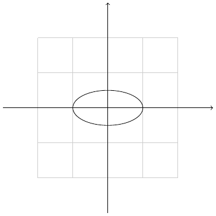
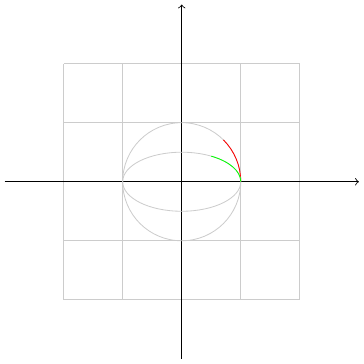
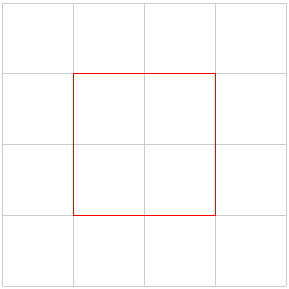

<nav id="table-of-contents">
<h2>Table of Contents</h2>
<div id="text-table-of-contents">
<ul>
<li><a href="#orgheadline2">1. 简介</a>
<ul>
<li><a href="#orgheadline1">1.1. 前言</a></li>
</ul>
</li>
<li><a href="#orgheadline16">2. beginning</a>
<ul>
<li><a href="#orgheadline3">2.1. 准备工作</a></li>
<li><a href="#orgheadline4">2.2. quicktikz软件简介</a></li>
<li><a href="#orgheadline5">2.3. 使用standalone类</a></li>
<li><a href="#orgheadline6">2.4. 绘制</a></li>
<li><a href="#orgheadline7">2.5. 初识tikz制图</a></li>
<li><a href="#orgheadline8">2.6. 画网格</a></li>
<li><a href="#orgheadline10">2.7. 画直线</a>
<ul>
<li><a href="#orgheadline9">2.7.1. 直线带上箭头</a></li>
</ul>
</li>
<li><a href="#orgheadline11">2.8. 画圆</a></li>
<li><a href="#orgheadline12">2.9. 画椭圆</a></li>
<li><a href="#orgheadline13">2.10. 画弧线</a></li>
<li><a href="#orgheadline14">2.11. 画长方形</a></li>
<li><a href="#orgheadline15">2.12. 放大图形</a></li>
</ul>
</li>
<li><a href="#orgheadline20">3. 确定点</a>
<ul>
<li><a href="#orgheadline17">3.1. 点的定义</a></li>
<li><a href="#orgheadline18">3.2. 点的相对偏移</a></li>
<li><a href="#orgheadline19">3.3. 极座标</a></li>
</ul>
</li>
<li><a href="#orgheadline21">4. 确定路径</a></li>
<li><a href="#orgheadline22">5. 路径上的动作</a></li>
<li><a href="#orgheadline23">6. 确定样式</a></li>
<li><a href="#orgheadline25">7. node语法详解</a>
<ul>
<li><a href="#orgheadline24">7.1. node里面插入中文字</a></li>
</ul>
</li>
<li><a href="#orgheadline26">8. tree语法详解</a></li>
<li><a href="#orgheadline27">9. 确定绘图单元</a></li>
<li><a href="#orgheadline28">10. 绘图单元的演变</a></li>
<li><a href="#orgheadline29">11. help lines</a></li>
<li><a href="#orgheadline30">12. information text</a></li>
<li><a href="#orgheadline31">13. 变量声明</a></li>
<li><a href="#orgheadline32">14. scope环境</a></li>
<li><a href="#orgheadline33">15. 迭代语句</a></li>
<li><a href="#orgheadline34">16. 平移</a></li>
<li><a href="#orgheadline35">17. 旋转</a></li>
<li><a href="#orgheadline36">18. 反对称</a></li>
<li><a href="#orgheadline37">19. 多个node连接</a></li>
<li><a href="#orgheadline38">20. 绘制几何图形</a></li>
<li><a href="#orgheadline44">21. 电路图</a>
<ul>
<li><a href="#orgheadline39">21.1. 电路基本符号</a></li>
<li><a href="#orgheadline40">21.2. 连线问题</a></li>
<li><a href="#orgheadline41">21.3. 翻转问题</a></li>
<li><a href="#orgheadline42">21.4. 电压表和电流表</a></li>
<li><a href="#orgheadline43">21.5. info选项</a></li>
</ul>
</li>
<li><a href="#orgheadline47">22. 示例</a>
<ul>
<li><a href="#orgheadline45">22.1. 例子一</a></li>
<li><a href="#orgheadline46">22.2. 例子二</a></li>
</ul>
</li>
<li><a href="#orgheadline50">23. 附录</a>
<ul>
<li><a href="#orgheadline48">23.1. 单位</a></li>
<li><a href="#orgheadline49">23.2. 参考资料</a></li>
</ul>
</li>
</ul>
</div>
</nav>


# 简介<a id="orgheadline2"></a>

## 前言<a id="orgheadline1"></a>

tikz制图详解

# beginning<a id="orgheadline16"></a>

## 准备工作<a id="orgheadline3"></a>

这里所谓的准备工作当然指你的 LaTeX 编译环境配置好，然后tikz宏包的加载是必须的。

tikz有两种使用方法，一种命令式的，一种环境式的。命令式用tikz命令包围起来，命令式是inline模式的。环境式用tikzpicture环境命令包围起来。如下所示：

```latex
\tikz{\draw (1,0) -- (0,1) -- (-1,0) -- (0,-1) -- cycle;}

\begin{tikzpicture}
\draw (1,0) -- (0,1) -- (-1,0) -- (0,-1) -- cycle;
\end{tikzpicture}
```

inline模式对于注重内容的用户来说会用的较少，有时可能自己建的某些宏包底层会使用到tikz命令。但不管是注重华丽表现效果的用户还是注重内容的用户，总是会有需求需要某一整张图片来表达某些内容，而tikz以及其他基于tikz的宏包在命令行绘图这个领域可以说是很优秀的，这绝不是那些只能绘制基本的线条或者其他的形状的图形包所能比的。下面将主要使用tikzpicture环境命令模式。

## quicktikz软件简介<a id="orgheadline4"></a>

我自己利用PyQt写了一个小软件，名字叫quicktikz，能够一边画图一边预览，目前还很粗糙，不过只要继续不断优化下去，就会变得很实用了的。

有兴趣的读者可以了解一下，

github地址在 [这里](https://github.com/a358003542/quicktikz) 。

## 使用standalone类<a id="orgheadline5"></a>

用tikz绘制某个单独的图片而不是一般的A4页面推荐使用 **standalone** 类。如下所示:

```tex
\documentclass[tikz,border=2pt]{standalone}
\begin{document}
\begin{tikzpicture}
\draw[step=1,color=gray!40] (-2,-2) grid (2,2);
\draw[-&gt;] (-3,0) -- (3,0);
\draw[-&gt;] (0,-3) -- (0,3);
\draw (0,0) circle (1); 
\end{tikzpicture}
\end{document}
```

## 绘制<a id="orgheadline6"></a>

## 初识tikz制图<a id="orgheadline7"></a>

## 画网格<a id="orgheadline8"></a>

画网格主要用于辅助绘图，其中 `help lines` 是个不错的参数设置。此外 `step` 用来控制网格之间的间距，可以color来设置网格的颜色，不过一般没那个必要。然后接下来第一个坐标点是网格的左底点，第二个坐标点是网格的右定点。

    \begin{tikzpicture}
    \draw[help lines] ( -5,-5 ) grid ( 5, 5);
    \end{tikzpicture}

我们看到tikz的每一条命令最后都要跟一个分号“;”。

## 画直线<a id="orgheadline10"></a>

    \begin{tikzpicture}
    \draw[help lines] ( -5,-5 ) grid ( 5, 5);
    \draw[red] (-3,0) -- (3,0);
    \draw[red] (0,-3) -- (0,3);
    \end{tikzpicture}

画直线就是两个坐标点相连，中间 `--` 符号表示直线的意思。之前网格是grid表示网格的意思。如果几个点用 `--` 符号连接起来，表示这几个点连着来画几条折线，有多个画直线命令依次执行的意思。

具体显示效果如下：


### 直线带上箭头<a id="orgheadline9"></a>

draw命令可以跟上可选项 **->** ，这样直线的右端就有一个箭头了。此外还有: **->>** ， **->|** ， **-to** ， **-latex** ， **-stealth** 。

他们的效果从上到下依次演示如下：

    \begin{tikzpicture}
    \draw[->] (-3,3) -- (3,3);
    \draw[->>] (-3,2) -- (3,2);
    \draw[->|] (-3,1) -- (3,1);
    \draw[-to] (-3,0) -- (3,0);
    \draw[-latex] (-3,-1) -- (3,-1);
    \draw[-stealth] (-3,-2) -- (3,-2);
    \end{tikzpicture}


类似的还有左端比如 **<-** ，或者两端比如 **latex-latex** ，这里就不多说了。

## 画圆<a id="orgheadline11"></a>

    \begin{tikzpicture}
    \draw[step=1,color=gray!40] (-2,-2) grid (2,2);
    \draw[->] (-3,0) -- (3,0);
    \draw[->] (0,-3) -- (0,3);
    \draw (0,0) circle (1); 
    \end{tikzpicture}

其中第一个点是圆中心，circle表示画圆，第二个参数是半径大小。


## 画椭圆<a id="orgheadline12"></a>

    \begin{tikzpicture}
    \draw[step=1,color=gray!40] (-2,-2) grid (2,2);
    \draw[->] (-3,0) -- (3,0);
    \draw[->] (0,-3) -- (0,3);
    \draw (0,0) ellipse (1 and 0.5);
    \end{tikzpicture}

这里第一个点是椭圆的中心点，ellipse表示画椭圆，后面参数两个值第一个是a也就是椭圆的半长轴，第二个是b也就是椭圆的半短轴。



## 画弧线<a id="orgheadline13"></a>

    \begin{tikzpicture}
    \draw[step=1,color=gray!40] (-2,-2) grid (2,2);
    \draw[->] (-3,0) -- (3,0);
    \draw[->] (0,-3) -- (0,3);
    \draw[color=gray!40] (0,0) circle (1); %
    \draw[color=red] (1,0) arc (0:45:1);
    \draw[color=gray!40] (0,0) ellipse (1 and 0.5);
    \draw[color=green] (1,0) arc (0:60:1 and 0.5);
    \end{tikzpicture}

最基本的画弧线的命令如上代码第5行，其中第一个点是弧线的起点，然后arc表示画弧线，接下来括号里面的三个参数：第一个参数是开始的角度，第二个参数是结束时的角度，第三个参数是弧线对应圆的半径。对比第4行画的浅灰色的圆可以看出他们之间的关系。

上面代码第7行画弧线增加了一个and 和一个参数，这个时候画的弧线是根据椭圆来的，其中1是椭圆的半长轴，0.5是椭圆的半短轴。对比第6行画的浅灰色的椭圆可以看出他们的关系。



## 画长方形<a id="orgheadline14"></a>

    \begin{tikzpicture}[scale=2]
    \draw[step=1,color=gray!40] (-2,-2) grid (2,2);
    \draw[color=red] (-1,-1) rectangle (1,1);
    \end{tikzpicture}

这里使用了可选项 **color=red** 来控制线条的颜色，然后画长方形的第一个点是左底点，rectangle表示画长方形，第二个点表示右顶点。



## 放大图形<a id="orgheadline15"></a>

在tikzpicture环境后面跟上可选项 `[scale=2]` ，即将图形放大两倍。

# 确定点<a id="orgheadline20"></a>

## 点的定义<a id="orgheadline17"></a>

使用coordinate命令或者path命令附带coordinate来定义一个点。 *注意* ，

    \begin{tikzpicture}
    \draw[step=1,color=gray!40] (-2,-2) grid (2,2);
    \path (1,1) coordinate (p1);
    \coordinate (p2) at ( 2, 0);
    \draw[dotted, red] (p1) -- (p2)  ;
    \end{tikzpicture}

## 点的相对偏移<a id="orgheadline18"></a>

现在加上这样两行代码：

    \begin{tikzpicture}[scale=2]
    \draw[step=1,color=gray!40] (-2,-2) grid (2,2);
    \draw[latex-latex, red] (0,-2) -- ++(-1,1) -- ++(-1,-1);
    \draw[dashed, blue] (0,1) -- +(-1,1) -- +(-2,0);
    \end{tikzpicture}


tikz中有一个重要的概念，当前点，然后点可以通过当前点根据相对偏移来确定一个新的点。上面代码第9行的 *++* 符号和第10行的 *+* 符号都根据当前点然后进行了$&Delta; x$和$&Delta; y$的相对偏移从而确定了一个新的点。这两个符号的区别在于是不是更新当前点数据。++符号更新当前点，而+符号不更新。

++适合描述一连串逐渐变化的点，+适合描述多个点围绕着一个点变化的情况。

## 极座标<a id="orgheadline19"></a>

tikz中的点也支持极座标表示，(30:1cm)，第一个参数是极座标里面的角度，第二个参数是半径。

# 确定路径<a id="orgheadline21"></a>

# 路径上的动作<a id="orgheadline22"></a>

# 确定样式<a id="orgheadline23"></a>

style，特定图形的样式。定义一个样式比如style001如下：
`style001/.style={color=red,fill=red!20}`

原有样式修改
\verb+help lines/.append style=blue!50+  
附加之后最新的样式胜出。

\subsection{样式带参数}

\begin{tikzpicture}[outline/.style={draw=#1,thick,fill=#1!50}]
\node [outline=red] at (0,1) {red};
\node [outline=blue] at (0,0) {blue};
\end{tikzpicture}

\subsection{样式参数有默认值}

\begin{tikzpicture}[outline/.style={draw=#1,thick,fill=#1!50},
outline/.default=black]
\node [outline]
at (0,1) {default};
\node [outline=blue] at (0,0) {blue};
\end{tikzpicture}

# node语法详解<a id="orgheadline25"></a>

## node里面插入中文字<a id="orgheadline24"></a>

```latex
\documentclass[tikz,border=2pt]{standalone}

%================字體================%
\RequirePackage{fontspec}
\usepackage{xcolor}

%中文環境
\RequirePackage[CJKnumber=true]{xeCJK}

\newfontfamily{\yanti}{颜体}
\begin{document}

\begin{tikzpicture}

\node{\fontspec[Scale=4,Color=red]{颜体} 新春快乐} ;

\end{tikzpicture}

\end{document}
```

# tree语法详解<a id="orgheadline26"></a>

# 确定绘图单元<a id="orgheadline27"></a>

# 绘图单元的演变<a id="orgheadline28"></a>

# help lines<a id="orgheadline29"></a>

```latex
\tikzset{help lines/.style= {step=0.5cm,color=gray!40,very thin}}
\begin{tikzpicture}
\draw[help lines] (0,0) grid (5,5);
\end{tikzpicture}
```

# information text<a id="orgheadline30"></a>

```latex
\tikzset{information text/.style={rounded corners,fill=red!10,inner sep=1ex}}

\begin{tikzpicture}
\node[right, text width = 6cm,information text] {这是一段测试文字。};
\end{tikzpicture}
```

# 变量声明<a id="orgheadline31"></a>

[参考网站](http://tex.stackexchange.com/questions/47178/what-is-the-preferred-way-of-defining-a-tikz-constant)

def命令可用，在里面声明一个变量。

pgfmathsetmacro命令和def一样可用来声明变量，不同是里面可以放着一些数学运算公式，tikz会将其先运算再赋值。

# scope环境<a id="orgheadline32"></a>

scope环境就是作用域控制，一个局域环境，参数只影响内部，外部的参数也影响不进来，不过值得一提的是，定义的点外面也可以用。

scope环境一个有用的特性的里面的clip命令不会影响到外面。

# 迭代语句<a id="orgheadline33"></a>

```latex
\begin{tikzpicture}
\draw[help lines] (0,0) grid (3,2);
\foreach \x in {0,1,...,4}
\draw[xshift=\x cm] (0,-1) -- (0,1);
\end{tikzpicture}
```

其中&#x2026;表示一直这样有规律下去生成迭代列表。迭代语句有很多用法，详见后面的具体例子。

# 平移<a id="orgheadline34"></a>

`xshift` ，x坐标轴平移。  `yshift` ，y坐标轴平移。 `rotate` ，旋转 。 注意xshift默认的单位并不是cm，如果要单位是cm需要写出来。

```latex
\begin{tikzpicture}
\draw[help lines] (0,0) grid (3,2);
\draw (0,0) -- (1,1);
\draw[red] (0,0) -- ([xshift=1cm] 1,1);
\end{tikzpicture}
```

# 旋转<a id="orgheadline35"></a>

后面加上可选项 `rotate=30` 即可，意思是图形逆时针旋转30度。

```latex
\begin{tikzpicture}
\draw (0,0)[rotate=30]  ellipse (2 and 1);
\end{tikzpicture}
```

# 反对称<a id="orgheadline36"></a>

xscale=-1或者yscale=-1就刚好相对y轴或x轴反对称。

\subsection{node命令中点的定义}

\begin{tikzpicture}
\node (node001) at (0,2) [draw] {test};
\end{tikzpicture}

从这里可以看到只要写上draw选项外面就会加上一个长方形，也就是shape的默认选项是rectangle。如果你不希望外面有长方形，不写draw选项即可。

这里通过node命令定义了一个点，node001，在(0,2)那里。后面是可以使用的。

\begin{tikzpicture}
\node (node001) at (0,2) [draw] {node001};
\node (node002) at (-2,0) [draw] {node002};
\node (node003) at (2,0) [draw] {node003};
\draw (node cs:name=node003,anchor=north) |- (0,1);
\draw (node002.north) |- (0,1) -| (node cs:name=node001,anchor=south);
\end{tikzpicture}

这里通过\textbf{node cs:name=node003}来获取之前那个node所在的点，然后通过\textbf{anchor=north}来定义那个node的接口在北边。除此之外的选项还有：\textbf{south}，\textbf{east}，\textbf{west}。这里\textbf{|-}似乎是画垂直拐线的意思。上面的语法简写为可以node002.north。

此外还有\textbf{angle}选项控制node接口的开口角度。

\subsection{两个点定义出一个点}

\begin{Verbatim}
\begin{tikzpicture}
\node (p1) at (30:1) {$p_1$} ;
\node (p2) at (75:1) {$p_2$} ;
\draw (-0.2,0) -- (1.2,0) node[right] (xline) {$q_1$};
\draw (2,-0.2) -- (2,1.2) node[above] (yline) {$q_2$};

\draw[->] (p1) -- (p1 |- xline);
\end{tikzpicture}
\end{Verbatim}

这种形式(p1 |- xline)表示取第一个点的x和第二个点的y组成一个新的点。如果是(p1 -| xline)表示取第二个点的x和第一个点的y组成一个新的点。

\begin{tikzpicture}
\node (p1) at (30:1) {$p_1$} ;
\node (p2) at (75:1) {$p_2$} ;
\draw (-0.2,0) -- (1.2,0) node[right] (xline) {$q_1$};
\draw (2,-0.2) -- (2,1.2) node[above] (yline) {$q_2$};

\draw[->] (p1) -- (p1 |- xline);
\end{tikzpicture}

\subsection{两个path的交点}

\begin{Verbatim}
\begin{tikzpicture}[scale=3]
\draw[help lines] (0,0) grid (2,2);
\coordinate (A) at (0,0);
\coordinate (B) at (2,0.5);
\coordinate (C) at (2,0);
\coordinate (D) at (0,2);
\shade[ball color=red](A) circle (0.025) node[below] {A};
\shade[ball color=red](B) circle (0.025) node[below] {B};
\shade[ball color=red](C) circle (0.025) node[below] {C};
\shade[ball color=red](D) circle (0.025) node[below] {D};
\draw[name path=AB] (A) -- (B);
\draw[name path=CD] (C) -- (D);
\path[name intersections={of=AB and CD}] (intersection-1) coordinate (P);
\shade[ball color=red](P) circle (0.025) node[below] {P};
\end{tikzpicture}
\end{Verbatim}

\usetikzlibrary{intersections,calc}
\tikzset{help lines/.style= {step=0.5cm,color=gray!40,very thin}}

\begin{tikzpicture}[scale=3]
\draw[help lines] (0,0) grid (2,2);
\coordinate (A) at (0,0);
\coordinate (B) at (2,0.5);
\coordinate (C) at (2,0);
\coordinate (D) at (0,2);
\shade[ball color=red](A) circle (0.025) node[below] {A};
\shade[ball color=red](B) circle (0.025) node[below] {B};
\shade[ball color=red](C) circle (0.025) node[below] {C};
\shade[ball color=red](D) circle (0.025) node[below] {D};
\draw[name path=AB] (A) -- (B);
\draw[name path=CD] (C) -- (D);
\path[name intersections={of=AB and CD}] 
(intersection-1) coordinate (P);
\shade[ball color=red](P) circle (0.025) node[below] {P};
\end{tikzpicture}

这个例子用到了点的定义，点的标出，以及path交点的定义，要用到library：\textbf{intersections}。有时候有些路径你不希望显示出来那么就用path命令来定义路径。

\subsubsection{给新交点取名字}
用\textbf{by}选项可以给画出来的交点取一个名字，默认的\\\intersection-1之类的也可以使用。此外还可以加上选项：

\begin{Verbatim}
\path [name intersections={of=D and E, 
by={[label=above:$C$]C, [label=below:$C'$]C'}}];
\end{Verbatim}

\subsection{点的运算}
在进行下面说的数学运算之前需要加载calc宏包：  
\verb+\usetikzlibrary{calc}+

基本格式是：  
\verb+([options]\((一些运算)\))+

这里\verb+$$+表示这里有一些数学运算。里面的基本格式如下：  
\verb+<factor>\*<点><其他修饰>+

\begin{Verbatim}
\begin{tikzpicture}[scale=3]
\draw [help lines] (0,0) grid (3,2);
\fill [red] ($2*(1,1)$) circle (2pt);
\fill [green] (${1+1}*(1,0.5)$) circle (2pt);
\fill [blue] ($cos(0)*sin(90)*(1,1)$) circle (2pt);
\fill [black] (${3*(4-3)}*(1,0.5)$) circle (2pt);
\end{tikzpicture}
\end{Verbatim}

第一个红点是点(1,1)，然后x和y都乘以2从而得到新点。后面情况类似，不同的是前面的乘法还可以加入更多的运算。

\begin{tikzpicture}[scale=3]
\draw [help lines] (0,0) grid (3,2);
\fill [red] ($2*(1,1)$) circle (2pt);
\fill [green] (${1+1}*(1,0.5)$) circle (2pt);
\fill [blue] ($cos(0)*sin(90)*(1,1)$) circle (2pt);
\fill [black] (${3*(4-3)}*(1,0.5)$) circle (2pt);
\end{tikzpicture}

这里有点类似矢量运算计算出点的位置，前面计算出乘量因子，然后后面一个矢量偏移量。

\section{计算两个点之间的距离}

\begin{Verbatim}
\begin{tikzpicture}
\coordinate[label=left:\textcolor{blue}{$A$}] (A)
 at ($(0,0) +0.1*(rand,rand)$) ;
\coordinate[label=right:\textcolor{blue}{$B$}] (B)
 at ($(1.25,0.25) +0.1*(rand,rand)$) ;

\draw (A) -- (B);

\draw  let
\p1 = ($ (B) - (A) $),
\n1 = {veclen(\x1,\y1)}
in
(A) circle (\n1)
(B) circle (\n1);

\end{tikzpicture}
\end{Verbatim}

\begin{tikzpicture}
\coordinate[label=left:\textcolor{blue}{$A$}] (A) 
at ($(0,0) +0.1*(rand,rand)$) ;
\coordinate[label=right:\textcolor{blue}{$B$}] (B)
 at ($(1.25,0.25) +0.1*(rand,rand)$) ;

\draw (A) -- (B);

\draw  let
\p1 = ($ (B) - (A) $),
\n1 = {veclen(\x1,\y1)}
in
(A) circle (\n1)
(B) circle (\n1);

\end{tikzpicture}

\textbf{let ... in ...}语句可以放在任何path命令的任何位置来控制变量的计算和定义。
\textbackslash p\textit{<digit>}定义的是点的变量，\textbackslash n\textit{<digit>}定义的是数值的变量，后面可以跟数字从而定义多个变量。

任何点变量都可以用\textbackslash x\textit{<digit>}和\textbackslash y\textit{<digit>}来引用该点的x坐标和y坐标。

\textbf{veclen}函数计算某个矢量的长度。

\section{线条}
path路径是最基本的命令，draw命令等价于\verb+\path[draw]+，fill命令等价于\verb+\path[fill]+，filldraw命令等价于\verb+\path[draw,fill]+，其他clip，shade命令情况类似。

\subsection{虚线和点线}
线条除了之前说的dashed和dotted两种样式之外，还有loosely dashed，densely dashed和loosely dotted， densely dotted。比如：\tikz{\draw[loosely dashed] (0,0) -- (1,0);} `~ \tikz{\draw[dashed] (0,0) -- (1,0);} ~` \tikz{\draw[densely dashed] (0,0) -- (1,0);}，这是dashed的三种，下面是dotted的三种：\tikz{\draw[loosely dotted] (0,0) -- (1,0);} `~ \tikz{\draw[dotted] (0,0) -- (1,0);} ~` \tikz{\draw[densely dotted] (0,0) -- (1,0);}。

\subsection{线条的粗细}

\begin{tikzpicture}
\draw [ultra thick] (0,1) -- (2,1);
\draw [thick] (0,0.5) -- (2,0.5);
\draw [thin] (0,0) -- (2,0);
\end{tikzpicture}

其他选项还有\textbf{ultra thin}, \textbf{very thin}, \textbf{thin}, \textbf{semithick},  \textbf{thick},\\\\ \textbf{very thick} and \textbf{ultra thick}
还有\textbf{help lines}选项那种很淡灰的样式。

或者直接通过可选项line width来定义。

\begin{tikzpicture}
\draw [line width=0.4pt] (0,0) -- (2,0);
\draw[red]  (0,1) -- (2,1);
\draw [line width=0.2cm] (4,.75) -- (5,.25);
\end{tikzpicture}

\subsection{圆圆的拐角}

\begin{tikzpicture}
\draw [<->, rounded corners, thick, purple] (0,2) -- (0,0) -- (3,0);
\end{tikzpicture}

\subsection{线条延长}
\href{http://tex.stackexchange.com/questions/58589/tikz-how-to-extend-the-curve-beyond-the-points}{参考网站}

\textbf{shorten >=-0.4cm,shorten <=-0.4cm}  
可以通过类似上面的选项让两个点确定的线条延长，不过这种延长是不能用intersection方法处理的。其中>=表示到第二个点超过的部分，负值表示超过；然后<=表示到第一个点超过的部分，正值则缩回去了。

第二种线条延长的方法实际上是通过一个新的点来起作用的，这个点定义的语法的如下例所示：\href{http://tex.stackexchange.com/questions/29368/tikz-how-to-find-the-intersection-of-two-extended-lines}{参考网站}

\begin{Verbatim}
\usetikzlibrary{calc,intersections}
\begin{tikzpicture}
\fill (0,0) circle [radius=2pt] node (A) [label=A] {};
\fill (2,1) circle [radius=2pt] node (B) [label=B] {};
\fill (3.2,1) circle [radius=2pt] node (C) [label=C] {};
\fill (4,0.5) circle [radius=2pt] node (D) [label=D] {};
\draw [name path=AB] (A) -- ($(B)!-1cm!(A)$);
\draw [name path=CD] (D) -- ($(C)!-1cm!(D)$);

\fill [red,name intersections={of={AB and CD}}] (intersection-1) circle [radius=2pt];
\end{tikzpicture}
\end{Verbatim}

\usetikzlibrary{calc,intersections}

\begin{tikzpicture}
\fill (0,0) circle [radius=2pt] node (A) [label=A] {};
\fill (2,1) circle [radius=2pt] node (B) [label=B] {};
\fill (3.2,1) circle [radius=2pt] node (C) [label=C] {};
\fill (4,0.5) circle [radius=2pt] node (D) [label=D] {};
\draw [name path=AB] (A) -- ($(B)!-1cm!(A)$);
\draw [name path=CD] (D) -- ($(C)!-1cm!(D)$);

\fill [red,name intersections={of={AB and CD}}] (intersection-1) circle [radius=2pt];
\end{tikzpicture}

\section{贝塞尔曲线}
贝塞尔曲线是四个点画出一个曲线，具体我现在还不太清楚。其中第一个点是起点，第四个点终点，然后另外两个点是控制点。

\begin{Verbatim}
\begin{tikzpicture}[scale=3]
\draw[help lines] (0,0) grid (2,2);
\draw[color=red] (0,0) .. controls (1,1) and (2,1) .. (2,0);
\shade[ball color=gray!10] (0,0) circle (0.1);
\shade[ball color=gray!40] (1,1) circle (0.1);
\shade[ball color=gray!70] (2,1) circle (0.1);
\shade[ball color=gray] (2,0) circle (0.1);
\end{tikzpicture}
\end{Verbatim}

上面第2行代码就是画贝塞尔曲线的代码。

\begin{tikzpicture}[scale=3]
\draw[help lines] (0,0) grid (2,2);
\draw[color=red] (0,0) .. controls (1,1) and (2,1) .. (2,0);
\shade[ball color=gray!10] (0,0) circle (0.1);
\shade[ball color=gray!40] (1,1) circle (0.1);
\shade[ball color=gray!70] (2,1) circle (0.1);
\shade[ball color=gray] (2,0) circle (0.1);
\end{tikzpicture}

\section{弧线}
\subsection{弧线反向}

\begin{Verbatim}
\begin{tikzpicture}
\draw[help lines] (0,0) grid (5,5);
\fill[green!20] (0,0) -- (3,0)
arc (0:30:3)  -- cycle;
\draw (2,2) arc (0:-90:-2);
\end{tikzpicture}
\end{Verbatim}

\begin{tikzpicture}
\draw[help lines] (0,0) grid (5,5);
\fill[green!20] (0,0) -- (3,0)
arc (0:30:3)  -- cycle;
\draw (2,2) arc (0:-90:-2);
\end{tikzpicture}

我们可以看到画弧线如果要中心点不是在左边而是在右边，那么可以通过让半径为负值和调整角度获得。其中角度的计算是顺时针的负值。

\section{node命令}
node命令主要用于插入文本，不过最好将其理解为接口。\XeLaTeX 文档内部各个命令等都可以使用，然后外面包围一个形状，如rectangle长方形，circle圆等。

\begin{Verbatim}
\newcommand{\testlinea}{this is a test line a}
\newcommand{\testlineb}{this is a test line b}
\begin{tikzpicture}
%\fill[cyan] (0,0) circle  (1) ;
\node[shape=rectangle,draw,inner sep=10pt] at (0,0) (a) {\testlinea};
\node[shape=rectangle,draw,inner sep=10pt] at (0,-3) (b) {\testlineb};
\draw[-latex](a) -- (b);
\end{tikzpicture}
\end{Verbatim}

这里我们看到\LaTeX 里面自定义的命令是可以正常使用的，然后可选项\textbf{shape}的意思是外面包围的形状是长方形，\textbf{draw}就是画这个形状是用的draw命令方法，比如fill就会填充。\textbf{inner sep}控制外面的形状和内部文本之间的间距。 然后\textbf{at (0,0)}控制整个图形的位置，然后\textbf{(a)}表示整个图形的名字，后面可以调用的，可以看作接口把。然后后面就是\LaTeX 的内容了。

\newcommand{\testlinea}{this is a test line a}
\newcommand{\testlineb}{this is a test line b}

\begin{tikzpicture}
%\fill[cyan] (0,0) circle  (1) ;
\node[shape=rectangle,draw,inner sep=10pt] at (0,0) (a) {\testlinea};
\node[shape=rectangle,draw,inner sep=10pt] at (0,-3) (b) {\testlineb};
\draw[-latex](a) -- (b);
\end{tikzpicture}

\subsection{插入文本的位置}
node命令的可选项\textbf{left}，\textbf{right}，\textbf{above}，\textbf{below}用于控制插入文本的位置。此外还有\textbf{above right}，\textbf{below right}，\textbf{above left} ，\textbf{below left}等。

\subsection{文本对齐控制}
用\textbf{align=left}，\textbf{align=right}，\textbf{align=center}来控制。

\subsection{在画图形的时候插入文本}

\begin{tikzpicture}
\draw (1,1) node {text} -- (2,2);
\end{tikzpicture}

在画图形的时候某个当前点下可以直接node接某个文本。

node命令在path的任何位置都可插入，具体是path完成之后才绘制出node要插入的内容。

node的\textbf{inner sep}选项调整node文本和外围的shape之间的间距。

node的\textbf{minimum size}选项控制node没有文本时候外围shape的大小，装上文本可以更大。

node可以通过\textbf{at}来具体控制node的位置，可以通过\textbf{[below=of wating]}这样的语句来让新的node相对其他node而存在。

\subsection{node旁插入标签}
node旁边加上标签，使用\textbf{label}选项，语法是：  
\verb+label=above:$s&le;3$+。除了常用的above，below等控制位置外，还可以直接用60这样的数值控制位置，表示node圆圈逆时针旋转60度的那个位置。

所有标签的样式可以通过重定义\textbf{every label}样式来实现，

\subsection{node用箭头连接}
\verb+\draw [->] (critical.west) &#x2013; (enter critical.east);+
比如上面这个语句，critical是node的名字，\emph{.west}表示该node的shape的西边（也就是左边）出发。

\subsection{弯曲箭头}
用\textbf{to}语句更加灵活地画弯曲箭头，out选项控制出来的角度，in选项控制进去的角度。
\textbf{bend right}选项很有用，此外还有\textbf{bend left}选项，后面跟数值控制偏转量，一般45。

\subsection{箭头旁边加标签}
to语句后面跟个node就可以直接加上标签，表示在这个箭头path上加个node。这种方法有一个\textbf{swap}可以让标签交换位置。

\subsection{shape穿过某个点}
使用through包可以让node外的某个shape自定义穿过某个点，比如\textbf{circle through}=(3,3)

\subsection{node的scale选项}
\href{http://tex.stackexchange.com/questions/26846/how-to-scale-a-tikzpicture-including-texts}{参考网站}

scale是不改变node的大小的，可以用\textbf{every node/.style=\\\\ \\{scale=0.6\\}}等类似的语法来改变所有node的大小，或者scale用于单独的node命令改变某一个node。

此外还有\textbf{transform shape }选项可以放这个node随着外部的scale命令一起变动。

\section{fill命令}
fill命令就是填充某种颜色的形状，后面跟个\textbf{color}可选项设置填充的颜色，默认是黑色。比如画一个填充颜色的圆：  
\verb+\fill[cyan] (0,0) circle  (1) ;+

\newcommand{\testtext}{this is a test line}

\begin{tikzpicture}
\fill[cyan] (0,0) circle  (1) ;
\end{tikzpicture}

为了简单起见，draw命令可以加上fill可选项，然后和上面类似的有：

\begin{Verbatim}
\begin{tikzpicture}
\draw [color=blue,fill=red,ultra thick,] (0,0) circle (1);
\end{tikzpicture}
\end{Verbatim}

\begin{tikzpicture}
\draw [color=blue,fill=red,ultra thick,] (0,0) circle (1);
\end{tikzpicture}

注意到线条的颜色和填充颜色的控制。

\subsection{填充没有线条}
如果你不希望有线条，那么使用path命令可以做到这点。

\begin{Verbatim}
\begin{tikzpicture}
\path[fill=cyan] (0,0) circle  (1) ;
\end{tikzpicture}
\end{Verbatim}

\begin{tikzpicture}
\path[fill=cyan] (0,0) circle  (1) ;
\end{tikzpicture}

\subsection{filldraw命令}
是draw命令和fill命令的结合。\textbf{fill=}可选项调整填充的颜色，\textbf{draw=}可选项调整画的线条的颜色。

\section{shade命令}
shade命令和fill命令的区别就是填充的颜色是渐变的，其他类似。

其可选项有\textbf{top color和bottom color}表示上下渐变的颜色，\textbf{left color和right color}，\textbf{innercolor和outercolor}，这些是配对的。此外还有\textbf{ball color}让颜色渐变像一个有光照的球。

\subsection{小红球}

\begin{tikzpicture}
\shade[ball color=red] (1,2) circle (1);
\end{tikzpicture}

\section{tikz中的随机数}
\textbf{rand}产生一个随机数，范围在-1～1之间。

\chapter{tikz进阶}
tikz除了前面的基本必要知识外，还有很多零零散散的内容，有的如果你需要的话就会很重要，如果不需要的话则不重要。接下来的部分将通过一个一个例子来学习，读者不需要全部都看，如果你想画图，然后看到感兴趣的例子了，你就可以看看这个代码。因为时间紧张，代码不会一一详细讲解了，读者如果遇到疑问，可以查阅手册。

\section{画正多边形}

\begin{Verbatim}

\begin{tikzpicture}
\draw (0,0) circle (4) ;
\coordinate (O) at (0,0);
\shade[ball color=red](O) circle (0.1) node[below] {O};
\def\n{5}
\pgfmathsetmacro\i{\n-1}
\foreach \x in {0,...,\i}
{
\def\pointname{\x}
\coordinate (\pointname) at ($(0,0) +(\x*360/\n:4cm)$)  ;
\shade[ball color=red](\pointname) circle (0.05) node[below] {\small \x};
}

\draw (0)
\foreach \x in {0,...,\i}
{ -- (\x) } -- cycle;

\end{tikzpicture}
\end{Verbatim}

\begin{tikzpicture}
\draw (0,0) circle (4) ;
\coordinate (O) at (0,0);
\shade[ball color=red](O) circle (0.1) node[below] {O};
\def\n{5}
\pgfmathsetmacro\i{\n-1}
\foreach \x in {0,...,\i}
{
\def\pointname{\x}
\coordinate (\pointname) at ($(0,0) +(\x*360/\n:4cm)$)  ;
\shade[ball color=red](\pointname) circle (0.05) node[below] {\small \x};
}

\draw (0)
\foreach \x in {0,...,\i}
{ -- (\x) } -- cycle;

\end{tikzpicture}

这个例子核心内容是批量定义点和点的运算，把这个弄懂了，后面tikz的核心大门就为你打开了，然后很多图形都可以用简洁的命令生成出来了。

# 多个node连接<a id="orgheadline37"></a>

```latex
\usetikzlibrary{positioning}
\tikzset{place/.style={circle,draw=blue!50,fill=blue!20,
thick,inner sep=0pt,minimum size=6mm}}
\tikzset{transition/.style={rectangle,draw=black!50,
fill=black!20,thick,inner sep=0pt,minimum size=4mm}}
\tikzset{every label/.style=red}
\begin{tikzpicture}[bend angle=45]
\node[place] (waiting)  {};
\node[place] (critical) [below=of waiting] {};
\node[place](semaphore) [below=of critical,label=above:$s\le3$] {};
\node[transition](leave critical) [right=of critical]{};
\node[transition] (enter critical)[left=of critical]{};
\draw [-&gt;] (enter critical) to (critical);
\draw [-&gt;] (waiting) to [bend right] (enter critical);
\draw [-&gt;] (enter critical) to [bend right] (semaphore);
\draw [-&gt;] (semaphore) to [bend right] (leave critical);
\draw [-&gt;] (critical) to (leave critical);
\draw [-&gt;] (leave critical) to [bend right] (waiting);
\end{tikzpicture}
```

这个例子需要加载positioning包，这个例子很好地展示了多个node和用箭头连接来表示他们关系的图形如何绘制。

# 绘制几何图形<a id="orgheadline38"></a>

为了减少文档大小，我编写的tikz的例子都放入文件夹[\textit{tikz制图}]里面了。

```latex
\begin{tikzpicture}
\coordinate[label=left:\textcolor{blue}{$A$}] (A) 
at ($(0,0) +0.1*(rand,rand)$) ;
\coordinate[label=right:\textcolor{blue}{$B$}] (B) 
at ($(1.25,0.25) +0.1*(rand,rand)$) ;

\draw [name path=A--B] (A) -- (B);

\node [name path=D,draw,circle through=(B),label=left:$D$] at (A) {};
\node [name path=E,draw,circle through=(A),label=right:$E$] at (B) {};

\path [name intersections={of=D and E, 
by={[label=above:$C$]C, [label=below:$C'$]C'}}];

\draw [red] (A) -- (C);
\draw [red] (B) -- (C);

\draw [name path=C--C',red] (C) -- (C');
\path [name intersections={of=A--B and C--C',by=F}];

\node [fill=red,inner sep=1,label=-45:$F$] at (F) {};

\foreach \point in {A,B,C,C'}
\fill [black,opacity=.5] (\point) circle (2pt);

\begin{pgfonlayer}{background}
\fill[orange!80] (A) -- (C) -- (B) -- cycle;
\end{pgfonlayer}

\end{tikzpicture}
```

\chapter{tikz高级知识}

\section{文本中的图片}
wherever \begin{tikzpicture} \draw [yellow, line width=6]
(0,0) &#x2013; (.5,0); \end{tikzpicture} you want

\section{clip命令}
clip就是剪切的意思，就是通过clip命令按照某个形状来剪切，外面的图形都不保留，可以跟一个可选项\textbf{draw}，这样剪切的时候同时画出了这个形状。

\section{path路径闭合}
任何构建的path最后都可以通过\textbf{ -{}- cycle}将其闭合起来。

\section{插入其他图片}
在node里面用includegraphics命令可以插入图片。\href{http://tex.stackexchange.com/questions/115087/how-do-i-embed-an-external-image-within-tikzpicture}{参考网站}

\section{baseline选项}
这个主要控制inline模式下图片的位置，默认\textbf{baseline=0pt}。

\section{tikzmark}

\chapter{pgfplots宏包介绍}
老实说pgfplots宏包真的编写的很好，有时甚至画一个基本的坐标轴都懒得动用其他宏包命令了，直接调用一个axis环境和进行一些简单的优化即可。当然就作为坐标轴作图可能总是用pgfplots宏包可能会稍显单调，但如果要求不是特别高的确实用pgfplots宏包会基于坐标轴的各个图形非常的称心如意。

这个宏包内容还是挺多的，先就最基本的内容整理一下。

\section{简单了解}
\subsection{直接画函数}

\begin{Verbatim}
\begin{tikzpicture}
\begin{axis}
\addplot {x^2};

\end{axis}
\end{tikzpicture}
\end{Verbatim}

\begin{tikzpicture}
\begin{axis}
\addplot {x^2};

\end{axis}
\end{tikzpicture}

\subsection{根据数据点来}

\begin{Verbatim}
\begin{tikzpicture}
\begin{axis}
\addplot coordinates 
{(0,0)
(1,1)
(2,3)
(3,9)};

\end{axis}
\end{tikzpicture}
\end{Verbatim}

\begin{tikzpicture}
\begin{axis}
\addplot coordinates 
{(0,0)
(1,1)
(2,3)
(3,9)};

\end{axis}
\end{tikzpicture}

\subsection{画三维数据图}

\begin{Verbatim}
\begin{tikzpicture}
\begin{axis}
\addplot3[surf] {x^2+y^2};

\end{axis}
\end{tikzpicture}
\end{Verbatim}

\begin{tikzpicture}
\begin{axis}
\addplot3[surf] {x^2+y^2};

\end{axis}
\end{tikzpicture}

\section{纯坐标轴优化}
首先我们来看一个简单的例子，然后就这些选项做出说明。

\begin{Verbatim}
\begin{tikzpicture}
\begin{axis}[grid=major,
xtick={0,0.1,0.2,0.3,0.4},
ytick={0,10,20,30,40},
%extra x ticks={1.5},
axis x line=bottom,
axis y line =left,
%legend pos=outer north east,
xmin=0,xmax=0.4,ymin=0,ymax=45,
minor tick num=1,
tick align=inside,
xlabel=$t$/s,
ylabel=$s$/cm,
grid=both]

\end{axis}
\end{tikzpicture}
\end{Verbatim}

\begin{tikzpicture}
\begin{axis}[grid=major,
xtick={0,0.1,0.2,0.3,0.4},
ytick={0,10,20,30,40},
%extra x ticks={1.5},
axis x line=bottom,
axis y line =left,
%legend pos=outer north east,
xmin=0,xmax=0.4,ymin=0,ymax=45,
minor tick num=1,
tick align=inside,
xlabel=$t$/s,
ylabel=$s$/cm,
grid=both]

\end{axis}
\end{tikzpicture}

\section{x坐标轴标记指定}
\href{http://tex.stackexchange.com/questions/47345/specify-the-step-of-pgfplots-axis}{参考网站}

默认的看好不好用，\textbf{xtick=data}选项会让所有输入的数据点都有标记。

\textbf{xtick=\\{1,2,3,5\\}}：指定的某些x轴显示。

\subsection{额外的坐标轴标记}
用\textbf{extra x ticks=\\{1.25\\}}来显示额外的坐标轴标记。

\section{坐标轴范围}
xmin，xmax，ymin，ymax选项使用来配置坐标轴范围的。

\section{画多个线条}
用\textbf{addlegendentry}命令来为某个图例加上名字。

\section{网格}
加上选项\textbf{grid=major}即加上网格。

# 电路图<a id="orgheadline44"></a>

用tikz绘制一般电路图的解决方案可以说是完美，首先需要加载宏包：

    \usetikzlibrary{circuits.ee.IEC}

然后电路基本的组成单元是以node的某个特定样式的形式引入的，比如电池：

    \node[battery] (battery) at(0,3) {};

下面列出常用的符号列表

## 电路基本符号<a id="orgheadline39"></a>

-   **battery :** 电池  `\tikz[circuit ee IEC]{\node[battery] {};}`
-   **bulb :** 灯泡   `\tikz[circuit ee IEC]{\node[bulb] {};}`
-   **make contact :** 开关  `\tikz[circuit ee IEC]{\node[make contact] {};}`
-   **make contact :** 开关另一种形式 额外选项[set make contact graphic= var make contact  IEC graphic]}  `\tikz[circuit ee IEC,set make contact graphic= var make contact IEC graphic]{\node[make contact] {};}`
-   resistor  & 电阻\footnote{加上选项[ohm=20k]则上面写上电阻数值}  & \tikz[circuit ee IEC]{\node[resistor] {};}

contact  & 电线交点  & \tikz[circuit ee IEC]{\node[contact] {};}  
current direction  & to路径上加上电流方向\footnote{如果是[\textbf{current direction'}]则方向反向。}  & \tikz[circuit ee IEC]{\draw (0,0) to[current direction] (1,0);}  

## 连线问题<a id="orgheadline40"></a>

各个元器件之间的连线除了一般的\verb+&#x2013;+连直线外，还可以通过\verb+-|+或者\verb+|-+来处理垂直拐线的问题，其中\verb+-|+你可以理解为从第一个点先横着走再竖着走，而\verb+|-+你可以理解为先从第一个点竖着走再横着走。

## 翻转问题<a id="orgheadline41"></a>

四个基本的选项[\textbf{point up point down point left point right}\\\\]，分别是朝上，朝下，朝左和朝 右。

其他复杂的角度的处理方法不是用rotate选项，而是在路径上加上上面的电路符号选项，这样那些元器件会自动跟随路径对齐的。

## 电压表和电流表<a id="orgheadline42"></a>

电压表电流表实际上\textbf{circuit ee IEC}里面也有，不过不是我们（中国大陆）初高中物理书上常见的那种，而我们其实可以很简单的用node命令就画出了类似书本上的那种符号：

```latex
\node[draw,circle,inner sep =1pt] (A) at (-2,1.5) {\footnotesize A};
\node[draw,circle,inner sep =1pt] (V) at (1,4) {\footnotesize V};
```

## info选项<a id="orgheadline43"></a>

这些node命令都支持\verb+info+选项，也就是旁边加上标签信息。此外还有一个\verb+info'+选项会让信息位置反向，有时很有用。如果位置还是不满意那就只好用\verb+info=angle:text+的形式了，其中angle填上你想要的角度。一般通过角度控制能够达到满意的效果了吧。

此外还有一个\textbf{info sloped}选项，这样文字会跟随路径出现旋转效果。

# 示例<a id="orgheadline47"></a>

## 例子一<a id="orgheadline45"></a>

```latex
\usetikzlibrary{circuits.ee.IEC}

\begin{tikzpicture}[circuit ee IEC]
\node[battery] (battery) at(0,3) {};
\node[make contact,info=S] (contact1) at(2,3) {};
\draw (battery) -- (contact1);
\node[draw,circle,inner sep =1pt] (A) at (3,1.5) {\footnotesize A};
\draw (contact1) -| (A);
\node[bulb,info=L1] (L1) at (-1,0){};
\node[bulb,info=L2] (L2) at (1.5,0){};
\node[contact,info=c] (c) at (2.5,0) {};
\draw (L2) -| (A);
\draw (L1) -- (L2);
\node[contact,info'=b] (b) {};
\node[contact,info=180:a] (a) at(-2,1.5) {};
\node[draw,circle,inner sep =1pt] (V) at (-1,1.5) {\footnotesize V};
\draw (a) -- (V);
\draw (V) -| (b);
\draw (L1) -| (a);
\draw (a) |- (battery);
\end{tikzpicture}
```

## 例子二<a id="orgheadline46"></a>

```latex
\usetikzlibrary{circuits.ee.IEC}

\begin{tikzpicture}[circuit ee IEC]
\node[battery] (battery) at(0,0) {};
\node[make contact,info=S] (S) at(-2,0) {};
\draw (battery) -- (S);
\node[draw,circle,inner sep =1pt] (A) at (-2,1.5) {\footnotesize A};
\node[bulb,info=L1] (L1) at (0,1.5){};
\draw (A) -- (L1);
\node[resistor] (R) at (0,3) {};
\node[bulb,info=L2] (L2) at (-2,3){};
\draw (L2) -- (R);
\node[contact] (a) at(-4,1.5) {};
\node[contact] (b) at(2,1.5) {};
\draw (S) -| (a);
\draw (battery) -| (b);
\draw (a) |- (L2);
\draw (a) -- (A);
\node[draw,circle,inner sep =1pt] (V) at (1,4) {\footnotesize V};
\draw[-latex] (V) -| (R.north);
\draw (L1) -- (b);
\draw (b) |- (R);
\draw (b) |- (V) ;

\end{tikzpicture}
```

# 附录<a id="orgheadline50"></a>

## 单位<a id="orgheadline48"></a>

tikz的单位继承自tex的单位系统，然后其默认的长度单位是cm。

## 参考资料<a id="orgheadline49"></a>

1.  Graphics with TikZ Andrew Mertz and William Slough

2.  A very minimal introduction to TikZ Jacques Crémer

3.  the tikz 官方文档，这个用texdoc命令调不出官方文档，用google搜索“tikz pdf”吧