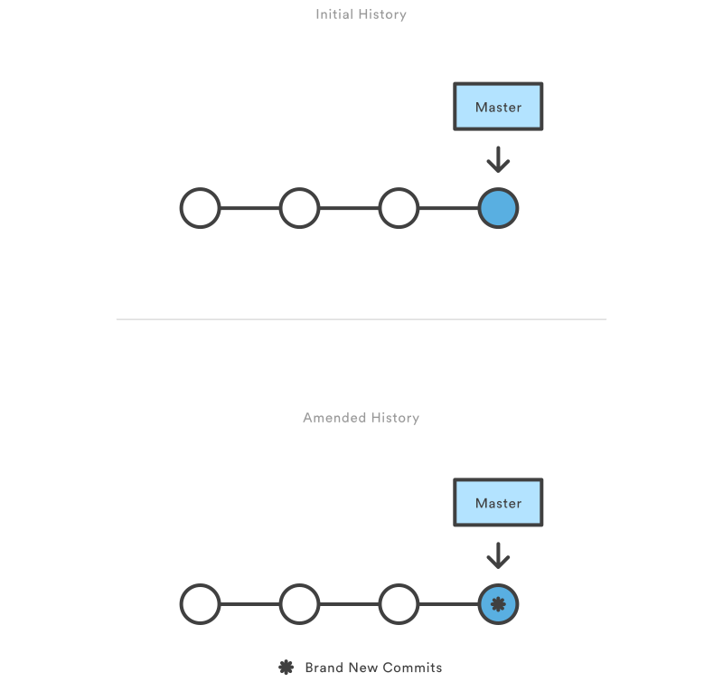
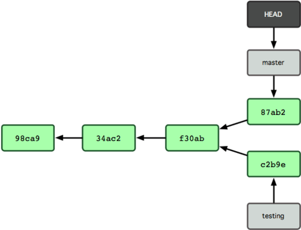

<nav id="table-of-contents">
<h2>Table of Contents</h2>
<div id="text-table-of-contents">
<ul>
<li><a href="#orgheadline1">1. 查看本地仓库更改记录</a></li>
<li><a href="#orgheadline2">2. 设置快捷命令</a></li>
<li><a href="#orgheadline3">3. 加上标签</a></li>
<li><a href="#orgheadline7">4. 返回功能</a>
<ul>
<li><a href="#orgheadline4">4.1. 返回某个特定的版本</a></li>
<li><a href="#orgheadline5">4.2. 丢弃本地操作</a></li>
<li><a href="#orgheadline6">4.3. commit的改进功能</a></li>
</ul>
</li>
<li><a href="#orgheadline22">5. 分支功能</a>
<ul>
<li><a href="#orgheadline8">5.1. 新建分支</a></li>
<li><a href="#orgheadline11">5.2. 查看分支</a>
<ul>
<li><a href="#orgheadline9">5.2.1. 查看本地分支</a></li>
<li><a href="#orgheadline10">5.2.2. 查看所有分支</a></li>
</ul>
</li>
<li><a href="#orgheadline12">5.3. 切换分支</a></li>
<li><a href="#orgheadline13">5.4. 克隆分支</a></li>
<li><a href="#orgheadline14">5.5. 合并分支</a></li>
<li><a href="#orgheadline17">5.6. 删除本地分支和github上的分支</a>
<ul>
<li><a href="#orgheadline15">5.6.1. 删除本地分支</a></li>
<li><a href="#orgheadline16">5.6.2. 删除github上的分支</a></li>
</ul>
</li>
<li><a href="#orgheadline18">5.7. 推送分支</a></li>
<li><a href="#orgheadline21">5.8. 下载github上的某个分支</a>
<ul>
<li><a href="#orgheadline19">5.8.1. 切换clone分支</a></li>
<li><a href="#orgheadline20">5.8.2. 只clone某个分支</a></li>
</ul>
</li>
</ul>
</li>
<li><a href="#orgheadline26">6. tag功能</a>
<ul>
<li><a href="#orgheadline23">6.1. 查看当前tag</a></li>
<li><a href="#orgheadline24">6.2. 添加一个tag</a></li>
<li><a href="#orgheadline25">6.3. 将tag推送到远程</a></li>
</ul>
</li>
<li><a href="#orgheadline31">7. 通过ssh来进行git操纵</a>
<ul>
<li><a href="#orgheadline27">7.1. 什么是bare仓库</a></li>
<li><a href="#orgheadline28">7.2. 新建一个bare仓库</a></li>
<li><a href="#orgheadline29">7.3. 远程clone根据这个bare仓库</a></li>
<li><a href="#orgheadline30">7.4. 本机ssh来git clone一个仓库</a></li>
</ul>
</li>
<li><a href="#orgheadline32">8. git clone 包括子git模块</a></li>
<li><a href="#orgheadline33">9. 参考资料</a></li>
</ul>
</div>
</nav>


# 查看本地仓库更改记录<a id="orgheadline1"></a>

    git log

使用git **log** 命令就可以查看本地仓库的更改记录。git log有很多设置，这里有个最简单的例子（参考了githowtu网页）：

```sh
git log --pretty="%h | %s%d[%an]" --graph
```

`--pretty=` ，控制输出格式：其中 `%h` commit hash值的缩写； `%s` 是commit的内容； `%d` 是commit的其它信息备注； `%an` 是commit的作者。然后 `--graph` 选项显示commit的分支树结构。 更多参数设置可参看 [这个网页](http://git-scm.com/book/zh/v1/Git-%E5%9F%BA%E7%A1%80-%E6%9F%A5%E7%9C%8B%E6%8F%90%E4%BA%A4%E5%8E%86%E5%8F%B2) 。

\*查看本地仓库目前的状态

    git status

使用git **status** 命令是查看目前仓库的状态，

# 设置快捷命令<a id="orgheadline2"></a>

git的 **alias** 也提供了一定的命令别名功能，具体例子如下所示：参考了githowto的 [这个网页](http://githowto.com/aliases) 。

```sh
git config --global alias.hist 
    'log --pretty="%h | %s%d[%an]" --graph'
```

这个命令具体是修改了主文件夹的.gitconfig文件，你可以打开看一下。

值得一提的是bash的alias命令来进行某些日常工作常用命令的封装也是很便捷的。比如把下面这行命令加入 `.bashrc` 文件中，以后就可以快捷地输入命令“gitpush”即可，其中commit的信息是当前的日期和时间。

一般日常提交就用这样简单的日期时间信息，如果有特别重大的版本推荐加上标签。

```sh
alias gitpush="git add --all . ;git commit -m '$(date +"%F %R")' ; git push origin master"
```

# 加上标签<a id="orgheadline3"></a>

git **tag** 命令是给某个重大的版本加上标签用的。加上的tag值可以作为checkout命令的索引值。

# 返回功能<a id="orgheadline7"></a>

版本控制软件最重要的一个功能就是能够返回到之前的文本编辑状态。

## 返回某个特定的版本<a id="orgheadline4"></a>

    git checkout  3fbdf2c

具体commit的hash值可用git log查看之，这个命令将会将本地文件夹返回到某个特定的版本状态。

## 丢弃本地操作<a id="orgheadline5"></a>

    git  checkout  .

如果你修改了本地的文件还没有add和commit，然后觉得不满意想要将修改全部丢弃，那么可以使用如上命令，这样本地文件夹将会返回到最后master未修改时候的样子。

如果你修改了本地的文件，已经add了，但是还没有commit，然后你想丢弃本地全部的操作，那么可以先：

    git  reset HEAD  .

然后再如上checkout之。

以上例子都用了当前目录下所有的文件 *.* 的表示，具体操作某个单个文件你可以直接引用那个文件的文件名。如：

    git  checkout test.txt

然后就算已经add了，你可以直接checkout返回HEAD。

    git  checkout  HEAD  .

然后如果已经commit了，那么返回到那个commit的那个版本即可，git当然可以取消某个commit，这里略过了。

## commit的改进功能<a id="orgheadline6"></a>

有的时候你提交一个commit了，然后又发现还有那个地方没有修改，或者commit的附加信息你不满意等等，你可以使用:

    git commit --amend

来覆写上一次你的commit记录，amend的意思是改进修正的意思。这里你只能amend你最近的那次commit，然后运行命令之后，等于你上一次所有的commit都被取消掉了，然后你做了一些修改，再重新进行一个commit。

[这个网页](https://www.atlassian.com/git/tutorials/rewriting-history/git-commit--amend) 的这个图片很好地说明了这个过程:



我们看到上一次的那个commit记录完全被覆写掉了，读者心里要有这个底，如果觉得稍微有点风险或者有点疑豫，那么再另外提交一个commit总不会有问题的。

# 分支功能<a id="orgheadline22"></a>

git的分支功能特别强大，推荐多使用来做到灵活开发。

git保存的是不是文件差异或者变化量而是一些列的文件快照。git在commit之后，除了相关的提交信息之外，还有一个指向这棵树的指针。而git中的分支本质上仅仅是个指向commit对象的可变指针。当使用 `git branch testing` 来新建一个分支之后，就是在目前这个commit对象上又新建了一个分支指针。然后git还保存了一个名叫 **HEAD** 的特别指针，其指向你正在工作的本地分支。因此运行git branch仅仅是新建了一个分支，系统并不会自动切换到那个分支，要切换到那个分支需要使用 `git checkout testing` 命令。如果master分支和testing分支各自向前commit推一次，然后一个分支样貌就如下图所示出来了:



按照pro git[参考资料1]的说法，Git中的分支实际上仅是一个包含所指对象校验和（40 个字符长度 SHA-1 字串）的文件，所以创建和销毁一个分支非常的廉价，而且切换也是非常的快。Git鼓励开发者频繁使用分支。

## 新建分支<a id="orgheadline8"></a>

如下新建一个git分支。

    git branch the_branch_name

额外需要提醒的是新建一个git分支之后，你还需要用checkout命令来切换到那个分支，否则是停留在原来的分支上的。

## 查看分支<a id="orgheadline11"></a>

### 查看本地分支<a id="orgheadline9"></a>

    git branch

### 查看所有分支<a id="orgheadline10"></a>

这里包括所有远程分支

    git branch -a

## 切换分支<a id="orgheadline12"></a>

    git checkout the_branch_name

## 克隆分支<a id="orgheadline13"></a>

使用git clone某个项目如果你只想克隆某个分支，那么可以加上 `-b` 选项来控制:

    git clone -b the_branch_name the_project_url

## 合并分支<a id="orgheadline14"></a>

如果你的master分支想要合并某个分支，那么首先切换到master分支，然后使用git merge合并分支之，如下所示:

    git checkout master
    git merge the_branck_name

合并采用的没有的新建，有的迭加合并，其中某些文件有冲突的可能需要手工处理。

## 删除本地分支和github上的分支<a id="orgheadline17"></a>

本小节参考了 [这个网页](http://stackoverflow.com/questions/2003505/delete-a-git-branch-both-locally-and-remotely) 。

### 删除本地分支<a id="orgheadline15"></a>

    git branch -D branch_name

### 删除github上的分支<a id="orgheadline16"></a>

    git push origin :branch_name

## 推送分支<a id="orgheadline18"></a>

    git push origin dev:dev

这里的意思是本地有一个dev分支，现在将其推送到远程的dev分支上去。我们看到这和删除远程分支的语法有点类似，除了冒号前面没有指定本地分支。

还有一种很不规范的做法:

    git push origin dev:master

这是将本地的dev分支推送到远程master分支上去，不推荐这么做，尽量让本地分支和e远程分支名字一样吧，免得自己也弄混了。

## 下载github上的某个分支<a id="orgheadline21"></a>

### 切换clone分支<a id="orgheadline19"></a>

参看了 [这个网页](http://blog.csdn.net/xqs83/article/details/7382074) ，默认 git clone 会clone整个仓库，但是本地只创建master分支，你可以通过 `git branch -a` 来查看远程分支，然后

    git checkout -b 本地分支名字 remotes/远程分支名字

### 只clone某个分支<a id="orgheadline20"></a>

    git clone -b master --single-branch  https://github.com/pydata/pandas

这样clone下来某个分支，如果想要再clone另外一个分支呢？

# tag功能<a id="orgheadline26"></a>

我们看到github上有个release栏就是基于git的轻量级tag功能。

## 查看当前tag<a id="orgheadline23"></a>

    git tag

## 添加一个tag<a id="orgheadline24"></a>

最简单的添加一个轻量级tag就是:

    git tag tag_name

## 将tag推送到远程<a id="orgheadline25"></a>

    git push --tag

然后我们就可以在github上看到这个release了。这里参看了 [这篇文章](http://zengrong.net/post/1746.htm) 。

# 通过ssh来进行git操纵<a id="orgheadline31"></a>

## 什么是bare仓库<a id="orgheadline27"></a>

我们往github上推送的时候，实际上是推送到github的另外一个bare仓库，然后我们在github上看到的远程仓库，实际上是github根据那个bare仓库来自动pull更新的另一个仓库。请参看 [这个网页](http://www.saintsjd.com/2011/01/what-is-a-bare-git-repository/) 。把这个弄明白了后面要讲的操作流程就很清晰了。

## 新建一个bare仓库<a id="orgheadline28"></a>

假设我们在blog.git这个文件夹下面:

    git init --bare

## 远程clone根据这个bare仓库<a id="orgheadline29"></a>

    git clone -l /the/path/to/blog.git/

这样克隆下来远程的这个仓库就可以直接用 **origin** 来进行之前提及的git的一些日常操作了。

## 本机ssh来git clone一个仓库<a id="orgheadline30"></a>

下面的 `100.100.100.100` 是虚拟远程主机外网ip。端口号也是虚拟的。

    git clone ssh://root@100.100.100.100:22/the/path/to/blog.git

同样，这样clone下来的仓库也可以直接用 **origin** 来进行之前提及的git的一些日常操作了，具体连接方式就是上面描述的ssh的连接方式。

# git clone 包括子git模块<a id="orgheadline32"></a>

参考了 [这个网页](http://stackoverflow.com/questions/3796927/how-to-git-clone-including-submodules) 。

    git clone --recursive what.git

# 参考资料<a id="orgheadline33"></a>

1.  [pro git第一版中文版](http://git-scm.com/book/zh/v1)
2.  推送分支部分参考了[这个网页](http://www.cnblogs.com/wangkangluo1/archive/2011/09/02/2164313.html) ，不过其内容过于混乱，没什么看头。