<nav id="table-of-contents">
<h2>Table of Contents</h2>
<div id="text-table-of-contents">
<ul>
<li><a href="#orgheadline4">1. ERP简介</a>
<ul>
<li><a href="#orgheadline1">1.1. Odoo历史</a></li>
<li><a href="#orgheadline3">1.2. ERPⅡ或商业智能化</a>
<ul>
<li><a href="#orgheadline2">1.2.1. 什么是商业智能</a></li>
</ul>
</li>
</ul>
</li>
<li><a href="#orgheadline7">2. Odoo框架简介</a>
<ul>
<li><a href="#orgheadline5">2.1. python模块分析</a></li>
<li><a href="#orgheadline6">2.2. python2还是python3</a></li>
</ul>
</li>
<li><a href="#orgheadline19">3. Odoo的安装和配置</a>
<ul>
<li><a href="#orgheadline8">3.1. PostgreSQL数据库</a></li>
<li><a href="#orgheadline9">3.2. Ubuntu14.04下可能缺失的软件包</a></li>
<li><a href="#orgheadline10">3.3. 网页显示node.js方面</a></li>
<li><a href="#orgheadline11">3.4. 其他问题</a></li>
<li><a href="#orgheadline16">3.5. 通过命令行运行时的配置</a>
<ul>
<li><a href="#orgheadline12">3.5.1. &#x2013;xmlrpc-port=8888</a></li>
<li><a href="#orgheadline13">3.5.2. &#x2013;addons-path=addons</a></li>
<li><a href="#orgheadline14">3.5.3. 数据库的一些配置</a></li>
<li><a href="#orgheadline15">3.5.4. &#x2013;save</a></li>
</ul>
</li>
<li><a href="#orgheadline17">3.6. 将安装环境封装起来</a></li>
<li><a href="#orgheadline18">3.7. 文档编译</a></li>
</ul>
</li>
<li><a href="#orgheadline31">4. 初入Odoo</a>
<ul>
<li><a href="#orgheadline20">4.1. 管理数据库</a></li>
<li><a href="#orgheadline21">4.2. 登录界面</a></li>
<li><a href="#orgheadline22">4.3. Administrator首选项</a></li>
<li><a href="#orgheadline23">4.4. 导入一个翻译</a></li>
<li><a href="#orgheadline24">4.5. 新的Demo用户</a></li>
<li><a href="#orgheadline25">4.6. 模块管理</a></li>
<li><a href="#orgheadline26">4.7. 修改公司信息</a></li>
<li><a href="#orgheadline27">4.8. 打开技术特性支持之后</a></li>
<li><a href="#orgheadline29">4.9. 进销存和财务系统的抽象讨论</a>
<ul>
<li><a href="#orgheadline28">4.9.1. 以采购部门为例</a></li>
</ul>
</li>
<li><a href="#orgheadline30">4.10. 安装和配置模块</a></li>
</ul>
</li>
<li><a href="#orgheadline48">5. 创建自己的模块</a>
<ul>
<li><a href="#orgheadline35">5.1. 快速生成模块骨架</a>
<ul>
<li><a href="#orgheadline32">5.1.1. python模块的init文件</a></li>
<li><a href="#orgheadline34">5.1.2. 作为Odoo模块的说明文件</a>
<ul>
<li><a href="#orgheadline33">5.1.2.1. 属性值清单:</a></li>
</ul>
</li>
</ul>
</li>
<li><a href="#orgheadline37">5.2. 安装自定义模块</a>
<ul>
<li><a href="#orgheadline36">5.2.1. 模块文件夹管理</a></li>
</ul>
</li>
<li><a href="#orgheadline43">5.3. 一个简单的演示模块</a>
<ul>
<li><a href="#orgheadline38">5.3.1. controllers</a></li>
<li><a href="#orgheadline39">5.3.2. views</a></li>
<li><a href="#orgheadline40">5.3.3. models</a></li>
<li><a href="#orgheadline41">5.3.4. security</a></li>
<li><a href="#orgheadline42">5.3.5. 美化网页</a></li>
</ul>
</li>
<li><a href="#orgheadline47">5.4. 加分项:通过pgadmin3来查看数据库</a>
<ul>
<li><a href="#orgheadline44">5.4.1. 安装</a></li>
<li><a href="#orgheadline45">5.4.2. 连接服务器</a></li>
<li><a href="#orgheadline46">5.4.3. 图形化查询</a></li>
</ul>
</li>
</ul>
</li>
<li><a href="#orgheadline60">6. Odoo开发基础: 请假模块第一谈</a>
<ul>
<li><a href="#orgheadline49">6.1. 纯理论讨论</a></li>
<li><a href="#orgheadline50">6.2. 定义模型</a></li>
<li><a href="#orgheadline53">6.3. 加入菜单</a>
<ul>
<li><a href="#orgheadline51">6.3.1. act_window 的属性</a></li>
<li><a href="#orgheadline52">6.3.2. menuitem 的属性</a></li>
</ul>
</li>
<li><a href="#orgheadline57">6.4. 视图优化</a>
<ul>
<li><a href="#orgheadline54">6.4.1. 修改tree视图</a></li>
<li><a href="#orgheadline56">6.4.2. 修改form视图</a>
<ul>
<li><a href="#orgheadline55">6.4.2.1. 使用group布局</a></li>
</ul>
</li>
</ul>
</li>
<li><a href="#orgheadline58">6.5. 完整的views.xml</a></li>
<li><a href="#orgheadline59">6.6. 给模块加个图标</a></li>
</ul>
</li>
<li><a href="#orgheadline64">7. Odoo开发基础: 工作计划模块第一谈</a>
<ul>
<li><a href="#orgheadline63">7.1. 数据访问权限管理</a>
<ul>
<li><a href="#orgheadline61">7.1.1. access rule</a></li>
<li><a href="#orgheadline62">7.1.2. record rule</a></li>
</ul>
</li>
</ul>
</li>
<li><a href="#orgheadline79">8. 扩展现有模块－继承机制</a>
<ul>
<li><a href="#orgheadline65">8.1. 给模块增加field</a></li>
<li><a href="#orgheadline66">8.2. 修改已有的field</a></li>
<li><a href="#orgheadline70">8.3. 重载原模型的方法</a>
<ul>
<li><a href="#orgheadline67">8.3.1. 什么是Recordset</a></li>
<li><a href="#orgheadline68">8.3.2. Odoo里面的domain语法</a></li>
<li><a href="#orgheadline69">8.3.3. recordset的search方法</a></li>
</ul>
</li>
<li><a href="#orgheadline73">8.4. 视图xml文件的继承式修改</a>
<ul>
<li><a href="#orgheadline71">8.4.1. 视图元素添加</a></li>
<li><a href="#orgheadline72">8.4.2. 原视图元素属性修改</a></li>
</ul>
</li>
<li><a href="#orgheadline74">8.5. 多态继承</a></li>
<li><a href="#orgheadline77">8.6. 修改其他数据文件</a>
<ul>
<li><a href="#orgheadline75">8.6.1. 删除记录</a></li>
<li><a href="#orgheadline76">8.6.2. 更新数据</a></li>
</ul>
</li>
<li><a href="#orgheadline78">8.7. 委托继承</a></li>
</ul>
</li>
<li><a href="#orgheadline88">9. 理解模型内的数据文件</a>
<ul>
<li><a href="#orgheadline80">9.1. 理解外部id</a></li>
<li><a href="#orgheadline81">9.2. 使用外部id</a></li>
<li><a href="#orgheadline82">9.3. 导出或导入数据文件</a></li>
<li><a href="#orgheadline83">9.4. 快捷输入标签</a></li>
<li><a href="#orgheadline87">9.5. 用field标签设置值</a>
<ul>
<li><a href="#orgheadline84">9.5.1. eval语法</a></li>
<li><a href="#orgheadline85">9.5.2. ref属性</a></li>
<li><a href="#orgheadline86">9.5.3. One2many和Many2many的eval赋值</a></li>
</ul>
</li>
</ul>
</li>
<li><a href="#orgheadline94">10. Odoo开发基础: 请假模块第二谈</a>
<ul>
<li><a href="#orgheadline89">10.1. 本例涉及到的数据库表格简介</a></li>
<li><a href="#orgheadline93">10.2. 工作流概念入门</a>
<ul>
<li><a href="#orgheadline90">10.2.1. 定义工作流对象</a></li>
<li><a href="#orgheadline91">10.2.2. 创建节点</a></li>
<li><a href="#orgheadline92">10.2.3. 创建连接</a></li>
</ul>
</li>
</ul>
</li>
<li><a href="#orgheadline101">11. Odoo模型层详解</a>
<ul>
<li><a href="#orgheadline95">11.1. _name</a></li>
<li><a href="#orgheadline96">11.2. 各个表头属性</a></li>
<li><a href="#orgheadline97">11.3. name字段</a></li>
<li><a href="#orgheadline98">11.4. 具体模型的数据</a></li>
<li><a href="#orgheadline99">11.5. 模型间的关系</a></li>
<li><a href="#orgheadline100">11.6. 工作流</a></li>
</ul>
</li>
<li><a href="#orgheadline102">12. Odoo视图层详解</a></li>
<li><a href="#orgheadline137">13. 附录</a>
<ul>
<li><a href="#orgheadline103">13.1. Odoo里老的API</a></li>
<li><a href="#orgheadline105">13.2. PostgreSQL数据库命令行操作</a>
<ul>
<li><a href="#orgheadline104">13.2.1. 命令行数据库备份</a></li>
</ul>
</li>
<li><a href="#orgheadline111">13.3. 反向代理(reverse proxy)</a>
<ul>
<li><a href="#orgheadline107">13.3.1. 安装ngnix软件</a>
<ul>
<li><a href="#orgheadline106">13.3.1.1. 释放http默认端口号</a></li>
</ul>
</li>
<li><a href="#orgheadline108">13.3.2. 强制https连接</a></li>
<li><a href="#orgheadline109">13.3.3. nginx优化</a></li>
<li><a href="#orgheadline110">13.3.4. 轮询机制</a></li>
</ul>
</li>
<li><a href="#orgheadline115">13.4. 跟踪项目源码初始化进程</a>
<ul>
<li><a href="#orgheadline112">13.4.1. base模块</a></li>
<li><a href="#orgheadline113">13.4.2. web模块</a></li>
<li><a href="#orgheadline114">13.4.3. web_kanban模块</a></li>
</ul>
</li>
<li><a href="#orgheadline118">13.5. 配置会计科目</a>
<ul>
<li><a href="#orgheadline116">13.5.1. 配置会计科目类型</a></li>
<li><a href="#orgheadline117">13.5.2. 配置会计科目</a></li>
</ul>
</li>
<li><a href="#orgheadline119">13.6. 分录</a></li>
<li><a href="#orgheadline122">13.7. 新建业务伙伴</a>
<ul>
<li><a href="#orgheadline120">13.7.1. 新建业务伙伴标签</a></li>
<li><a href="#orgheadline121">13.7.2. 新建客户</a></li>
</ul>
</li>
<li><a href="#orgheadline123">13.8. 创建新的产品</a></li>
<li><a href="#orgheadline124">13.9. 设置会计年度</a></li>
<li><a href="#orgheadline125">13.10. 向供应商下单</a></li>
<li><a href="#orgheadline135">13.11. 会计学入门</a>
<ul>
<li><a href="#orgheadline126">13.11.1. 财务报表</a></li>
<li><a href="#orgheadline127">13.11.2. 原始凭证</a></li>
<li><a href="#orgheadline131">13.11.3. 账户</a>
<ul>
<li><a href="#orgheadline128">13.11.3.1. 资产类账户</a></li>
<li><a href="#orgheadline129">13.11.3.2. 负债类账户</a></li>
<li><a href="#orgheadline130">13.11.3.3. 所有者权益账户</a></li>
</ul>
</li>
<li><a href="#orgheadline132">13.11.4. 分类帐</a></li>
<li><a href="#orgheadline133">13.11.5. 会计科目表</a></li>
<li><a href="#orgheadline134">13.11.6. 报告期间</a></li>
</ul>
</li>
<li><a href="#orgheadline136">13.12. 参考资料</a></li>
</ul>
</li>
</ul>
</div>
</nav>


# ERP简介<a id="orgheadline4"></a>

## Odoo历史<a id="orgheadline1"></a>

Odoo8的前身是“Tiny ERP”，最初是由比利时的Fabien Pinckaers 创建的。


到2009年的时候，发布第5版，公司获得风投，盈利增长迅速，软件更名为OpenERP。OpenERP这个名字最为人们熟知，当时软件已经包含几百个模块了，从财务管理、
采购/销售管理、库存管理到人力资源管理、销售点管理、项目管理等等都有。当时可能某些模块的功能已经开始超过传统意义上的ERP（Enterprise Resource Planning，企业资源规划）的定义了（不过最新的ERPⅡ定义则更广泛，下面会有详细的讨论。）。

而在2014年9月，软件发布第8版，在之前版本逐渐优化的web client这一块的基础上，进行了大范围的功能加强。比如有了Website builder模块，可以方便公司快速架构出自己的网站；e-commerce模块方便公司快速搭建销售平台；还有business intelligence这个模块，可以辅助生成高质量的说明演示用的图形等等等等。这使得OpenERP这个名字已经不能很好地说明这个软件的雄心壮志了，于是软件更名为 **Odoo** 这个名字了，目前最新的版本是Odoo8【预计2015年7月份出Odoo9】。

可以看得出来目前该软件的开发方向就是基于web client/server模型，将公司内部所涉及到的所有的信息流都整合起来，其不仅包括具体实施层面，也包括分析决策层面。可以预见不久的将来Odoo开发将快速为公司构建出这样一个生态圈:

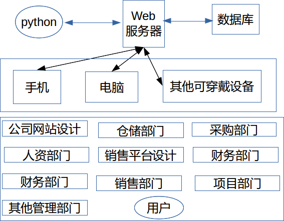

## ERPⅡ或商业智能化<a id="orgheadline3"></a>

随着信息时代的到来，商业也不可避免地走向信息化，智能化。最新的ERPⅡ的概念包含的内容如下所示:

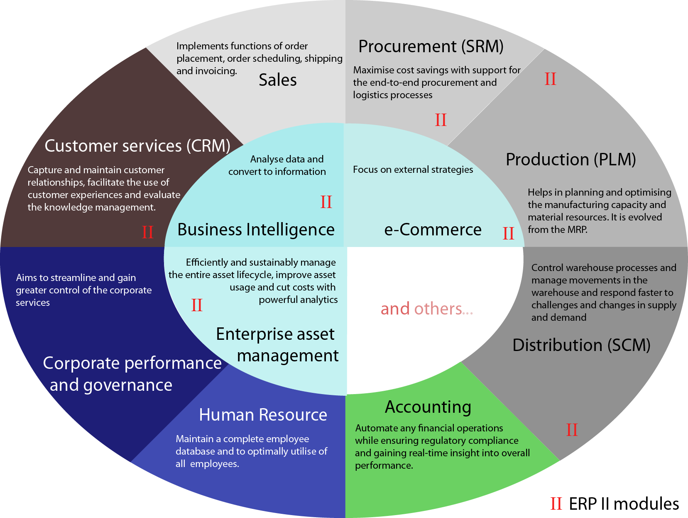

-   Business Intelligence 商业智能，其主要关注于分析数据，并将数据变成知识这一过程。
-   e-Commerce 电子商务，关注于对外战略。
-   Enterprise asset management 企业资产管理，有效可持续地管理公司的资产生命周期，用强有力的分析工具来提高资产使用率和削减成本。

-   Procurement(SRM) 采购，最大化的节约成本和支持终端对终端的采购，还有物流过程。
-   Production(PLM) 生产，帮助管理和优化生产能力和物料资源。是MRP的升级版。<sup><a id="fnr.1" class="footref" href="#fn.1">1</a></sup> 这里谈论的PLM不仅要解决物料需求问题，而且要解决生产的时间问题，从而达到优化生产能力的目的。

-   Distribution(SCM) 配送，控制仓库流程，使其能够对补给需求或更改做出快速的反应。
-   Accounting 会计，自动化财务管理，同时要确保管理的便捷和对绩效做出实时反映。
-   Human Resource 人资，维护一个完整的雇员数据库，更好地使用所有雇员。
-   Corporate performance and governance 公司表现监管，对公司的各个部门更高的控制，目标让他们能够流水线作业。
-   Customer services(CRM) 客服，获取和维护和客户的关系，充分利用客户的体验来进行知识管理评估。（其和BI模块结合很紧密）
-   Sales 销售，具体的定单确认，下单，货运和开发票等。

### 什么是商业智能<a id="orgheadline2"></a>

商业智能（Business intelligence）的概念经由Howard Dresner（1989年）的通俗化而被人们广泛了解。其将商业智能定义为：一类由数据仓库（Data warehouses）、查询报表、数据分析、数据挖掘、数据备份和恢复等部分组成的、以帮助企业决策为目的技术及其应用。

目前商业智能被理解为将企业中的现有数据转化为知识，帮助企业做出 *明智的* 的业务经营决策的工具。这里所谈的数据包括来自企业业务系统的订单、库存、交易账目、客户和供应商资料及来自企业所处行业和竞争对手的数据，以及来自企业所处的其他外部环境中的各种数据。而商业智能能够辅助的业务经营决策既可以是作业层的，也可以是管理层和策略层的决策。

商业智能（BI）的架构示意图如下<sup><a id="fnr.2" class="footref" href="#fn.2">2</a></sup>。

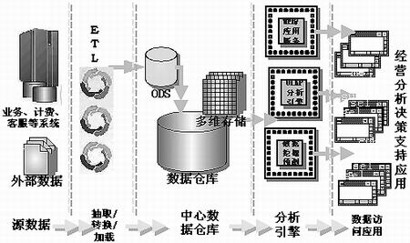

典型的BI系统包括：

-   **ETL过程:** ETL过程是指对于数据的抽取（Extraction）、转换（Transformation）和装载（Load）。该部分从各业务系统中抽取、转换、装载数据到数据仓库。此部分通常提供一些配置手段，使得用户能够比较方便的从各种数据源取得数据，并设置规则，将数据变换成需要的形式。odoo带有ETL模块。

-   **数据仓库:** 用于存放ETL抽取回来的数据，此部分通常是经过数据仓库优化的关系数据库。用于数据仓库的关系数据库特别适于处理大数据量及多维数据集。odoo的BI模块直接以PostgreSQL数据库作为数据仓库。

-   **OLAP:** 通常是实现了MDX（多维数据查询，Multi-Dimensional eXpress）语言的多维数据集（Cube）查询器。MDX有些类似于SQL，但比SQL更简单，是数据分析语言的事实标准。OpenERP的BI模块支持MDX语言。

-   **报表工具:** 用于展现MDX的查询结果，通常提供方便手段访问和格式化数据，提供丰富的数据呈现方式。odoo的BI模块以pyChart作为报表工具，报表开发方法和odoo中的Graph视图类似。

# Odoo框架简介<a id="orgheadline7"></a>

下面一副图很好地说明了Odoo技术框架:


-   PostgreSQL数据库

-   Object Relation Mapping 也就是大家熟知的SQL ORM包装层。Odoo除了使用的基本的 **psycopg2** 作为接口之外，ORM层是Odoo自己写的。

-   Base Module Distribution 官方基本模块

-   Report Engine 负责生成各种报表。目前支持的报表格式有 PDF,OpenOffice,HTML 三种。

-   Workflow Engine 工作流引擎。支持任意复杂度的工作流。

-   WebService 提供网络调用接口。目前支持 Net-RPC、XML-RPC 两种。Odoo和flask一样使用Werkzeug作为WSGI层的包装，jinja2作为模板工具。然后剩下的框架部分是Odoo自己写的。

## python模块分析<a id="orgheadline5"></a>

Odoo这个框架使用了很多模块，从这些模块的使用我们可以大致看出Odoo的工作原理。其中最主要的模块有: 

-   psycopg2 PostgreSQL数据库接口，其ORM层Odoo是自己写的，python中有类似的模块SQLAlchemy或者peewee等。​

-   Werkzeug和jinja2作为Odoo网络服务器框架的基础，同样flask也基于这两个模块。​

-   babel为网页提供国际化方案，MarkupSafe可处理Markdown标记语言，lxml用于分析网页，mock和unittest2用于单元测试加强，pyserial用于串口通信，pyusb用于处理usb，requests用于处理网络协议，xlwt用来支持excel表格，pillow用于图像处理。这些模块都较好，目前也处于活跃开发中，已支持python3。​

-   pyPDF模块用来处理PDF的，以后推荐使用pypdf2模块。pychart这个模块也快被废弃了，关于后台运算和绘图这一块推荐使用目前流行的ipython系(numpy和matplotlib等)来解决。​

还有其他一些琐碎的模块十几个，这个以后再慢慢了解。​

## python2还是python3<a id="orgheadline6"></a>

Odoo框架严格意义上来说只支持python2.7，其他python版本都不支持，也因为这种局限性，也带来对其他一些python模块的版本号的选择性。​

我做过试着编译Odoo的python3版本(经过2to3脚本处理之后)，其依赖的python模块目前绝大部分都已经支持python3了，就是Odoo框架自身，要移植到python3问题还很大，最大的阻碍就是他自己写SQL ORM那一部分。​

同时我们还要考虑官方自带的模块更新也是基于python2.7的，所以很长一段时间之内，都还是安心使用python2.7版本的Odoo框架，直到官方发布支持python3的版本或者我们写出了一个比他更好的框架。​

python2.7和python3版本之间的差异在不断缩小，但还是有很多小细节上的差异，这块需要额外的留心。​

# Odoo的安装和配置<a id="orgheadline19"></a>

Odoo项目的github地址是 [<https://github.com/odoo/odoo>](https://github.com/odoo/odoo) 。我们可以看到这个项目非常活跃，下面的内容都基于Odoo8。推荐使用github的最新版本。

常规的安装就是到 Odoo的github 地址那里下载源码，然后运行: ​

```sh
sudo python setup.py install ​
```

安装之，当然Odoo框架稍微复杂一点，这么简单处理一般是不会安装成功的，下面就一些额外的操作做出说明。​

首先强调第一个问题: *注意* ，在Ubuntu下，下载下的源码不要放在有中文名字的目录下面了，目前还不支持中文目录，包括桌面文件夹。

接下来我们git clone 下Odoo的源码，然后python-dev  build-essential 是一般都要安装的，推荐先用apt-get安装上。

然后是pip工具要安装上去: 

```python
sudo apt-get install python-pip
```

然后运行

```python
sudo pip install -U pip
```

来将pip升级到最新的工具。

setuptools模块应该通过pip也安装上去了，不太确定，推荐用pip安装一下，顺便也确保升级到最新的版本。

```python
sudo pip install -U setuptools
```

## PostgreSQL数据库<a id="orgheadline8"></a>

PostgreSQL是很有名的一个开源数据库，最初由加州大学伯克利分校的计算机系开发，其和sqlite3最大的区别就是其采用了client/server模型，Odoo搭建在PostgreSQL基础之上了，也继承了这种client/server模型。Odoo对PostgreSQL数据库的版本号要求不是很严格，用最新的也是可以的。

PostgreSQL数据库在ubuntu下安装是很方便的，就用apt-get简单安装即可。

```sh
sudo  apt-get install postgresql
```

但是这样安装之后，你需要牢记一点的是，新安装的PostgreSQL数据库还只有 **postgres** 这个用户有新建role（或说用户）和新建数据库的权限。你需要通过postgres这个用户来执行createuser命令才能顺利创建一个新的用户。

    sudo -u postgres createuser $USER

如果某个用户不存在，那么PostgreSQL将会报错: 

    createdb: could not connect to database template1: FATAL:  role "wanze" does not exist

你还可以通过postgres创建一个数据库: 

    sudo -u postgres createdb dbname

如果你的用户名已经创建了，然后这个dbname也已经创建了，那么你就可以用psql命令行登入这个数据库来进行相关操作了。不过Odoo框架要求你这个用户还具有可以创建数据库的权限。这需要你如下这样去做: 

    sudo -u postgres psql postgres
    ALTER USER wanze CREATEDB;

首先是用postgres用户身份登入postgres这个数据库，这个数据库放着PostgreSQL的一些配置信息。然后使用SQL语句 `ALTER USER wanze CREATEDB;`

这样你的用户就有了创建数据库的权限了，这块内容参考了 [这个网页](http://dba.stackexchange.com/questions/33285/how-to-i-grant-a-user-account-permission-to-create-databases-in-postgresql) 。

如果系统提示你没有 `.psql_history` 这个文件，那么简单的touch一下即可。

## Ubuntu14.04下可能缺失的软件包<a id="orgheadline9"></a>

这些缺失的软件包主要和一些依赖的python模块有关。也就是如果使用whell技术封装的whl包可能是不需要安装下述的这些软件包了，不过最好还是都确保安装上吧。

关于python-ldap 模块的安装参考了 [这个网页](http://stackoverflow.com/questions/4768446/python-cant-install-python-ldap) ，请确保下面两个软件包都安装了（否则会提示找不到lber.h错误）: 

    sudo apt-get install libldap2-dev 
    sudo apt-get install libsasl2-dev

关于psycopg2模块请确保下面软件包安装了: 

    sudo apt-get install libpq-dev

还有这几个软件包确保安装了，其中libxml2和lxml模块有关。

    sudo apt-get install libxml2-dev
    sudo apt-get install libxslt1-dev

pillow模块需要安装下面这个软件包:

    sudo apt-get install libjpeg-dev

随着系统的变动，你可能还缺少某些软件包，这个就要具体情况具体分析了。

## 网页显示node.js方面<a id="orgheadline10"></a>

按照官方文档的描述，ubuntu14.04 nodejs已经安装了，只需要通过npm安装 less 和 less-plugin-clean-css ，然后给nodejs创建一个别名链接 node 即可。

    sudo apt-get install -y npm
    sudo npm install -g less less-plugin-clean-css
    sudo ln -s /usr/bin/nodejs /usr/bin/node

然后ubuntu小于14.04的版本还额外需要手工安装nodejs。

## 其他问题<a id="orgheadline11"></a>

1.  pydot因为googlecode不能用了，你需要用pip命令单独install pydot将其安装好。或者到 [github](https://github.com/erocarrera/pydot) 这里下载之。
2.  可能有其他模块因为网络问题或者其他问题下载失败，你可以考虑用pip命令来安装或者到github下载对一个模块的源码来安装之。
3.  PostgreSQL的连接配置可能会出问题，修改 `/etc/postgresql/.../main/pg_hba.conf` 文件，看到

    # "local" is for Unix domain socket connections only
    local    all     all     peer

注意前面的postgres用户那一行绝对不要动，然后这里指本地连接，一般设置为peer，或者干脆设置为trust。

然后重启PostgreSQL服务器:

    sudo service postgresql restart

## 通过命令行运行时的配置<a id="orgheadline16"></a>

在源码包目录下运行odoo.py文件即可启动Odoo，下面是一切其他参数的配置。

### &#x2013;xmlrpc-port=8888<a id="orgheadline12"></a>

设置网页显示的端口号，默认是8069，但可能会出于某些原因被占用了。

### &#x2013;addons-path=addons<a id="orgheadline13"></a>

设置插件addons的路径，默认会把源码addons文件夹加上去，但可能会出错。这里设置为源码的addons文件夹。

设置多个addons路径语法如下: `--addons-path=addons, myaddons` ，这可以用于加载你自己定义的某些模块。

上面两个参数配置是最常用的，我就简单设置这两个参数就可以运行Odoo了: 

    ./odoo.py --addons-path=addons --xmlrpc-port=8888

### 数据库的一些配置<a id="orgheadline14"></a>

这一块推荐先不设置，就使用默认的 `$USER` ，然后创建数据库进入Odoo之后再配置。除非读者对PostgreSQL非常熟悉之后，再考虑更改这些配置（因为本地localhost登录还有用户权限还有连接方式上PostgreSQL里面还有很多内容，要小心啊。）。

-   &#x2013;db\_user=

这个参数用于指定Odoo框架数据库的user，又是你不想使用默认的 `$USER` ，那么可以加上这个参数。

-   &#x2013;database=

这个参数用于指定具体Odoo框架使用的数据库，如上你不想使用默认的 `$USER` ，那么此时最好也为你想要的新用户名创建一个新的数据库。

-   &#x2013;db\_password=

这个参数用于指定登录某个数据库时的密码。

### &#x2013;save<a id="orgheadline15"></a>

保存目前你的运行命令行配置，下次就可以简单使用./odoo.py来运行了。具体配置文件是主文件夹的 `.openerp_serverrc` 。有兴趣的可以打开看一下。 

## 将安装环境封装起来<a id="orgheadline17"></a>

我们在开发的时候，最好把所有依赖的python模块包版本号都固定起来，这可以通过pyhon的virtualenv模块来实现。安装virtualenv模块是:

```sh
sudo apt-get install python-virtualenv
sudo pip install -U virtualenv
```

最好如上将virtualenv升级到最新的版本。

然后我们将Odoo框架的源码加入进去，然后再安装一次。这里不赘述了。安装成功之后，我们使用pip freeeze命令来将目前的python模块包版本号环境输出出来:

```sh
pip freeze &gt; requirements.txt
```

这样下次我们可以直接 `pip install -r requirements.txt` 来将依赖的python模块包刷一遍。但这还不够好。利用最新的wheel技术，我们可以将这些依赖的python模块包打包出来，从而可以实现不依赖网络的更快速的安装。

首先是安装wheel模块:

```sh
pip install wheel
```

然后:

```sh
pip wheel -r requirements.txt
```

注意将requirements.txt中的odoo版本删除，然后将pychart改成:

    http://download.gna.org/pychart/PyChart-1.39.tar.gz#egg=PyChart

命令行执行完之后看到wheelhouse文件夹里面有一大堆whl文件，这就是所谓的pip模块安装包，其安装不依赖任何系统的工具，如果你有python环境，然后已经安装了pip工具，然后运行:

    sudo pip install *.whl

就可以把所有依赖的python模块安装上去了，这个安装过程也不依赖于网络。

借助于virtualenv工具和wheel工具，你可以快速对你的开发环境进行再更新。比如你想升级你的开发环境的某个模块了，将其升级之后测试没有问题，就可以将其pip freeeze出来，然后pip wheel出来，这样就可以快速在其他机器上部署这个开发环境了。有时可能有些模块的某些版本号wheel不出来，最好将这个模块版本号倒退。

## 文档编译<a id="orgheadline18"></a>

这部分是可选的，就是编译文档。需要通过pip安装sphinx和sphinx-patchqueue，然后就可以make html 和latex了，通过latex就可以make出pdf文档了，这方便在本机上查阅资料。

    pip install sphinx
    sudo pip install sphinx
    sudo pip install sphinx-patchqueue
    make html
    make latex

# 初入Odoo<a id="orgheadline31"></a>

如上安装配置好之后，在网页浏览器上输入 `127.0.0.1:8069` （具体端口号读者要视自己的情况而定）之后我们就会看到如下界面:

## 管理数据库<a id="orgheadline20"></a>

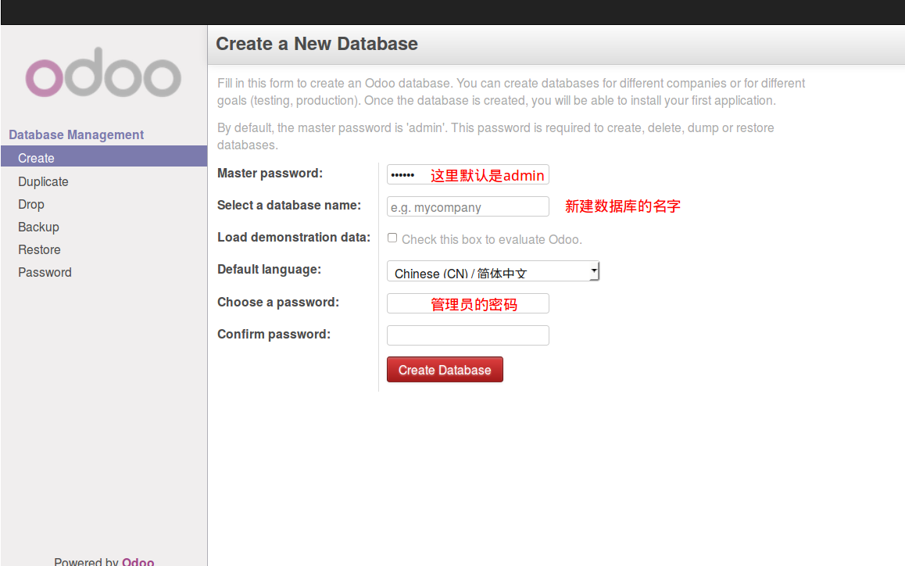

这里不仅新建了一个数据库，还指定了管理员的新密码，以后管理员要用那个新密码登录，用户名还是默认的 `admin` 。

左边有create（新建数据库），duplicate（复制数据库），drop（删除数据库），backup（备份数据库），restore（恢复数据库），password（修改管理员密码）。

然后这个管理数据库的url最好记下来，有的时候登入Odoo出问题了，这个管理数据库的界面你还是可以进入的，可以考虑还原数据库等操作。 `http://127.0.0.1:8069/web/database/manager` 。

读者可以如下用 `psql -l` 命令来查看一下，具体新建的那个数据库。

创建好数据库之后，我们就看到这个界面了，我们看到这里有很多模块。

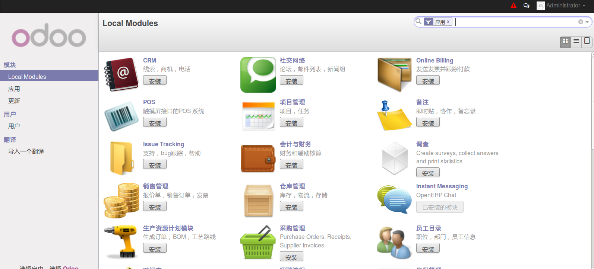

## 登录界面<a id="orgheadline21"></a>

因为我们给Odoo框架创建数据库权限了，所以Odoo现在支持一切高级数据库操作了。我们注销Administor账户，然后就会看到一个登录界面。

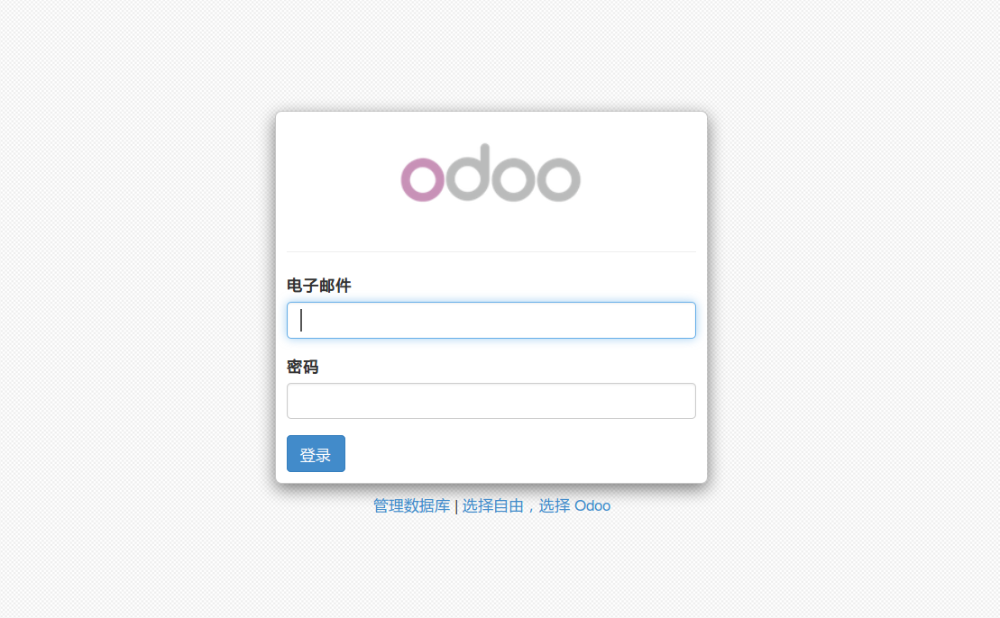

然后下面就有一个管理数据库的链接，点击就进入之前看到的管理数据库界面了。

## Administrator首选项<a id="orgheadline22"></a>

在右上角Administrator→首选项那里可以设置网站的语言，时区，还有管理员的头像，管理员的邮箱和个性签名。

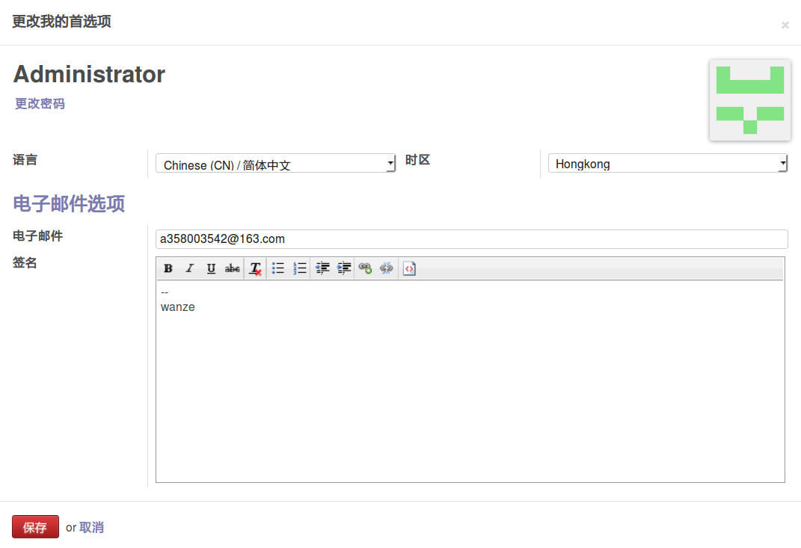

## 导入一个翻译<a id="orgheadline23"></a>

看到左侧翻译一栏，点击导入一个翻译即可加载一个翻译。

## 新的Demo用户<a id="orgheadline24"></a>

看到左侧用户一栏，点击创建一个新用户，即进入创建一个新用户的界面。这里将新建一个演示用的Demo用户。

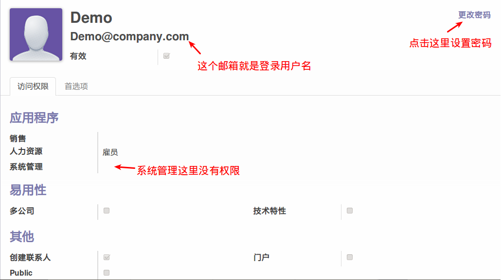

然后我们使用这里设置的Demo用户名和密码登录，会看到一片空白，没有左侧的那些设置选项了。

## 模块管理<a id="orgheadline25"></a>

-   安装模块，刚进入Odoo即看到那个模块一览的界面，点击相应的模块即安装对应的模块了。
-   更新模块，然后看到左侧还有一个更新选项可用于更新本地模块。
-   卸载模块，按照官方文档的描述，虽然点击对应模块的详细表单视图，里面有卸载按钮，但并不推荐。最好还是每次有模块更动之前先备份一下数据库，之后不行恢复一下数据库即可。

## 修改公司信息<a id="orgheadline26"></a>

在最左上角那里，鼠标划过会看到编辑公司数据的信息，然后点击进入即可以看到如下的修改公司信息界面:

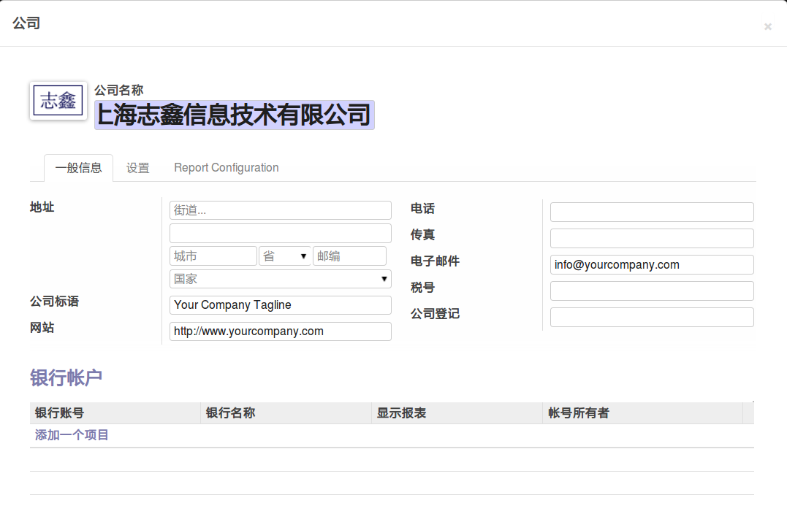

比如设置公司的Logo，名字，地址，网站等等。然后在设置选单那里还可以设置币种，这个币种设置会影响后面会计模块的默认币种行为。还有一些信息设置能够填上的最好都填上。

## 打开技术特性支持之后<a id="orgheadline27"></a>

打开技术特性支持之后会多了很多参数设置，比如 **工作流** 配置那一栏，之前是没有的。

再比如你可以更新模块列表了，只有你更新模块列表之后，你新写的模块才能被搜索到和安装上去。

## 进销存和财务系统的抽象讨论<a id="orgheadline29"></a>

进销存和财务软件系统目前大多融为一体了，以前还是分开的。然后进销存那块以前最开始的软件是仓库管理软件，后面采购和销售是慢慢加上去的。理解这点很重要，我们可以把仓库管理看作最底层的模块，而采购和销售是于之上的模块，然后采购和销售又和财务存在着很多信息交流。具体如下图所示: 

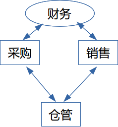

简单来说就是不管是采购还是销售其一笔成交的订单都必然产生两个信息流，一个是仓管那边；一个是财务那边。而这个信息流的过程最好是由系统自动化完成。下面以采购部门为例子来说明系统内部的这种信息流自动化过程。

### 以采购部门为例<a id="orgheadline28"></a>

采购部门一般职能是接受其他各部门的采购要求，定期汇总做成采购计划；然后根据采购计划会相应的供应商询价、议价；然后下采购单；然后跟踪供货商及时发货；货到后验货、入库。如果有问题则要求供应商换货、退货。

首先看采购计划那边，本公司各个部门根据实际需要应该都可以向采购部门发送采购需求，然后某些部门的模块会根据自己的实际情况有自动发送采购需求的功能，比如仓管的最小库存原则，再比如销售部门的某些紧急需求等等（原则上其他部门不紧急的需求应该发送给仓管，然后由仓管根据最小库存原则来发送采购需求，但某些部门具有特别紧急的需求是可以直接给采购部门发送采购需求的。当然还可能某些公司的某些部门的情况是种类繁多库存较小的情况，那么也是可以直接向采购部门发送需求的）。这个信息采购需求的发送机制需要根据不同的公司实际情况进行优化。

对于采购需求，系统应该具备一定的自动整理功能，比如按照供应商分类，紧急程度插队机制等等。采购人员处理经过初步整理出来的采购需求，将这些信息自动生成 **询价单** ，此时系统可以提供电邮，打印询价单的功能，或者和供应商洽谈视频的功能等。询价结束之后对方同意之后采购员可以点击确定然后将这些信息发送给采购部门的经理，由经理确认之后， **采购单** 就自动生成了。

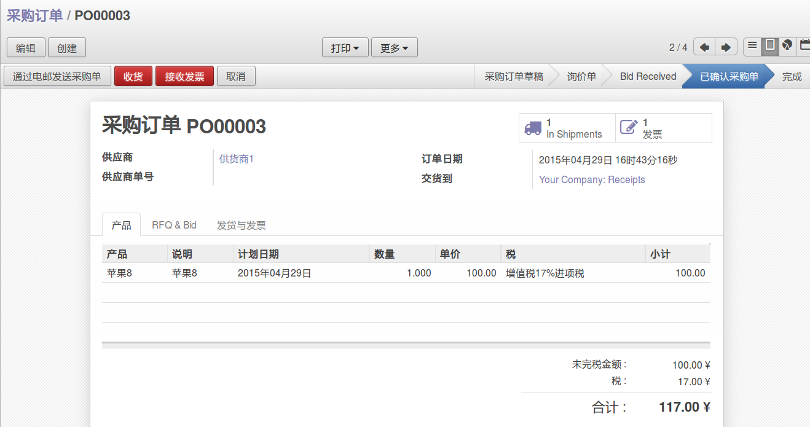

采购单确认之后，前面讲的信息流分成仓管和财务两边。首先我们看仓管那边，在货物还没送到之前，仓管那边就可以看到将要到的货物了，这样他们可以预先对仓库进行整理，方便后面的快速存放工作。货物送到之后首先是采购员验收，验收确认采购单上单击 **收货** ，然后是点击 **入库** 操作，就表示这个货物正式入库了，然后仓管那边对于是什么产品，单价多少，重量多少甚至体积多少都可能有所说明自动存放在软件系统仓管那一栏了。

然后是财务那边，在采购单确定之后，财务那边应该 **接受发票** ，然后点击 **确认生效** ，这是相应的信息应该送到财务那边去了。财务那边还有一些付款事宜。财务付款完了采购员就会看到这个采购单已经完成了。

这里谈论的以采购部门为例的一般流程，这个流程不是死的，也不一定是最优的。具体要根据公司的实际情况的不同和功能需求不同对这些底层的信息流程做出调整和优化。

## 安装和配置模块<a id="orgheadline30"></a>

我们现在就安装进销存加财务这四个经典模块:

-   财务与会计 ( account 模块),
-   仓库管理( stock 模块),
-   采购管理 ( purchase 模块),
-   销售管理 ( sale 模块).

安装完这些模块之后需要再导入一次翻译（否则可能会有某些词条没有正确翻译），然后重启Odoo框架好让这些新的模块的翻译生效。

在安装过程中会弹出这个会计窗口，默认值就可以了。

# 创建自己的模块<a id="orgheadline48"></a>

Odoo开发的一条黄金准则就是我们最好不要修改现有的模块，特别是官方内置的那些模块。这样做会让原始模块代码和我们的修改混为一谈，使得很难对软件进行升级管理。我们应该创建新的模块（在原有的模块基础之上）来达到修改和扩展功能的目的。Odoo提供了一种继承机制，允许第三方模块扩展现有模块，或者官方的或者来自社区的，这种继承修改可从任意层次来开展，从数据模型到业务逻辑到用户界面。

## 快速生成模块骨架<a id="orgheadline35"></a>

可以如下快速生成一个模块骨架:

    ./odoo.py scaffold  mymodule myaddons

这将在当前位置新建一个myaddons文件夹，然后在myaddons文件夹下创建一个名字叫mymodule的模块骨架。创建好了之后读者可以进入翻一下。值得一提的是，这个模块骨架并不怎么实用，在学完本章稍微对Odoo的模块结构有所熟悉之后，自己新建文件或者复制一些代码过来可能反而会更加灵活便捷一些。其中有些原因是这个命令生成的模块结构有点老旧了，官方文档的推荐结构如下所示: 

    addons/<my_module_name>/
    |-- __init__.py
    |-- __openerp__.py
    |-- controllers/
    |    |-- __init__.py
    |    `-- main.py
    |-- data/
    |    |-- <main_model>_data.xml
    |    `-- <inherited_main_model>_demo.xml
    |-- models/
    |    |-- __init__.py
    |    |-- <main_model>.py
    |    `-- <inherited_main_model>.py
    |-- security/
    |    |-- ir.model.access.csv
    |    `-- <main_model>_security.xml
    |-- static/
    |    |-- img/
    |    |-- lib/
    |    `-- src/
    |        |-- js/
    |        |-- css/
    |        |-- less/
    |        `-- xml/
    `-- views/
        |-- <main_model>_templates.xml
        |-- <main_model>_views.xml

这里的文件夹权限推荐是755，文件权限推荐是644。

上面只是一个泛泛而论的情况，具体有些文件夹或文件可能是不需要的。下面对这些内容进一步说明之。

### python模块的init文件<a id="orgheadline32"></a>

Odoo模板本质上就是一个python模块，所以首先它应该有一个 `__init__.py` 文件。刚开始里面不放任何内容都是可以的。

而scaffold自动创建有下面的内容: 

    import controllers
    import models

推荐改成这样的形式（有更好的python2和python3兼容性）:

    from .models import main_model

这种相对路径语法python2和python3都是通用的，具体对应的就是本目录下的models目录下的main\_model.py文件。推荐将所有的模型定义python文件都放入models文件夹中，models文件夹下也应该有一个 `__init__.py` 文件。然后这里还新建了一个main\_model.py文件，这个文件的名字倒是随意的了。

### 作为Odoo模块的说明文件<a id="orgheadline34"></a>

然后本模块作为Odoo框架的模块还必须新建一个 `__openerp__.py` 文件，最小型的什么都不做的Odoo模块就需要这两个文件，一个是这个 `__openerp__.py` 文件，一个是 `__init__.py` 文件。

scaffold自动创建的 `__openerp__.py` 文件大致内容如下: 

    # -*- coding: utf-8 -*-
    {
        'name': "mymodule",
    
        'summary': """
            我的第一个模块
            """,
    
        'description': """
            我的第一个模块，用于学习自定义模块。
        """,
    
        'author': "wanze",
        'website': "http://www.yourcompany.com",
    
        # Categories can be used to filter modules in modules listing
        # Check https://github.com/odoo/odoo/blob/master/openerp/addons/base/module/module_data.xml
        # for the full list
        'category': 'Test',
        'version': '0.1',
    
        # any module necessary for this one to work correctly
        'depends': ['website'],
    
        # always loaded
        'data': [
            'security/ir.model.access.csv',
            'views/mymodule_templates.xml',
    
            'demo.xml',
        ],
        # only loaded in demonstration mode
        'demo': [
            'demo.xml',
        ],
    }

以后我们要创建一个新的模块，这个文件的格式可以复制粘贴过去。其中一些基本的比如name就是本模块的名字，然后description还有category分类等等就不多说了，这些含义都是很明显的，就是本模块的一些描述信息。然后提得一提的是这三个属性:

-   **depends:** 本模块的依赖关系，这里主要是指本模块对于Odoo框架内其他的模块的依赖。如果本模块实在没什么依赖，就把 **base** 模块填上去。
-   **data:** 本模块要加载的数据文件，别看是数据文件，似乎不怎么重要，其实Odoo里面视图，动作，工作流，模型具体对象等等几乎大部分内容都是通过数据文件定义的。具体这些xml或csv文件如何放置后面再讲。
-   **demo:** 这里定义的数据文件正常情况下不会加载，只有在demonstration模式下才会加载，具体就是你新建某个数据库是勾选上了加载演示数据那个选项。如下图所示:


这可能并不是你想要的效果，因为其他官方内置模块也附加很多演示信息进来了。其实读者一定也想到了，我们完全可以将demo.xml放入 "data" 那里，然后实际运作的时候不加载就是了，我更喜欢这种处理方案。

#### 属性值清单:<a id="orgheadline33"></a>

-   **name:** 模块名字
-   **summary:** 可以看作简短介绍吧
-   **description:** 可以看作详细介绍
-   **author:** 模块作者
-   **website:** 模块网站
-   **category:** 模块分类
-   **version:** 模块版本号
-   **license:** 模块版权信息，默认是AGPL-3
-   **depends:** 模块依赖
-   **data:** 模块必加载的数据文件
-   **demo:** demonstration下才加载的数据文件
-   **installabel:** 默认True，可设为False禁用该模块
-   **auto\_install:** 默认False，如果设为True，则根据其依赖模块，如果依赖模块都安装了，那么这个模块将自动安装，这种模块通常作为胶合(glue)模块。
-   **application:** 默认False，如果设为True，则这个模块成为一个应用了。你的主要模块建议设置为True，这样进入Odoo后点击本地模块，然后默认的搜索过滤就是 `应用` ，这样你的主模块会显示出来。

## 安装自定义模块<a id="orgheadline37"></a>

就设置好这样两个文件，虽然里面什么内容都没有，实际上也就可以开始安装这个模块而来。

前面说了设置  `--addons-path=addons, myaddons` ，就可以加载自定义的模块了。具体安装就和安装其他模块没有两样，除了你需要清除搜索栏然后输入搜索关键词。然后注意如果不是新建的数据库，那么需要打开技术特性执行， <span class="underline">更新模块列表</span> 之后，才能搜索到你自己定义的新的模块。

自定义模块如果修改之后，（不需要重新编译Odoo）， <span class="underline">肯定是需要重启Odoo的</span> ，然后进去之后如果你的模块增减了额外的文件，则还需要升级(update)相应的模块。

### 模块文件夹管理<a id="orgheadline36"></a>

-   data文件夹 ，放着demo和data xml
-   models文件夹，放着模型定义
-   controllers文件夹，http路径控制
-   views文件夹，网页视图和模板
-   static文件夹，网页的一些资源，里面还有子文件夹:css，js，img，lib等等。

## 一个简单的演示模块<a id="orgheadline43"></a>

### controllers<a id="orgheadline38"></a>

现在我们在controllers文件夹里新建一个 `__init__.py` ，然后新建一个main.py文件。在main.py文件中添加如下内容:

```python
class Mymodule(http.Controller):
    @http.route('/mymodule/mymodule/', auth='public')
    def index(self, **kw):
        return "Hello, world"
```

现在请读者如下所示安装和更新自定义模块之后，进入 `127.0.0.1:8089/mymoduel/mymodule` 来看一下效果。这样我们就明白了这里的 `@http.route` 装饰器有根据具体某个函数的返回信息进行路径分发和控制访问权限的功能。

如果没有什么问题，你应该能看到一行hello world文字，祝你好运。

### views<a id="orgheadline39"></a>

views文件夹用于视图控制，里面通常放着一些模板文件等。我们首先修改 `__openerp__.py` 文件中data属性为这个样子。

    'data': [
        'views/mymodule_templates.xml',
    ],

然后按照这个在views文件夹里面创建一个mymodule\_templates.xml文件。

```xml
&lt;openerp&gt;
    &lt;data&gt;
        &lt;template id="index"&gt;
            &lt;title&gt;MyModule&lt;/title&gt;
            &lt;t t-foreach="fruits" t-as="fruit"&gt;
                &lt;p&gt;&lt;t t-esc="fruit"/&gt;&lt;/p&gt;
            &lt;/t&gt;
        &lt;/template&gt;
    &lt;/data&gt;
&lt;/openerp&gt;
```

这里使用了Qweb模板语言，就这里提及的我们可以简单了解下:

    <t t-foreach="[1, 2, 3]" t-as="i">
    <p><t t-esc="i"/></p>
    </t>

其输出是:

    <p>1</p>
    <p>2</p>
    <p>3</p>

如果对应python语言的话，可以理解为:

```python
for i in [1, 2, 3]:
    print('&lt;p&gt;{i}&lt;/p&gt;'.format(i = i))
```

这里的 `<t t-esc="i"/>` 是先计算 i 的值，然后将其打印出来。

然后在之前controllers那里的main.py文件那里，我们使用这个模板文件。

```python
from openerp import http

class Mymodule(http.Controller):
    @http.route('/mymodule/mymodule/', auth='public')
    def index(self, **kw):
        return http.request.render("mymodule.index",
            {'fruits':['apple','banana','pear']})
```

如果不出意外的话，你应该看到这样的画面了:


这里调用http.request.render函数，可以猜到这是一个网页模板渲染输出函数。然后注意看第一个参数， `mymodule.index` ，这里还是有一些讲究的，mymodule就是你正在编写的这个模块的名字，然后这个index对应的就是那个网页模板文件的id属性: `<template id="index">` 。接下来的第二个参数就是给模板传递进去的一些变量值了。

### models<a id="orgheadline40"></a>

一般一些数据对象或类就定义在models.py文件里，如果类继承自 `models.Model` 类，那么这个类就有了Odoo字节写的ORM接口了。也就是你定义的这些模型生成的对象都会存入SQL数据库中。

我们在models文件夹里面新加入一个 `__init__.py` 文件，然后再新建一个 `main_module.py` 文件， 在其内写上一个简单的模型定义，具体如下所示:

```python
class Fruits(models.Model):
    _name = 'mymodule.fruits'

    name = fields.Char()
```

然后 `__init__.py` 那边也注意加载好模块，这里就不多说了。

新加入一个演示数据 `demo.xml` :

```xml
&lt;openerp&gt;
    &lt;data&gt;
        &lt;record id="apple" model="mymodule.fruits"&gt;
            &lt;field name="name"&gt;apple&lt;/field&gt;
        &lt;/record&gt;
        &lt;record id="banana" model="mymodule.fruits"&gt;
            &lt;field name="name"&gt;banana&lt;/field&gt;
        &lt;/record&gt;
        &lt;record id="pear" model="mymodule.fruits"&gt;
            &lt;field name="name"&gt;pear&lt;/field&gt;
        &lt;/record&gt;
    &lt;/data&gt;
&lt;/openerp&gt;
```

在 `__openerp__.py` 的demo那里设置成这样:

    'data': [
        'security/ir.model.access.csv',
        'views/mymodule_templates.xml',
    
        'demo.xml',
    ],

然后 `controllers/main.py` 改成这样了:

```python
from openerp import http

class Mymodule(http.Controller):
    @http.route('/mymodule/mymodule/', auth='public')
    def index(self, **kw):
        fruits = http.request.env['mymodule.fruits']

        return http.request.render("mymodule.index",
            {'fruits': fruits.search([])})
```

我们知道 `demo.xml` 里面定义的数据都放入全局环境里面去了。这里具体的细节还需要进一步讨论，不过我们可以猜测通过 `http.request.env` 可以来引用这个全局环境的字典值，来查找 'mymodule.fruits' 的值，然后对这个值进行了 `search` 操作，这里具体的细节还需要进一步讨论，但我们可以猜得其最后返回的是一个列表值，然后里面存储的数据都是Fruit模型建立的对象。

而 `views/mymodule_templates.xml` 改成这样子了:

```xml
&lt;openerp&gt;
    &lt;data&gt;
        &lt;template id="index"&gt;
            &lt;title&gt;MyModule&lt;/title&gt;
            &lt;t t-foreach="fruits" t-as="fruit"&gt;
                &lt;p&gt;&lt;t t-esc="fruit.id"/&gt;&lt;t t-esc="fruit.name"&gt;&lt;/t&gt;&lt;/p&gt;
            &lt;/t&gt;
        &lt;/template&gt;
    &lt;/data&gt;
&lt;/openerp&gt;
```

这里引用了fruit的id属性和name属性。我们可以看到这样的输出结果:


刚开始id是从1,2,3开始的，因为我运行过几次，在这里成7,8,9了。

哦，最后我们还需要修改一个东西:

### security<a id="orgheadline41"></a>

security文件夹里面已经有一个 `ir.model.access.csv` 文件了，其对模型的访问权限进行管理，大致修改内容如下:

    id,name,model_id:id,group_id:id,perm_read,perm_write,perm_create,perm_unlink
    access_mymodule_fruits,mymodule.fruits,model_mymodule_fruits,,1,0,0,0

目前还不太懂，看到perm\_read那一列，要设置为1，这样所有用户可读。然后一些名字是根据你定义的模型的名字变化的。

### 美化网页<a id="orgheadline42"></a>

Odoo框架里面已经内置了一个帮助你设计网页的website builder模块，然后这里我们可以通过调用这个模块的结构来简单看一下。

首先是 `__openerp__.py` 的"depends" 属性修改一下:

    'depends': ['website'],

然后是controllers的main.py那里加上 `website=True` 这个设置。

    @http.route('/mymodule/mymodule/', auth='public', website=True)

最后是模块文件那里修改为:

    <openerp>
    <data>
        <template id="index">
        <t t-call="website.layout">
        <t t-set="title">MyModule</t>
        <div class="oe_structure">
            <div class="container">
            <t t-foreach="fruits" t-as="fruit">
            <p><t t-esc="fruit.id"/><t t-esc="fruit.name"></t></p>
            </t>
            </div>
        </div>
        </t>
    </template>
    </data>
    </openerp>

请读者自己试着运行一下，看看效果，然后里面还有很多其他的设置功能等等。这里的细节先略过了。

## 加分项:通过pgadmin3来查看数据库<a id="orgheadline47"></a>

pgadmin3是针对PostgreSQL数据库很有名的一个管理员工具，里面的经很多，这里只是简单谈论一下。

### 安装<a id="orgheadline44"></a>

在ubuntu下可以用apt-get简单安装之。

```sh
sudo apt-get install pgadmin3
```

### 连接服务器<a id="orgheadline45"></a>

刚进入软件需要连接服务器，如下图所示:


目前我已经确认的就是名称随意填，然后主机不能填127.0.0.1，而只能填"localhost"这个字符串。然后后面的应该不用更改什么了，如果你给你的postgres数据库设置密码了，那么这个密码也需要填上。

连接好服务器了，我们就可以双击或点击查看你的PostgreSQL数据库的信息了。

### 图形化查询<a id="orgheadline46"></a>

在工具那里有很多有用的工具，比如查看服务器状态工具等。然后我们点击查询工具，会弹出一个窗口，看到图形化查询那个子选单，如下图所示:


这里我找到了前面我们新建的那个fruits模型，可以看到所有的fruits模型是放在一个名字叫做 `mymodule_fruits` 的SQL表格里的。然后它的表头有:id, create\_uid, create\_date, name等。

然后我们切换到SQL编辑器子选单。这个工具会根据你的图形化查询选择结果自动生成对应的SQL查询语句:

    SELECT 
      * 
    FROM 
      public.mymodule_fruits;

所以在我们这个odoo数据库里面，我们新建的模型fruits的各个对象，具体存入的table名是 `public.mymodule_fruits` 。

然后我们点击 查询→执行 ，来具体执行这个SQL语句，输出结果如下所示:


# Odoo开发基础: 请假模块第一谈<a id="orgheadline60"></a>

## 纯理论讨论<a id="orgheadline49"></a>

在实际编写前先谈谈理论，这部分理论讨论非常有用，对于具体编写模块的时候你清楚自己在感谢什么很有帮助。感谢老肖的《OpenERP 应用和开发基础》一书，该书第六章对我帮助很大。

首先我们需要一个菜单，那么这个菜单在Odoo框架中是如何生成的呢？前面谈到Odoo的模型具体的对象实际上就是SQL表格的一条记录，而Odoo框架具体显示的菜单也是一个Odoo中的一个对象，其对应的表格是 `ir_ui_menu` ，其在xml中的声明是通过menuitem标签来完成的，具体细节等下再讲。然后菜单需要连接一个动作，这样用户点击这个菜单的时候，这个动作将会触发。

这些动作对象（和窗口操作相关的）是存放在 `ir_act_window` 表格中的。动作触发之后接下来是要处理视图问题，首先根据 `ir_act_window_view` 表格来找到具体关联的某个视图对象，具体某个视图对象是存放在 `ir_ui_view` 表格中的。然后根据具体关联的某个模型的某个对象的具体的值来构建出显示画面。

具体研究对象的模型，视图，菜单，动作等，这些实际上都是Odoo里面的模型，也就是具体对象的值是存放在某个具体的SQL表格里的，然后程序完成一系列的索引，取值等操作，并最终生成显示结果，这大概就是Odoo框架里面发生的故事概貌了。

按照上面的讨论，等下我们的工作有:

1.  具体研究对象的模型，这里是请假单模型，然后请假单模型里面应该有的field有: 申请人，请假天数，开始休假日期，请假事由。
2.  构建菜单对象。
3.  构建动作对象，并与具体的某个菜单关联起来。
4.  构建视图对象。

`__init__.py` 文件内容如下:

```python
# -*- coding: utf-8 -*-

from .models import main_model
```

`__openerp__.py` 文件内容如下:

    # -*- coding: utf-8 -*-
    {
        'name': "qingjia",
    
        'summary': """
            请假模块，提供请假功能
            """,
    
        'description': """
            请假模块，提供请假功能。
        """,
    
        'author': "wanze",
        'website': "http://www.yourcompany.com",
    
        # Categories can be used to filter modules in modules listing
        # Check https://github.com/odoo/odoo/blob/master/openerp/addons/base/module/module_data.xml
        # for the full list
        'category': 'Test',
        'version': '0.1',
    
        # any module necessary for this one to work correctly
        'depends': ['base'],
    
        # always loaded
        'data': [
            'security/ir.model.access.csv',
            'views/views.xml',
        ],
        # only loaded in demonstration mode
        'demo': [
            'demo.xml',
        ],
        'application' : True,
    }

首先我们来看下main\_model.py文件里面定义的模型是怎样的:

## 定义模型<a id="orgheadline50"></a>

```python
from openerp import models, fields, api

class Qingjd(models.Model):
    _name = 'qingjia.qingjd'

    name = fields.Many2one('res.users', string="申请人", required=True)
    days = fields.Float(string="天数", required=True)
    startdate = fields.Date(string="开始日期", required=True)
    reason = fields.Text(string="请假事由")

    def send_qingjd(self):
        self.sended = True
        return self.sended

    def confirm_qingjd(self):
        self.state = 'confirmed'
        return self.state
```

这种模型定义语法结构我们大体是熟悉的了，下面定义的两个方法等下会用到的，等下再谈。然后Float是浮点类型，Date是日期类型这个是一目了然的，然后Text是大段文本对象，string是这个field的用户界面显示的文字，required设置为True则该值为必填项。然后这个 **Many2one** 还有 **res.users** 是什么？

首先让我们看看 `public.res.users` 这个表格的值:


这里Many2one的意思像是我从很多(Many)相同模型的对象中取一个(one)的意思。等下我们会看到一个下拉选单。更多细节需要深入学习Odoo ORM的API细节。

## 加入菜单<a id="orgheadline53"></a>

接下来的工作就是在views/views.xml文件里面定义具体的菜单对象。

代码第一版如下所示:

    <?xml version="1.0"?>
    <openerp>
    <data>
        <record id="action_qingjia_qingjd" model="ir.actions.act_window">
            <field name="name">请假单</field>
            <field name="res_model">qingjia.qingjd</field>
            <field name="view_mode">tree,form</field>
        </record>
    
        <menuitem id="menu_qingjia" name="请假" sequence="0"></menuitem>
        <menuitem id="menu_qingjia_qingjiadan" name="请假单" parent="menu_qingjia"></menuitem>
        <menuitem id="menu_qingjia_qingjiadan_qingjiadan" parent="menu_qingjia_qingjiadan" action="action_qingjia_qingjd"></menuitem>
    
    </data>
    </openerp>

这种record语法我们已经有所熟悉了，然后model是 `ir.actions.act_window` ，我们可以在源码openerp→addons→base→ir中找到 `ir_actions.py` 文件，然后有下面的代码:

    class ir_actions_act_window(osv.osv):
        _name = 'ir.actions.act_window'
        _table = 'ir_act_window'

我们可以看到其对应的正是表格 `ir_act_window` 。

field是用来填充具体表格的某个列值的，我们还可以使用如下简便的语法:

    <act_window id="action_qingjia_qingjd"
        name="请假单"
        res_model="qingjia.qingjd"
        view_mode="tree,form" />

这里的标签 `act_widow` 还不清楚是在那里规定的，然后下面具体的菜单对象也简便使用了 `menuitem` 标签。

我们可以在openerp→addons→base→ir中找到 `ir_ui_menu.py` 文件，有如下代码:

    class ir_ui_menu(osv.osv):
        _name = 'ir.ui.menu'

可以看到菜单对象对应的是 `ir_ui_menu` 表格——和数据模型一样的映射法则，\_name的点号变成下划线。至于菜单对象为何对应 `menuitem` 标签还不清楚那里固定的。

这两个对象具体的一些属性说明一下:

### act\_window 的属性<a id="orgheadline51"></a>

-   **name:** 具体act\_window动作在UI中显示的名字（类似于QT中动作作为菜单中的项目的情况）。
-   **res\_model:** act\_window动作对应的某个数据模型（这里动作和数据模型关联在一起了）
-   **view\_mode:** act\_window动作打开后支持的视图模式。

### menuitem 的属性<a id="orgheadline52"></a>

-   **name:** 具体这个菜单在视图中显示的名字。
-   **sequence:** 是显示排序（还不太懂）。
-   **parent:** 是本菜单的父菜单。如果是子菜单则需要指定，只有顶级菜单不需要指定。
-   **action:** 指定本菜单连接的动作。如果连接动作了那么name属性可以不用指定了，系统会直接引用动作的name属性的。这里菜单和某个动作关联起来了。和前面联系起来，那么就是具体某个子菜单和某个数据模型关联起来了。

这样现在你应该看到类似如下的视图了:


## 视图优化<a id="orgheadline57"></a>

最主要的三个视图是list或者tree视图；表单form视图和search搜索视图。视图都属于ir.ui.view模型

### 修改tree视图<a id="orgheadline54"></a>

下面定义了一个自己的tree视图:

    <record id="qingjia_qingjd_tree" model="ir.ui.view">
    <field name="name">qing jia dan tree</field>
    <field name="model">qingjia.qingjd</field>
    <field name="arch" type="xml">
        <tree>
            <field name="name"/>
            <field name="startdate"/>
            <field name="days"/>
        </tree>
    </field>
    </record>

这里的name属性是本视图的名字，似乎没什么意义。然后 **model** 属性很重要，前面子菜单关联到了某个动作，然后某个动作关联到了某个数据模型了，这里就是将这个视图和某个模型关联起来了。

下面的 **arch** 这个格式还不清楚有什么用，但必须这么写:

    <field name="arch" type="xml">
        ...
    </field>

然后接下来定义tree视图，又叫列表视图。其中的field就是对应的具体那个数据模型的field，加入谁就要显示谁。

### 修改form视图<a id="orgheadline56"></a>

下面定义一个自己的form视图:

    <record id="qingjia_qingjd_form" model="ir.ui.view">
    <field name="name">qing jia dan form</field>
    <field name="model">qingjia.qingjd</field>
    <field name="arch" type="xml">
        <form>
        <sheet>
        <label for="name"/> <field name="name"/>
        <label for="days"/><field name="days"/>
        <label for="startdate"/><field name="startdate"/>
        <label for="reason"/><field name="reason"/>
        </sheet>
        </form>
    </field>
    </record>

其他都类似上面的，不赘述了。

重点在form标签里面。这里引入了sheet布局，然后label加入标签 field引入具体属性。

然后我们还可以使用 **header** 标签引入表单视图的头部分。头部分里面一般放着一些按钮动作。比如:

    <header>
        <button name="send_qingjd" type="object"
        string="发送" class="oe_highlight" />
        <button name="confirm_qingjd" type="object"
        string="确认" />
    </header>

这里string是这个按钮具体显示的字符，然后name是这个按钮具体应该执行的动作（对应本模型的该名字的方法），class="oe\_highlight" 让按钮变为红色突出显示。

#### 使用group布局<a id="orgheadline55"></a>

此外还可以使用group布局，group布局还不太懂，其中可以引入 **string** 属性，等下可以作为group的标题显示出来。

这是我的这个简单的请假单布局

    <sheet>
        <group name="group_top" string="请假单">
            <field name="name"/>
            <field name="days"/>
            <field name="startdate"/>
            <field name="reason"/>
        </group>
    </sheet>

## 完整的views.xml<a id="orgheadline58"></a>

至此完整的views.xml文件如下所示:

```xml
&lt;?xml version="1.0"?&gt;
&lt;openerp&gt;
&lt;data&gt;

&lt;!--
    打开请假单动作
--&gt;
    &lt;act_window id="action_qingjia_qingjd"
        name="请假单"
        res_model="qingjia.qingjd"
        view_mode="tree,form" /&gt;
&lt;!--
表单视图
--&gt;
    &lt;record id="qingjia_qingjd_form" model="ir.ui.view"&gt;
    &lt;field name="name"&gt;qing jia dan form&lt;/field&gt;
    &lt;field name="model"&gt;qingjia.qingjd&lt;/field&gt;
    &lt;field name="arch" type="xml"&gt;
        &lt;form&gt;
        &lt;header&gt;
            &lt;button name="send_qingjd" type="object"
            string="发送" class="oe_highlight" /&gt;
            &lt;button name="confirm_qingjd" type="object"
            string="确认" /&gt;
        &lt;/header&gt;

        &lt;sheet&gt;
            &lt;group name="group_top" string="请假单"&gt;
                &lt;field name="name"/&gt;
                &lt;field name="days"/&gt;
                &lt;field name="startdate"/&gt;
                &lt;field name="reason"/&gt;
            &lt;/group&gt;
        &lt;/sheet&gt;

        &lt;/form&gt;
    &lt;/field&gt;
    &lt;/record&gt;
&lt;!--
tree视图
--&gt;
    &lt;record id="qingjia_qingjd_tree" model="ir.ui.view"&gt;
    &lt;field name="name"&gt;qing jia dan tree&lt;/field&gt;
    &lt;field name="model"&gt;qingjia.qingjd&lt;/field&gt;
    &lt;field name="arch" type="xml"&gt;
        &lt;tree&gt;
            &lt;field name="name"/&gt;
            &lt;field name="startdate"/&gt;
            &lt;field name="days"/&gt;
        &lt;/tree&gt;
    &lt;/field&gt;
    &lt;/record&gt;
&lt;!--
加入菜单
--&gt;
    &lt;menuitem id="menu_qingjia" name="请假" sequence="0"&gt;&lt;/menuitem&gt;
    &lt;menuitem id="menu_qingjia_qingjiadan" name="请假单" parent="menu_qingjia"&gt;&lt;/menuitem&gt;
    &lt;menuitem id="menu_qingjia_qingjiadan_qingjiadan" parent="menu_qingjia_qingjiadan" action="action_qingjia_qingjd"&gt;&lt;/menuitem&gt;
&lt;/data&gt;
&lt;/openerp&gt;
```

至此显示效果如下所示:


## 给模块加个图标<a id="orgheadline59"></a>

模块 **static→description** 的 **icon.png** 文件就对应模块的图标。把它设置好你的模块就有一个图标了。

# Odoo开发基础: 工作计划模块第一谈<a id="orgheadline64"></a>

这个例子来自Daniel Reis的《Odoo Development Essentials》一书，之所以也加进来是因为我觉得学习框架是例子越多越好，然后这本书我是在 [这个网站](https://www.safaribooksonline.com/library/view/odoo-development-essentials/9781784392796/) 限时观看的，也是为了保留有价值的信息吧。

我们这次要创建的模块的功能是进行工作计划管理，也就是常说的"to do task"，

首先是 `__init__.py` 文件:

    # -*- coding: utf-8 -*-
    
    from .models import main_model

然后是 `__openerp__.py` 文件:

    # -*- coding: utf-8 -*-
    {
        'name': "todo task app",
    
        'summary': """
            工作计划管理系统
            """,
    
        'description': """
            工作计划管理系统: 安排你的工作计划。
        """,
    
        'author': "wanze",
        'website': "http://www.yourcompany.com",
    
        # Categories can be used to filter modules in modules listing
        # Check https://github.com/odoo/odoo/blob/master/openerp/addons/base/module/module_data.xml
        # for the full list
        'category': 'Test',
        'version': '0.1',
    
        # any module necessary for this one to work correctly
        'depends': ['mail'],
    
        # always loaded
        'data': [
            'security/ir.model.access.csv',
            'views/views.xml',
        ],
        # only loaded in demonstration mode
        'demo': [
        #    'demo.xml',
        ],
        'application' : True,
    }

注意到depends设置为了mail模块，因为等下to do task子菜单要在消息子菜单中显示的，其是由mail模块设置的。然后同样加载了views.xml文件，还有设置访问权限的ir.model.access.csv文件等下再说。

然后我们再来看 `main_model.py` 文件

```python
from openerp import models, fields, api

class TodoTask(models.Model):
    _name = 'todo.task'

    name = fields.Char('Description',required=True)
    is_done = fields.Boolean('Done?')
    active = fields.Boolean('Active?', default=True)

    @api.one
    def do_toggle_done(self):
        self.is_done = not self.is_done
        return True

    @api.multi
    def do_clear_done(self):
        done_recs = self.search([('is_done', '=', True)])
        done_recs.write({'active': False})
        return True
```

读者现在应该很清楚这些代码在做什么了，其中fields.Boolean定义了一个布尔值字段，然后我们看到第一个可选参数默认就是 **string** ，就可以直接写上。然后 **default** 是来设置该字段的默认值的。

下面定义的两个方法和等下form视图下的两个按钮相关，这里用到了Odoo新的ORM API，使用了 `@api.one @api.multi` 这样的装饰器。 值得一提的是，可被用户调用的方法，比如这里的按钮是被用户点击才调用的， <span class="underline">都需要一个返回值</span> ，否则XMLRPC协议无法正常工作，实在没啥好返回的，就 `return True` 。

-   **@api.multi:** 默认的装饰器是这个，没有自动迭代recordset，因为它默认接受的self就是recordset对象（所有recordset就是指相同模型下的所有对象，或者说同一SQL表格下的所有记录。）。

-   **@api.one:** @api.one装饰器将会自动产生一个迭代动作，具体是指迭代某一recordset，然后其内的self就是一个record也就是该模型下SQL表格的一条记录。然后@api.one返回的是一个列表值，某些网络客户端可能并不支持这点。所以还是尽量少用@api.one。

具体 `views.xml` 文件的内容如下所示:

```xml
&lt;?xml version="1.0"?&gt;
&lt;openerp&gt;
&lt;data&gt;

    &lt;!-- Action to open To-do Task list --&gt;
    &lt;act_window id="action_todo_task"
    name="To-do Task"
    res_model="todo.task"
    view_mode="tree,form" /&gt;

    &lt;record id="view_form_todo_task" model="ir.ui.view"&gt;
    &lt;field name="name"&gt;To-do Task Form&lt;/field&gt;
    &lt;field name="model"&gt;todo.task&lt;/field&gt;
    &lt;field name="arch" type="xml"&gt;

    &lt;form&gt;
    &lt;header&gt;
        &lt;button name="do_toggle_done" type="object"
            string="Toggle Done" class="oe_highlight" /&gt;
        &lt;button name="do_clear_done" type="object"
            string="Clear All Done" /&gt;
    &lt;/header&gt;
    &lt;sheet&gt;
        &lt;group name="group_top"&gt;
            &lt;group name="group_left"&gt;
            &lt;field name="name"/&gt;
            &lt;/group&gt;
            &lt;group name="group_right"&gt;
            &lt;field name="is_done"/&gt;
            &lt;field name="active" readonly="1" /&gt;
            &lt;/group&gt;
        &lt;/group&gt;
    &lt;/sheet&gt;
    &lt;/form&gt;

    &lt;/field&gt;
    &lt;/record&gt;

    &lt;record id="view_tree_todo_task" model="ir.ui.view"&gt;
    &lt;field name="name"&gt;To-do Task Tree&lt;/field&gt;
    &lt;field name="model"&gt;todo.task&lt;/field&gt;
    &lt;field name="arch" type="xml"&gt;
        &lt;tree colors="gray:is_done==True"&gt;
            &lt;field name="name"/&gt;
            &lt;field name="is_done"/&gt;
        &lt;/tree&gt;
    &lt;/field&gt;
    &lt;/record&gt;


    &lt;record id="view_filter_todo_task" model="ir.ui.view"&gt;
    &lt;field name="name"&gt;To-do Task Filter&lt;/field&gt;
    &lt;field name="model"&gt;todo.task&lt;/field&gt;
    &lt;field name="arch" type="xml"&gt;
        &lt;search&gt;
        &lt;field name="name"/&gt;
        &lt;filter string="Not Done"
                domain="[('is_done','=',False)]"/&gt;
        &lt;filter string="Done"
                domain="[('is_done','!=',False)]"/&gt;
        &lt;/search&gt;
    &lt;/field&gt;
    &lt;/record&gt;


    &lt;!-- Menu item to open To-do Task list --&gt;
    &lt;menuitem id="menu_todo_task"
    name="To-Do Tasks"
    parent="mail.mail_feeds"

    sequence="20"
    action="action_todo_task" /&gt;

&lt;/data&gt;
&lt;/openerp&gt;
```

有了前面的基础，这个文件虽然看上去有点复杂，但我们应该是已经能够看出点端倪出来了的。首先我们不管视图那块，看到act\_window和munuitem，我们看到这个菜单项设置的父菜单是 `mail.mail_feeds` ，

    parent="mail.mail_feeds"

因为对Odoo官方模块还不是很熟悉，但我们根据后面的显示效果，如下图所示:


我们可以推断这个父菜单 `mail.mail_feeds` 就是上图箭头所指的那个菜单。

然后我们看到tree视图，其中有这么一行:

    <tree colors="gray:is_done==True">

这种语法还不太熟悉，但大体意思就是如果该模型下的某个对象 `is_done` 的值为True，则颜色设置为灰色。

然后值得一提的是，这里的search视图，并不需要在前面的动作对象的view\_mode属性上加上，其更像是tree视图的增强功能，在搜索框那里，你点击才能看到。代码中唯一的难点就是domain过滤器的语法，这里先略过，后面再讨论吧。

然后我们再看到form视图，具体显示效果如下所示:

<a id="orgtarget1"></a>


    <sheet>
        <group name="group_top">
            <group name="group_left">
            <field name="name"/>
            </group>
            <group name="group_right">
            <field name="is_done"/>
            <field name="active" readonly="1" />
            </group>
        </group>
    </sheet>

这里代码如何利用group来布局要好好体会一下，然后field标签这里又出现了一个新的属性 **readonly** ，这样这个字段的值就不能更改了。

## 数据访问权限管理<a id="orgheadline63"></a>

Odoo对于其内的数据访问权限管理有两种机制: 一种是模型访问权限管理(access rule)；第二种是记录规则管理(record rule)。其中record rule可以看作在access rule之上的更进一步细化。如果什么访问规则都不设定的话，那么默认只有Administrator才能访问这个模型的数据，其他的用户都不能访问。Odoo的安全机制是通过群组(group)来管理的，然后record rule对Administator用户是无效的，而access rule还有效。

<https://www.odoo.com/forum/help-1/question/is-it-possible-to-manage-record-based-access-control-2597>

### access rule<a id="orgheadline61"></a>

访问权限控制一般是用security文件夹下的 `ir.model.access.csv` 文件来管理的。这个csv文件的表头是:

    id,name,model_id:id,group_id:id,perm_read,perm_write,perm_create,perm_unlink

我们这里定义的模型名字是 `todo.task` ，其对应的 `model_id` 就是 `model_todo_task` 。这个是规定死了的，然后其他的id, name名字可随意。一般id就是在模型名字前加个access即 `access_todo_task` ，然后name更随意了，似乎我看到空格都可以的，但一般就简单把对应的模型的名字放进去即可，即 `todo.task` 。然后第四个是群组id，接下来就是读权限，写权限，创建权限和删除权限，用0表示无权限，1表示有权限，具体要根据需要来设置权限。

下面是todo\_app模块的 `ir.model.access.csv` 详情:

    id,name,model_id:id,group_id:id,perm_read,perm_write,perm_create,perm_unlink
    access_todo_task,todo.task,model_todo_task,base.group_user,1,1,1,1

The default policy is DENY

这里的base.group\_user群组参考资料4说雇员群组属于base.group\_user群组，这里不太清楚，如果实在不确定这个值省略不填也是可以的。

### record rule<a id="orgheadline62"></a>

这样设置之后每一个登录Odoo用户写的todo task其他人都可以看到，这显然不太好。进一步我们可以用record rule来对具体的record记录进行筛选。

在security文件夹里新建一个 `todo_record_rules.xml` 文件，文件内容如下:

```xml
&lt;?xml version="1.0" encoding="utf-8"?&gt;
&lt;openerp&gt;
  &lt;data noupdate="1"&gt;
    &lt;record id="todo_task_user_rule" model="ir.rule"&gt;
        &lt;field name="name"&gt;ToDo Tasks only for owner&lt;/field&gt;
        &lt;field name="model_id" ref="model_todo_task"/&gt;
        &lt;field name="domain_force"&gt;[('create_uid','=',user.id)]
        &lt;/field&gt;
        &lt;field name="groups" eval="[(4,ref('base.group_user'))]"/&gt;
    &lt;/record&gt;
  &lt;/data&gt;
&lt;/openerp&gt;
```

这些record rule记录是 `ir.rule` 模型，存储在 `public.ir_rule` 表格里面的。name属性就不多说了，应该很熟悉了。然后 `model_id` 属性对应的就是某个模型，而 `domain_force` 就是对该模型中所有记录进行某种过滤操作，

The default policy is ALLOW,so by default any operation will be refused if the user does not explicitly have the right to perform it via one of her groups' access rights.

 The default policy is ALLOW, so if no rule exists for a given model, all documents of that model may be accessed by users who have the necessary access rights.
然后 `groups` 字段还看不太懂。我看了一下 `ir_rule` 表格，似乎没有groups这个属性，这里的细节先略过吧。

data标签这里有个 **noupdate** 属性，如果设置为"1"，则意思是本模块升级不更新本数据，如果设置为"0"则更新本数据。

然后我还发现一个问题: 那就是我中途试验过一个不加载这个xml文件的版本，数据库里面还是保存着这条记录，然后我手动删除SQL数据库的这条记录才行，后来又试验加载这个xml文件的版本，数据库这个权限记录加载不上去。然后我发现如果删除模块，则数据库里面的这条记录才会被删除了。然后再重新安装本模块，则这条权限记录才会被更新上去。也就是说目前的Odoo框架升级对于record rule支持并不是很好，在这方面要小心。

经过这样的配置之后，除了Administrator用户可以看到所有人的todo task之外，其他人都只能看到和编辑自己的todo task了。

# 扩展现有模块－继承机制<a id="orgheadline79"></a>

即使是对于现有的模块，推荐的做法也是通过新建一个模块来达到扩展和修改现有模块的目的。具体方法就是在python中的类里面使用 `_inherit` 属性。这标识了将要扩展的模块。新的模型继承了父模型的所有特性，我们只需要声明一些我们想要的修改就行了。通过这种继承机制的修改可从模型到视图到业务逻辑等对原模块进行全方位的修改。

实际上，Odoo模型在我们定义的模型之外，它们都在注册中心注册了的，所谓全局环境的一部分，可以用 `self.env[model name]` 来引用之。比如要引用 `res.partner` 模型，我们就可以写作 `self.env['res.partner']` 。

## 给模块增加field<a id="orgheadline65"></a>

如下代码就是首先通过 `_inherit` 继承原模块，然后再增加一些field:

```python
from openerp import models, fields, api

class TodoTask(models.Model):

    _inherit = 'todo.task'

    user_id = fields.Many2one('res.users',string='Responsible')
    date_deadline = fields.Date('Deadline')
```

关于 `res.users` 和 `res.partner` 具体是雇员还是合作伙伴什么的，这个以后再摸清楚，这里先简单将其看作一个SQL表格，然后Many2one前面讲过了就是根据某个给定的SQL表格来生成一个下拉选单，具体是引用的该SQL表格的那个表头属性，这里应该还有一个细节讨论。

不管怎么说，现在我们通过新建一个模块 todo\_user ，如前面描述的将模块设置配置好之后，原模块 todo\_app 的todo.task模型就增加了新的两个field了，也就是两个新的表头了。

## 修改已有的field<a id="orgheadline66"></a>

按照上面的继承机制，我们可以如上类似处理，只修改你希望更改的某个field的某个属性即可。如下:

    name = fields.Char(help="can I help you")

这样原模型的namefield额外增加了help帮助信息了。


## 重载原模型的方法<a id="orgheadline70"></a>

读者一定已经想到了，类似的在这种继承机制下，可以通过重写原模型的方法来重载该方法。事实上确实可以这样做，而这里要讲的是还有一种更加优雅的继承原模型的方法，那就是通过 `super()` 来调用父类的方法<sup><a id="fnr.3" class="footref" href="#fn.3">3</a></sup>。

首先我们看到下面这个例子:

    @api.multi
    def do_clear_done(self):
        domain = [('is_done', '=', True),
        '|', ('user_id', '=', 'self.env.uid'),
        ('user_id','=',False)]
        done_recs = self.search(domain)
        done_recs.write({'active':False})
        return True

这里涉及到Odoo新API的一些东西，这里先浅尝辄止讲一下。

### 什么是Recordset<a id="orgheadline67"></a>

Odoo8引入了一种新的ORM API，老的API也兼容，但推荐使用新的API，因为新的API更加简洁和方便。

首先是模型(model)，其对应的就是python的类，具体类的实例就是对应现实世界的某个对象。然后老式的简单ORM封装就是将这些类的具体某些数据对应到SQL的数据库的一条记录(record)中去。新的API引入一个核心的概念就是 **Recordset** ，Recordset是个什么东西呢？就是前面讲的某一个模型（类）的所有对象（具体的实例）的集合就是一个Recordset对象。——这是recordset最大的情况，一个重要的限定条件就是其内元素必定是相同模型的，由这个最大的集合情况然后删除过滤掉一些元素（记录）之后仍然是recordset对象。

按照官方文档的描述是，一个Recordset对象应该是已经排序了的同一模型的对象的集合。他还指出虽然现在还可以存放重复的元素，这个以后可能会变的。同时你从名字可能猜到这个Recordset对象应该支持集合的一些操作，事实确实如此。

比如Recordset支持如下运算:

    record in recset1     # include
    record not in recset1 # not include
    recset1 + recset2     # extend 
    recset1 | recset2     # union
    recset1 & recset2     # intersect
    recset1 - recset2     # difference
    recset.copy()         # copy the recordset (not a deep copy)

上面的操作只有 `+` 还保留了次序，不过recordset是可以排序的，关于次序比如使用:

    for record in recordset:
        print(record)

具体的次序是否像集合set一样是不一定的还是如何呢？这里需要进一步的讨论。

### Odoo里面的domain语法<a id="orgheadline68"></a>

本小节主要参考了 [这个网页](http://stackoverflow.com/questions/14608775/how-to-filter-datas-in-openerp-using-domain-list) 。

Odoo里面的domain语法使用比较广泛，其就好像一个过滤器，应该对应的是SQL的SELECT语句。最基本的语句形式是 `[('field_name', 'operator', value)]`

-   **field\_name:** 必须是目标模型的有效field名字。
-   **operator:** 比如是一个字符串，可用的值有: `= != > >= < <= like ilike` , 此外还有"in", "not in", "parent\_left", "child\_of", "parent\_right"。这里的parent和chind似乎是某种记录的关系，先暂时略过。其他的意义都是很明显的。

-   **value:** 必须是和前面的field\_name类型相同的某个值。

然后这些圆括号包围的基本语句可以用以下几个逻辑运算符连接: `&` `|` `!` ，其中 `&` 是默认的逻辑运算连接符，也就是你看到两个圆括号表达式中间没有逻辑运算连接符，则要视作其间加入了 `&` 。具体形式大概类似这样:

    [('field_name1', 'operator', value), '!',  
        ('field_name2', 'operator', value), '|', 
        ('field_name3', 'operator', value),('field_name4', 'operator', value)]

多个逻辑运算符的情况有点复杂，具体是 `!` 先解析，其只作用于后面的第一个元素；然后 `&` 和 `|` 作用于后面的两个元素。一个简单的解析步骤是先将 `!` 解析进去，比如是解析为不是等，然后再将 `|` 解析进去，相当于一个并联电路接进来，然后所有的过滤条件组成一个大的串联过滤线路。这样上面的表达式就解析为:

    1表达式 and 2表达式否 and 3表达式或4表达式

然后前面的那个domain:

    domain = [('is_done', '=', True),
    '|', ('user_id', '=', 'self.env.uid'),
    ('user_id','=',False)]

应该解析为:

    is_done是True and user_id 是self.env.uid 或 user_id是False

### recordset的search方法<a id="orgheadline69"></a>

一个recordset对象调用其search方法还是返回一个recordset对象。

search方法接受一个参数，这个参数就是前面谈论的基于Odoo domain语法的过滤器表达式。

所以下面这个表达式:

    self.env[’res.users’].search([(’login’, ’=’, ’admin’)])

的含义就是调用 `res.users` 这个表格或者说recordset，然后执行search方法，具体选中的record是login这个字段等于admin的。

好了前面那个 `do_clear_done` 函数我们应该完全理解了，首先 `@api.multi` 告诉我们这个函数里面的self是一个recordset，然后domain的语法是: is\_done是True或说被勾选了，然后要某该记录的user\_id等于当前用户的id `self.env.uid` ，要某 user\_id 值为False（不清楚什么情况）。

接下来执行search方法，返回的done\_recs也是一个recordset对象，对于这些recordset对象执行了 **write** 方法，其接受一个字典值，就是直接更改SQL表格里面的某个表头（属性），将其改为某个值。值得一提的是，recordset调用write方法会将本recordset内所有的record都进行修改操作的。

前面讲到通过 `super()` 来继承修改原模型的某个方法，请看下面的例子:

    @api.one
    def do_toggle_done(self):
        if self.user_id != self.env.user:
            raise Exception('Only the responsible can do this!')
        else:
            return super(TodoTask, self).do_toggle_done()

这里 `@api.one` 自动遍历目标recordset，然后方法里面的self就是一个record。这里程序的逻辑很简单，就是如果用户名不是当前登录用户（因为todo task管理只是自己管理自己的任务计划），那么将会报错。如果是那么就调用之前的方法。

## 视图xml文件的继承式修改<a id="orgheadline73"></a>

一个初步的继承式修改视图xml文件如下所示:

```xml
&lt;?xml version="1.0"?&gt;
&lt;openerp&gt;
&lt;data&gt;
    &lt;record id="view_form_todo_task_inherited" model="ir.ui.view"&gt;
    &lt;field name="name"&gt;Todo Task form – User extension&lt;/field&gt;
    &lt;field name="model"&gt;todo.task&lt;/field&gt;
    &lt;field name="inherit_id" ref="todo_app.view_form_todo_task"/&gt;
    &lt;field name="arch" type="xml"&gt;
        &lt;field name="name" position="after"&gt;
            &lt;field name="user_id" /&gt;
        &lt;/field&gt;
        &lt;field name="is_done" position="before"&gt;
            &lt;field name="date_deadline" /&gt;
        &lt;/field&gt;
        &lt;field name="name" position="attributes"&gt;
            &lt;attribute name="string"&gt;I have to...&lt;/attribute&gt;
        &lt;/field&gt;

    &lt;/field&gt;
    &lt;/record&gt;
&lt;/data&gt;
&lt;/openerp&gt;
```

我们可以看到其通过这样的语句:

    <field name="inherit_id" ref="todo_app.view_form_todo_task"/>

对xml视图进行了继承。这里是要对from视图进行修改，就继承的原form视图的id。

### 视图元素添加<a id="orgheadline71"></a>

首先我们来看视图元素的添加问题。Odoo提供了这样的定位语法:

    <field name="name" position="after">
        <field name="user_id" />
    </field>

其具体对应的是所谓的XPath语法，比如 `<field name="is_done">` 对应的是:

    //field[@name]='is_done'

除了field，其他的tag如sheet、group等等都是可以用的，属性name最常使用，其他的属性也是可以用的。定位到具体的标签之后，需要使用 **position** 来指明插入点。

-   **inside:** 默认的就是inside，也就是插入定位标签之内。
-   **before:** 插入定位标签之前。
-   **after:** 插入定位标签之后。
-   **replace:** 替换掉定位标签的元素，如果使用空内容，则就是删除原标签元素。

比如这个例子

    <field name="name" position="after">
        <field name="user_id" />
    </field>
    <field name="is_done" position="before">
        <field name="date_deadline" />
    </field>

的意思就是找到field name="name"的那个标签，然后在它的后面插入 `<field name="user_id" />` 。

然后找到field name="is\_done"的那个标签，在它的前面插入 `<field name="date_deadline" />` 。

### 原视图元素属性修改<a id="orgheadline72"></a>

position如果设置为 **attributes** ，则可以具体对原标签元素的某个属性进行修改。

-   **attributes:** 修改定位标签元素的某个属性。

比如这样:

    <field name="name" position="attributes">
        <attribute name="string">I am going to</attribute>
    </field>

再如:

    <field name="active" position="attributes">
        <attribute name="invisible">1</attribute>
    </field>

之前的active field没必要显示出来了，可以将这个字段的 **invisible** 属性设置为1，让这个字段在视图上不显示即可。前面讲到replace说到可以删除某个标签元素，但一般不建议这样做，因为可能其他扩展模块又依赖这个标签元素。最好就是将它的 **invisible** 属性修改一下即可。

读者可以看到 [之前那个form视图](#orgtarget1) 。

经过如上的修改，现在成了这个样子了:


## 多态继承<a id="orgheadline74"></a>

`_inherit` 继承也可以继承多个模型，如下所示写成一个列表值即可，然后 `_name` 比如指明了，因为有多个继承模型，不指明Odoo是不清楚要继承谁的 `_name` 的。

    _name = 'todo.task'
    _inherit = ['todo.task', 'mail.thread']

mail.thread是一个抽象模型，抽象模型没有数据库表达，没有实际创立SQL表格。抽象模型最适合被混合继承使用。要创建一个抽象模型就是继承自 `models.AbstractModel` 而不是 `models.Model` 。

## 修改其他数据文件<a id="orgheadline77"></a>

不像视图文件的 **arch** 结构下的xml可以用XPath表达式，其他xml数据文件则要采取不同的方法来修改之。

### 删除记录<a id="orgheadline75"></a>

这是删除记录的语法

    <delete model="ir.rule" search="[('id', '=',
     ref('todo_app.todo_task_user_rule'))]" />

使用的是delete标签，然后模型对应某个recordset，然后使用search方法，这里的ref语句还不太清楚。

### 更新数据<a id="orgheadline76"></a>

其他记录若不像删除，则使用 <record id="x" model="y"> 这样的语法，若该记录不存在，则会创建，若存在则会修改其中的某些值。

下面这个例子是用来修改record rule权限文件的，将其改成本人和follower都可以看你的todo task。

```xml
&lt;?xml version="1.0" encoding="utf-8"?&gt;
&lt;openerp&gt;
  &lt;data noupdate="0"&gt;

    &lt;delete model="ir.rule" search="[('id', '=',
     ref('todo_app.todo_task_user_rule'))]" /&gt;

    &lt;record id="todo_task_per_user_rule" model="ir.rule"&gt;
        &lt;field name="name"&gt;ToDo Tasks only for owner&lt;/field&gt;
        &lt;field name="model_id" ref="model_todo_task"/&gt;
        &lt;field name="groups" eval="[(4, ref('base.group_user'))]"/&gt;
        &lt;field name="domain_force"&gt;
          ['|',('user_id','in', [user.id,False]),
            ('message_follower_ids','in',[user.partner_id.id])]
        &lt;/field&gt;
    &lt;/record&gt;

  &lt;/data&gt;
&lt;/openerp&gt;
```

这里的一些细节我们可以先暂时略过，记住这种记录数据删除和更新的方法就是了。然后看到data标签的 **noupdate** 属性，如果设置为"0"的话就更新数据，这通常是在开发期这样设置，如果在运行期则设置为"1"，也就是接下来模块升级也不会更新本data数据，通常为了运行期稳定会这样设置。

## 委托继承<a id="orgheadline78"></a>

除了前面谈论的 `_inherit` 继承外，Odoo还提供了一种继承机制，叫做什么委托继承(delegation inheritance)。委托继承特别适合继承官方内置的现有模型。按照官方文档的说法，委托继承一些值是存放于不同的SQL表格中的，所以其似乎是通过一种SQL连接机制来达到继承效果的。然后委托继承只有fields被继承了，而方法没有被继承（因为那些方法又不是存放在SQL表格里面的。）。

具体委托继承的详情分析还需要进一步讨论。

# 理解模型内的数据文件<a id="orgheadline88"></a>

## 理解外部id<a id="orgheadline80"></a>

所有的记录在Odoo数据库中都有一个独一无二的标识码id，Odoo是通过 `ir.model.data` 模型来管理这些外部id的。ir.model.data模型对应的SQL表格是 `ir_model_data` 。这个表格里面存储着各个模型外部名字ID（通过record标签的id属性指定）和具体数据库某个表格ID的映射关系。这个表格有四个字段值得引起我们的注意:

我们执行:

    SELECT 
      id, name, module, model, res_id
    FROM 
      public.ir_model_data
     WHERE
    MODULE = 'qingjia'
    ;

注意WHERE字句后面的字段要大写。则有:

      id  |                name                | module  |         model         | res_id 
    ------+------------------------------------+---------+-----------------------+--------
     3707 | model_qingjia_qingjd               | qingjia | ir.model              |    153
     3708 | field_qingjia_qingjd_startdate     | qingjia | ir.model.fields       |   1703
     3709 | field_qingjia_qingjd_create_date   | qingjia | ir.model.fields       |   1704
     3710 | field_qingjia_qingjd_name          | qingjia | ir.model.fields       |   1705
     3711 | field_qingjia_qingjd_create_uid    | qingjia | ir.model.fields       |   1706
     3712 | field_qingjia_qingjd_state         | qingjia | ir.model.fields       |   1707
     3713 | field_qingjia_qingjd_days          | qingjia | ir.model.fields       |   1708
     3714 | field_qingjia_qingjd_reason        | qingjia | ir.model.fields       |   1709
     3715 | field_qingjia_qingjd_write_date    | qingjia | ir.model.fields       |   1710
     3716 | field_qingjia_qingjd_write_uid     | qingjia | ir.model.fields       |   1711
     3717 | field_qingjia_qingjd_id            | qingjia | ir.model.fields       |   1712
     3718 | access_qingjia_qingjd              | qingjia | ir.model.access       |    189
     3719 | action_qingjia_qingjd              | qingjia | ir.actions.act_window |    130
     3720 | qingjia_qingjd_form                | qingjia | ir.ui.view            |    298
     3721 | qingjia_qingjd_tree                | qingjia | ir.ui.view            |    299
     3722 | menu_qingjia                       | qingjia | ir.ui.menu            |    133
     3723 | menu_qingjia_qingjiadan            | qingjia | ir.ui.menu            |    134
     3724 | menu_qingjia_qingjiadan_qingjiadan | qingjia | ir.ui.menu            |    135
     3725 | wkf_qingjia                        | qingjia | workflow              |      1
     3726 | act_draft                          | qingjia | workflow.activity     |      1
     3727 | act_confirm                        | qingjia | workflow.activity     |      2
     3728 | act_accept                         | qingjia | workflow.activity     |      3
     3729 | act_reject                         | qingjia | workflow.activity     |      4
     3731 | qingjia_draft2confirm              | qingjia | workflow.transition   |      1
     3732 | qingjia_confirm2accept             | qingjia | workflow.transition   |      2
     3733 | qingjia_confirm2reject             | qingjia | workflow.transition   |      3

然后我们看到


这里的完整ID就对应具体的那条记录，其是由module和name这两个字段的值组合而成的，比如说 `qingjia.menu_qingjia` ，具体格式就是 `<module>.name` 。然后具体的内部引用对应的是 `ir_ui_menu` 这个SQL表格（根据上面的model `ir.ui.menu` 而来）中的133号记录（根据 `res_id` ）而来。

## 使用外部id<a id="orgheadline81"></a>

在Odoo新的API下，你可以通过这样 `self.env.ref('external id')` 的简介语法来通过外部id来引用具体的某个record。

## 导出或导入数据文件<a id="orgheadline82"></a>

在tree列表视图下，有具体的导入或到处数据文件功能。导入需要csv格式，导出可以是csv格式或excel格式。

值得一提的是 **security** 文件夹下的 `ir.model.access.csv` 文件名字是固定的，然后其他一些访问权限规则最好是单独用文件编写。

然后视图的xml文件讲起来也是官方内置模块的对象数据文件，不过这里是不能在网页下点击操作的，必须手工编写xml文件来完成。

workflow的xml文件推荐放在workflow文件夹下。

在一定要手工编写XML文件的情况下，前面已经有所讨论了，这里进一步进行一些补充说明。

## 快捷输入标签<a id="orgheadline83"></a>

一般的记录声明就是使用的record标签，然后加上id属性和model属性。如下所示:

    <record id="group_purchase_user" model="res.groups">
        <field name="name">User</field>
        <field name="implied_ids" eval="[(4, ref('base.group_user'))]"/>
        <field name="category_id" ref="base.module_category_purchase_management"/>
    </record>

同时前面提到了 **menuitem** 这样的快捷输入标签可以这样使用。

    <menuitem id="menu_qingjia" name="请假" sequence="0"></menuitem>

这些快捷标签的使用很方便的，下面是一些可用的快捷输入标签清单:

-   **<act\_window>:** 对应模型 `ir.actions.act_window` ，视窗动作对象。
-   **<menuitem>:** 对应模型 `ir.ui.menu` ，菜单对象。
-   **<report>:** 对应模型 `ir.actions.report.xml` 打印动作对象。
-   **<template>:** 对应模型 `ir.ui.view` ，视图的模板文件对象。
-   **<url>:** 对应模型 `ir.actions.act_url` URL打开动作对象。

其他的就好用record标签的标准形式来引入对象数据记录了。

## 用field标签设置值<a id="orgheadline87"></a>

具体指定某个字段的值如上使用field标签，然后用name指明某个字段。

具体的值字符串不需要加上双引号""，直接写上即可。布尔值直接写上0，1或者False，True都是可以的。返回日期或日期时间采用如下格式也可以正确被转换: `YYYY-MM-DD` 和 `YYYY-MM-DD HH:MI:SS` 。

### eval语法<a id="orgheadline84"></a>

前面也有所涉及，field的值支持用eval语法来运算某个表达式获得。如下所示，其内任意的python表达式都是可以的:

    <field name="expiration_date"
       eval="(datetime.now() + timedelta(-1)).strftime('%Y-%m-%d')" />

datatime模块下的datetime还有timedelta类已经被引入进来可以直接使用了。datetime模块的介绍不是这里的重点，所以这里的细节略过了。

然后ref函数也可以直接使用:

    <field name="user_id" eval="ref('base.group_user')" />

上面使用ref函数引用记录外部id `base.group_user` ，其是res\_groups表格的第五条记录，具体在群组里面是employee（人力资源/雇员）组。

    <value model="sale.order"
      eval="obj(ref('test_order_1')).amount_total" />

这里的obj是根据某个记录来得知具体的某个模型（还不清楚？？）

### ref属性<a id="orgheadline85"></a>

ref函数在这里对应的field主要是Many2One类型的field。不过更简单的可以不用eval而直接用ref属性来调用。比如上面的就可以简单写为:

    <field name="user_id" ref="base.group_user" />

### One2many和Many2many的eval赋值<a id="orgheadline86"></a>

    <field name="tag_ids"
      eval="[(6,0,   
        [ref('vehicle_tag_leasing'),
        ref('fleet.vehicle_tag_compact'),
        ref('fleet.vehicle_tag_senior')]
    )]" />

-   (0,\_ ,{'field': value})  这将创建一个新的记录并连接它
-   (1,id,{'field': value}): 这是更新一个已经连接了的记录的值
-   (2,id,\_) 这是删除或取消连接某个已经连接了的记录
-   (3,id,\_) 这是取消连接但不删除一个已经连接了的记录
-   (4,id,\_) 连接一个已经存在的记录
-   (5,\_,\_) 取消连接但不删除所有已经连接了的记录
-   (6,\_,[ids]) 用给出的列表替换掉已经连接了的记录

这里的下划线一般是0或False。

# Odoo开发基础: 请假模块第二谈<a id="orgheadline94"></a>

`__init__.py` 文件没啥好改动的，然后我们再看到main\_model.py文件，这一次进行了较多地方的改动。

```python
from openerp import models, fields, api
import logging

class Qingjd(models.Model):
    _name = 'qingjia.qingjd'

    name = fields.Many2one('hr.employee', string="申请人", readonly=True)

    manager = fields.Many2one('hr.employee', string="主管",readonly=True)

    beginning = fields.Datetime(string="开始时间", required=True,
        default = fields.Datetime.now())
    ending = fields.Datetime(string="结束时间", required=True)
    reason = fields.Text(string="请假事由",required=True)

    accept_reason = fields.Text(string="同意理由",default="同意。")

    #########compute 没有写入数据库 on the fly 可以被workflow的condition调用
    current_name = fields.Many2one('hr.employee', string="当前登录人",compute="_get_current_name")
    is_manager = fields.Boolean(compute='_get_is_manager')

    ######

    state = fields.Selection([
        ('draft', "草稿"),
        ('confirmed', '待审核'),
        ('accepted', '批准'),
        ('rejected', '拒绝'),
    ],string='状态',default='draft',readonly=True)

    @api.model#使用新的api
    def _get_default_name(self):
        uid = self.env.uid
        res = self.env['resource.resource'].search([('user_id','=',uid)])
        name = res.name
        employee = self.env['hr.employee'].search(
            [('name_related','=',name)])

     #   for i in self.env.user:# 说明其是recordset
    #        print('hello')

        return employee

    @api.model
    def _get_default_manager(self):#单记录recordset可以直接用点记号读取属性值
        uid = self.env.uid
        res = self.env['resource.resource'].search([('user_id','=',uid)])
        name = res.name
        employee = self.env['hr.employee'].search(
            [('name_related','=',name)])
        logging.info("myinfo  {}".format(employee.parent_id))

        return employee.parent_id # 似乎有这种数字引用方法值得我们注意


    _defaults = {
        'name' : _get_default_name ,
        'manager' : _get_default_manager ,
    }

    def _get_is_manager(self):###这里return不起作用
        print('----------test')
        print(self.current_name, self.manager,self.env.uid)
        if self.current_name == self.manager:
            self.is_manager = True
        else:
            self.is_manager = False

    def _get_current_name(self):
        uid = self.env.uid
        res = self.env['resource.resource'].search([('user_id','=',uid)])
        name = res.name
        employee = self.env['hr.employee'].search(
            [('name_related','=',name)])

        self.current_name = employee

##############################
    def draft(self, cr, uid, ids, context=None):
        if context is None:
            context={}
        self.write(cr,uid,ids,{'state':'draft'},context=context)
        return True

    def confirm(self, cr, uid, ids, context=None):
        if context is None:
            context={}
        self.write(cr,uid,ids,{'state':'confirmed'},context=context)
        return True

    def accept(self, cr, uid, ids, context=None):
        if context is None:
            context={}
        self.write(cr,uid,ids,{'state':'accepted'},context=context)
        print('你的请假单被批准了')
        return True

    def reject(self, cr, uid, ids, context=None):
        if context is None:
            context={}
        self.write(cr,uid,ids,{'state':'rejected'},context=context)
        print('抱歉，你的请假单没有被批准。')
        return True
```

读者不要着急，这里的内容我会慢慢讲解的。然后views.xml改成了这个样子:

```xml
&lt;?xml version="1.0"?&gt;
&lt;openerp&gt;
&lt;data&gt;

&lt;!--
    打开请假单动作
--&gt;
    &lt;act_window id="action_qingjia_qingjd"
        name="请假单"
        res_model="qingjia.qingjd"
        view_mode="tree,form" /&gt;
&lt;!--
表单视图
--&gt;
    &lt;record id="qingjia_qingjd_form" model="ir.ui.view"&gt;
    &lt;field name="name"&gt;qing jia dan form&lt;/field&gt;
    &lt;field name="model"&gt;qingjia.qingjd&lt;/field&gt;
    &lt;field name="arch" type="xml"&gt;
        &lt;form&gt;
        &lt;header&gt;
            &lt;button name="btn_confirm" type="workflow" states="draft"
            string="发送" class="oe_highlight" /&gt;
            &lt;button name="btn_accept" type="workflow" states="confirmed"
            string="批准" class="oe_highlight"/&gt;
            &lt;button name="btn_reject" type="workflow" states="confirmed"
            string="拒绝" class="oe_highlight"/&gt;
            &lt;field name="state" widget="statusbar" statusbar_visible="draft,confirmed,accepted,rejected" class="oe_highlight" type="workflow"/&gt;
        &lt;/header&gt;

        &lt;sheet&gt;
            &lt;group name="group_top" string="请假单"&gt;
                &lt;group name="group_left"&gt;
                &lt;field name="name"/&gt;
                &lt;field name="beginning"/&gt;
                &lt;/group&gt;
                &lt;group name="group_right"&gt;
                &lt;field name="manager"/&gt;
                &lt;field name="ending"/&gt;
                &lt;/group&gt;
            &lt;/group&gt;
            &lt;group name="group_below"&gt;
            &lt;field name="reason"/&gt;
            &lt;/group&gt;
        &lt;/sheet&gt;

        &lt;/form&gt;
    &lt;/field&gt;
    &lt;/record&gt;
&lt;!--
tree视图
--&gt;
    &lt;record id="qingjia_qingjd_tree" model="ir.ui.view"&gt;
    &lt;field name="name"&gt;qing jia dan tree&lt;/field&gt;
    &lt;field name="model"&gt;qingjia.qingjd&lt;/field&gt;
    &lt;field name="arch" type="xml"&gt;
        &lt;tree&gt;
            &lt;field name="name"/&gt;
            &lt;field name="beginning"/&gt;
            &lt;field name="ending"/&gt;
            &lt;field name="state"/&gt;
        &lt;/tree&gt;
    &lt;/field&gt;
    &lt;/record&gt;
&lt;!--
加入菜单
--&gt;
    &lt;menuitem id="menu_qingjia" name="请假" sequence="0"&gt;&lt;/menuitem&gt;
    &lt;menuitem id="menu_qingjia_qingjiadan" name="请假单" parent="menu_qingjia"&gt;&lt;/menuitem&gt;
    &lt;menuitem id="menu_qingjia_qingjiadan_qingjiadan" parent="menu_qingjia_qingjiadan" action="action_qingjia_qingjd"&gt;&lt;/menuitem&gt;
&lt;/data&gt;
&lt;/openerp&gt;
```

除了跟着main\_model.py文件里面的一些修改而更改外，最值得一提的就是button的 **type** 属性设置为了 "workflow" 。如果还是设置为 "object" ，当你点击按钮的时候，该模型就应该提供对应按钮 **name** 的一个方法，这个方法将执行某些动作。这里要强调的就是这样简单的object按钮是不和后面谈到的工作流的概念兼兼容的。如果按钮的type还是设置为object，那么其是不发送工作流的signal的。更多工作流的细节等下再谈。

然后还编写了一个工作流的workflow.xml文件:

```xml
&lt;?xml version="1.0" ?&gt;
&lt;openerp&gt;
&lt;data noupdate="0"&gt;
    &lt;record id="wkf_qingjia" model="workflow" &gt;
        &lt;field name="name"&gt;wkf.qingjia&lt;/field&gt;
        &lt;field name="osv"&gt;qingjia.qingjd&lt;/field&gt;
        &lt;field name="on_create"&gt;True&lt;/field&gt;
    &lt;/record&gt;

    &lt;record id="act_draft" model="workflow.activity" &gt;
        &lt;field name="wkf_id" ref="wkf_qingjia" /&gt;
        &lt;field name="name"&gt;draft&lt;/field&gt;
        &lt;field name="flow_start" eval="True"/&gt;
        &lt;field name="kind"&gt;function&lt;/field&gt;
        &lt;field name="action"&gt;draft()&lt;/field&gt;
    &lt;/record&gt;

    &lt;record id="act_confirm" model="workflow.activity" &gt;
        &lt;field name="wkf_id" ref="wkf_qingjia" /&gt;
        &lt;field name="name"&gt;confirm&lt;/field&gt;
        &lt;field name="kind"&gt;function&lt;/field&gt;
        &lt;field name="action"&gt;confirm()&lt;/field&gt;
    &lt;/record&gt;

    &lt;record id="act_accept" model="workflow.activity" &gt;
        &lt;field name="wkf_id" ref="wkf_qingjia" /&gt;
        &lt;field name="name"&gt;accept&lt;/field&gt;
        &lt;field name="kind"&gt;function&lt;/field&gt;
        &lt;field name="flow_stop"&gt;True&lt;/field&gt;
        &lt;field name="action"&gt;accept()&lt;/field&gt;
    &lt;/record&gt;

    &lt;record id="act_reject" model="workflow.activity" &gt;
        &lt;field name="wkf_id" ref="wkf_qingjia" /&gt;
        &lt;field name="name"&gt;reject&lt;/field&gt;
        &lt;field name="kind"&gt;function&lt;/field&gt;
        &lt;field name="action"&gt;reject()&lt;/field&gt;
    &lt;/record&gt;


    &lt;record model="workflow.transition" id="qingjia_draft2confirm"&gt;
        &lt;field name="act_from" ref="act_draft" /&gt;
        &lt;field name="act_to" ref="act_confirm" /&gt;
        &lt;field name="signal"&gt;btn_confirm&lt;/field&gt;
    &lt;/record&gt;

    &lt;record model="workflow.transition" id="qingjia_confirm2accept"&gt;
        &lt;field name="act_from" ref="act_confirm" /&gt;
        &lt;field name="act_to" ref="act_accept" /&gt;
        &lt;field name="signal"&gt;btn_accept&lt;/field&gt;
        &lt;field name="condition"&gt;is_manager&lt;/field&gt;
    &lt;/record&gt;

    &lt;record model="workflow.transition" id="qingjia_confirm2reject"&gt;
        &lt;field name="act_from" ref="act_confirm" /&gt;
        &lt;field name="act_to" ref="act_reject" /&gt;
        &lt;field name="signal"&gt;btn_reject&lt;/field&gt;
        &lt;field name="condition"&gt;is_manager&lt;/field&gt;
    &lt;/record&gt;


&lt;/data&gt;
&lt;/openerp&gt;
```

然后 `__openerp__.py` 文件没做什么修改，就把上面的workflow.xml加进来，然后depends将base改为了hr，因为等下一些功能是依赖官方内置模块hr（人资管理模块）的。

读者可以按照上面的描述先看看这个请假模块第二版是什么样子，下面是一个简单的示意图:


这么一张简单的图并没很好地第二版的加强功能说明出来，建议读者新建几个用户，然后在人力资源那里把员工和部门设置好，尤其是部门主管等信息。然后读者可以尝试以一个普通员工来新建一个请假单，编辑，保存，发送。然后接下来的批准和拒绝按钮该普通员工是不能点击的（工作流的condition控制的），而只有主管才可以正常点击批准或拒绝按钮。

## 本例涉及到的数据库表格简介<a id="orgheadline89"></a>

这里我只进行简略的讨论，具体该表格的细节请读者自己用pgadmin3软件查看之。

-   **res.uses:** 在网页视图下对应的菜单是: 设置→用户→用户。 这个表格（或说模型）存储着一些登录用户的信息，比如用户名或密码等。
-   **res.groups:** 在网页视图下对应的菜单是: 设置→用户→组。 权限管理就是利用了这个表格建立的群组概念，比如最常使用的群组，人力资源/雇员就是这个表格的第五条记录，其外部id是 `base.group_user` 。
-   **resource.resource:** res.uses存储的只是用户的登录名和密码等，而在网页上具体显示的是该用户更人类易读的名字，其就是根据这个表格来完成的。这个表格有user\_id，该id就对应res.uses的某条记录，而name就是对应的人类易读的名字。
-   **hr.employee:** 在网页视图下对应的菜单是: 人力资源→人力资源→员工。这个表格存储着员工的一些信息，其中name\_related属性就对应前面resource.resource的name，然后parent\_id对应该员工的上一级也就是主管，具体就是本表格的对应id记录，然后department是该员工所属部门，具体是hr.department表格中的对应id的记录。
-   **hr.department:** 在网页视图下对应的菜单是: 人力资源→设置→部门。本表格记录了公司的部门信息（支持多公司概念，有company\_id标识），还有该部门的主管对应的员工id。

## 工作流概念入门<a id="orgheadline93"></a>

工作流对象算是Odoo框架里面颇具特色的一部分，其在网页视图中对应的菜单是: 设置→工作流→工作流。对应的模型是 **workflow** ，但并没有workflow这个表格，要说对应的话应该是wkf这个表格，然后还有wkf\_activity表格等。

Odoo工作流的图标视图如下图所示是一个不错的查看和管理当前工作流程的工具:


其中节点叫做“活动(activity)”，然后弧线连接叫做“转变(transition)”。活动描述了Odoo服务器应该完成的一些工作，比如:改变某些记录的状态，发送email等等。转变则控制了从活动到活动之间的工作流。

转变可以增加属性如条件、信号、触发器等。这样工作流的行为是取决于用户的动作（如点击某个按钮），或某个记录值的更改或任意的python代码。总而言之，Odoo工作流系统提供了:

-   关于记录如何演变的描述
-   根据多样的弹性的条件建立自动化行动机制
-   管理公司流程和确认规则
-   管理对象间的互动
-   在他们的生命期内一个可视化的流程图

工作流和模型关联在一起，具体某个模型新建一个对象就会是实例化一个工作流对象。然后该工作流对象应该有个状态记录，服务器重启之后工作流还是在那个状态下，也就是已经执行了的都不会执行了。

### 定义工作流对象<a id="orgheadline90"></a>

    <record id="wkf_qingjia" model="workflow" >
        <field name="name">wkf.qingjia</field>
        <field name="osv">qingjia.qingjd</field>
        <field name="on_create">True</field>
    </record>

首先是定义了本工作流对象，model=workflow，id是多少，这个id很重要，等下本工作流对象里面的活动和转变都要用到这个id。

然后field定义了

-   **name:** 本工作流的name，随意。
-   **osv:** 这个属性很重要，是具体的那个模型，其和本工作流关联起来了。
-   on\_create 一般设置为True，工作流会根据每一个模型新建一个对象再实例化一次。

### 创建节点<a id="orgheadline91"></a>

    <record id="act_draft" model="workflow.activity" >
        <field name="wkf_id" ref="wkf_qingjia" />
        <field name="name">draft</field>
        <field name="flow_start" eval="True"/>
        <field name="kind">function</field>
        <field name="action">draft()</field>
    </record>

这里创建了一个节点活动对象:

-   **flow\_start:** 如果设置为True 工作流会从这里开始

-   **wkt\_id:** 属于某个工作流对象   我们看到这里的ref语法如果是引用本模型内的对象则可以省略。

kind  有四种 dummy function subflow stop all

action 具体的动作（于模型上）

flow\_stop 一个工作流的完成就是所有的活动有flow\_stop属性的都设置为了 True

### 创建连接<a id="orgheadline92"></a>

    <record model="workflow.transition" id="holiday_draft2confirm"> <!-- 1. draft->submitted (confirm signal) -->
        <field name="act_from" ref="act_draft" />
        <field name="act_to" ref="act_confirm" />
        <field name="signal">confirm</field>
        <field name="condition">can_reset</field>
        <field name="group_id" ref="base.group_user"/>
    </record>

转变对象属于 **workflow.transition** 模型。

act\_from 何活动出发
act\_to 到何活动去
signal 

condition

2.1.2 Accessing Current User
self.env.user

'lang' ('self.env.lang').

default 使用lambda语句  其默认接受self参数, 即本模型具体的对象。

ir.module.category   

# Odoo模型层详解<a id="orgheadline101"></a>

经过前面的介绍，我们也确实感觉到Odoo的ORM层的API应该是Odoo技术框架最核心的部分，如果我们翻翻Odoo框架的源码，也会看到models.py那个文件有六七千行的代码，这也说明Odoo的设计者在编写ORM这块是花费了很多精力的。所以我想我们把Odoo的ORM层的API这部分知识掌握了，Odoo框架的神秘面纱也基本上被掀开一大半了。本章将在前面讨论的基础上进一步详细介绍Odoo ORM API的细节。

## \_name<a id="orgheadline95"></a>

定义了本模型具体对应SQL表格的名字，比如前面定义的 `mymodule.fruits` 对应的数据库中的表格名是 `public.mymodule_fruits` 。

## 各个表头属性<a id="orgheadline96"></a>

    class Fruits(models.Model):
        _name = 'mymodule.fruits'
    
        name = fields.Char()

如上所示这样定义的类的一个 `name` 属性就对应SQL中的一个表头名，即名叫 `name` 的一列。这个我们在前面的pgadmin3中看到了的。

然后上面的 `fields.Char()` 具体定义了一个字符串输入字段，类似的还有 `fields.Boolean` 布尔值； `fields.Integer` 整数值； `fields.Float` 浮点数值； `fields.Text` 和Char类似，但通常用于多行文本字段输入； `fields.Selection` 几个值的选择； `fields.Html` ； `fields.Date` ； `fields.Datetime` 等。这些都是所谓的简单字段输入，此外还有一种关系字段，其是用于描述表格之间的关系的（相同模型或者不同模型）。

`fields.Char()` 函数可以接受一些可选参数，比如 **string** 表示本模型为用户可见的名字； **required** 接受一个布尔值，默认是False，如果是True，则该字段不可为空值，其要某有个默认值要某有个设定值； **help** 在用户UI界面下的帮助信息； **index** 布尔值，默认是False，如果为True则要求在数据库中为这列创建一个索引(index)。

然后我们在pgadmin3前面的介绍中也看到了，此外还有创建一些其他的表头字段:

-   id 在表格中一条记录的独特id
-   create\_date 创建日期
-   create\_uid 谁创建的
-   write\_date 最后修改日期
-   write\_uid 谁修改的

## name字段<a id="orgheadline97"></a>

Odoo中的模型一般都还需要 `name` 字段，用于各种搜索或显示行为。

## 具体模型的数据<a id="orgheadline98"></a>

具体模型的数据是用XML文件来声明的，如下所示:

    <openerp>
        <data>
            <record id="apple" model="mymodule.fruits">
                <field name="name">apple</field>
            </record>
        </data>
    </openerp>

这里的 `record` 元素你可以理解为SQL表格的一条记录，或者Odoo模型具体的一个实例一个对象。然后 **id** 属性特别标记了这条记录（说可被外调用，具体还不清楚）； **model** 属性就是这个对象具体对应那个模型。

然后里面的 `field` 元素你可以看作某条记录具体的某个 **name** 表头的字段， `field` body 里面就放着这个字段的值。

这里的record在视图中对应的是basic view；此外还有 **tree** 对应的是列表视图；此外还有 **form** 对应的是表单视图。

## 模型间的关系<a id="orgheadline99"></a>

Many2one

One2many

Many2many

## 工作流<a id="orgheadline100"></a>

一个工作流模型 在Session模型上都加入了state 字段  : 有三种字段， Draft Confirmed Done

有效的转变有: 

Draft →  Confirmed 
Confirmed → Draft
Confirmed → Done
Done → Draft 

# Odoo视图层详解<a id="orgheadline102"></a>

# 附录<a id="orgheadline137"></a>

## Odoo里老的API<a id="orgheadline103"></a>

\_name 点号记法  对应具体SQL表名
\_columns {

}         表述SQL表头

\_defaults  字典值 描述默认值

\_inherit

\_inherits 委托继承

## PostgreSQL数据库命令行操作<a id="orgheadline105"></a>

### 命令行数据库备份<a id="orgheadline104"></a>

## 反向代理(reverse proxy)<a id="orgheadline111"></a>

反向代理如下图所示【图片来自wiki】


其之所以叫做反向是相对于我们常见的代理翻墙软件而言的，翻墙软件叫做前向代理，其代理是给客户端用的，而反向代理具体是给服务器端用的。反向代理的用途有加密，安全，缓存，压缩负载均衡等等。有名的Apache软件就是一个反向代理软件，此外还有ngnix软件也是一个不错的反向代理软件。

### 安装ngnix软件<a id="orgheadline107"></a>

#### 释放http默认端口号<a id="orgheadline106"></a>

http的默认端口号是80，这不应该被占用，可使用curl命令检测之。

其应该返回连接不上的错误:

    $ curl http://localhost
    curl: (7) Failed to connect to localhost port 80

如果有响应，则需要将对应的服务停用掉。然后再安装ngnix软件。

在ubuntu下安装ngnix软件很简单，使用apt-get安装即可:

```sh
sudo apt-get install ngnix
```

安装完了之后再 `curl http://localhost` 应该返回ngnix的一些信息了。

然后人们一般把默认的配置文件给删除了:

    sudo rm /etc/nginx/sites-enabled/default

在 `/etc/nginx/available-sites/` 编写可用网站的配置文件，如果想具体使用该网站的配置文件，就创建一个符号连接到目录 `/etc/nginx/enabled-sites/` 。

具体创建一个odoo的配置文件如下:

    sudo touch /etc/nginx/sites-available/odoo
    sudo ln -s /etc/nginx/sites-available/odoo /etc/nginx/sites-enabled/odoo

然后开始编辑配置avilable-sites文件夹下的那个odoo文件。初步将文件修改如下:

    upstream backend-odoo {
        server 127.0.0.1:8069;
    }
    
    server {
        location / {
            proxy_pass http://backend-odoo;
        }
    }

这里upstream 可看作上传流，名字，然后具体对应的端口号。然后服务器server的location应该是入口点，然后proxy\_pass这里的http://backend-odoo 应该就具体对应前面upstream的那个backend-odoo。具体细节后面再慢慢了解。

然后执行:

    sudo nginx -t

来测试下nginx是否工作正常，正常的话再重启下nginx服务。

    sudo /etc/init.d/nginx reload

然后进入浏览器输入localhost，我们已经能够正常登入odoo了。

### 强制https连接<a id="orgheadline108"></a>

### nginx优化<a id="orgheadline109"></a>

### 轮询机制<a id="orgheadline110"></a>

## 跟踪项目源码初始化进程<a id="orgheadline115"></a>

首先我们看到odoo.py的main函数，正常的输入 `./odoo.py` 前面的if语句都没有执行，直接跳转到 `openerp.cli.main()` 那里。

然后接下来执行一个 `openerp.cli.server.Server` 对象，并调用这个对象的run方法，继而执行cli文件夹下server.py的main函数，然后args参数也传递过来了（比如 `['--addons-path=addons,myaddons']` ）。

接下来执行 `check_root_user` 函数，检查当前用户是不是root用户，如果是这样很不安全，程序终止。

首先是初始化这个对象，在openerp.tools的config.py文件中，初始化class configmanager 。一些基本的参数设置和命令行选项帮助信息等的设置。接下来处理传递过来的参数 `openerp.tools.config.parse_config(args)` ，实际的刷参数和设置参数。

然后是 `check_postgres_user` 检查数据库用户是不是 postgres，如果是太过于危险，程序退出。

然后是 `report_configuration` 报告配置情况。

配置初始化之后，根据配置进行了一些基本的抉择，然后执行 `setup_pid_file` 函数，为进程创建一个文件，还不太懂。

然后是这个:

    rc = openerp.service.server.start(preload=preload, stop=stop)

具体是openerp的service文件夹的server.py的start函数，参数我们假设这里都是默认值None，这个函数就是启动openerp的http服务器和cron处理器。

server这个服务器变量被定义为了一个全局变量，然后开始执行 `load_server_wide_modules` 这个函数，

然后接下来是:

    INFO:root:now i am load the module web
    INFO:root:now i am load the module web_kanban

通过调用openerp→modules文件夹下的module.py的 `load_openerp_module` 函数来加载某个模块。

这是避免重复加载:

    global loaded
    if module_name in loaded:
        return

接下来就是具体处理模块的路径问题，这里有些细节先略过，然后就是将其作为一个python模块加载进来，然后读取模块的基本信息。

作为python模块大家都清楚必须要有 `__init__.py` 文件，然后模块的基本信息是写在 `__openerp__.py` 文件里面的。然后模块那边还有很多细节问题，比如 `__init__.py` 里面一般有

    import controllers

也就是本文件夹下应该有个 controllers.py 文件，其内代码将被加载或说被执行。 然后 `__openerp__.py` 里面描述了包的依赖，从其中我们可以看到，它们都依赖于openerp→addons里面的 **base** 模块，这个base模块里面的细节也需要详细讨论。这些细节在这里我们先略过。现在假设web和web\_kanban这两个模块都加载好了。

    if openerp.evented:
        server = GeventServer(openerp.service.wsgi_server.application)
    elif config['workers']:
        server = PreforkServer(openerp.service.wsgi_server.application)
    else:
        server = ThreadedServer(openerp.service.wsgi_server.application)

我们再看到openerp→service的 `wsgi_server.py` 文件的application函数。

假设没设置代理的话，其对应的是 `application_unproxied(environ, start_response)` 这就是WSGI接口层的一些东西，这里的细节先略过，其中还进行了线程封装等等，然后就是:

    rc = server.run(preload, stop)

就是具体开始运行服务器了。至此程序进入和用户交互的环节了。

在服务器进入和用户交互之后，如果你输入 `127.0.0.1:8069` ，程序要处理两个handler:

    2015-05-11 08:40:16,875 6807 INFO ? root: i found the handler <function wsgi_xmlrpc at 0xb56d2614> 
    2015-05-11 08:40:16,876 6807 INFO ? root: i found the handler <openerp.http.Root object at 0xb54f69ec>

第一个是wsgi\_xmlrpc，第二个就是openerp.http.Root的一个实例。其中第一个我估计和具体xml rpc通信有关，然后第二个就是具体刷新根目录需要做的工作。然后我们看到

    2015-05-11 08:40:17,011 6807 INFO ? openerp.addons.bus.bus: Bus.loop listen imbus on db postgres
    2015-05-11 08:40:17,246 6807 INFO ? openerp.addons.report.models.report: You need Wkhtmltopdf to print a pdf version of the reports.
    2015-05-11 08:40:17,329 6807 INFO ? openerp.http: HTTP Configuring static files
    2015-05-11 08:40:17,336 6807 INFO odoo openerp.modules.loading: loading 1 modules...
    2015-05-11 08:40:17,344 6807 INFO odoo openerp.modules.loading: 1 modules loaded in 0.01s, 0 queries
    2015-05-11 08:40:17,361 6807 INFO odoo openerp.modules.loading: loading 47 modules...
    2015-05-11 08:40:17,443 6807 INFO odoo openerp.modules.loading: 47 modules loaded in 0.08s, 0 queries
    2015-05-11 08:40:18,040 6807 INFO odoo openerp.modules.loading: Modules loaded.
    2015-05-11 08:40:18,041 6807 INFO odoo openerp.addons.base.ir.ir_http: Generating routing map
    2015-05-11 08:40:18,643 6807 INFO odoo werkzeug: 127.0.0.1 - - [11/May/2015 08:40:18] "GET / HTTP/1.1" 200 -

程序一是建立和数据库的连接，然后进行HTTP的相关配置，然后加载模块，然后是生成寻址map，然后就是通过werkzeug进行WSGI通信，GET /。后面的内容就会更加琐碎了，就是具体什么路径什么模块，什么WSGI通信和响应等等了。这一块我们先暂时略过，先看看web和web\_kanban这两个模块。这两个模块在服务器还没有启动之前就加载了，所以是些什么内容呢？然后还有base模块肯定也已经加载进去了。

### base模块<a id="orgheadline112"></a>

因为其他所有的模块都依赖于base模块，所以base模块的一些内容会被其他模块调用，比如在web的controllers下的main.py中就有这样的导入语句:

    from openerp.addons.base.ir.ir_qweb import AssetsBundle, QWebTemplateNotFound

这个 `openerp.addons.base.ir` 里面有很多py文件，要了解起来是要花费一定的时间的，这个ir\_qweb.py看起来和QWEB模板系统有关。然后还有其他很多内容。。

### web模块<a id="orgheadline113"></a>

随便翻翻web模块的controllers文件夹下的main.py文件，其主要和数据库管理页面还有登录页面有关。

### web\_kanban模块<a id="orgheadline114"></a>

这个模块没什么python代码，似乎就是前面web模块的一些数据补充？

## 配置会计科目<a id="orgheadline118"></a>

### 配置会计科目类型<a id="orgheadline116"></a>

看到会计→设置→科目→科目类型。

新建下面四项:

<table>


<colgroup>
<col  class="org-left">

<col  class="org-left">

<col  class="org-left">

<col  class="org-left">
</colgroup>
<thead>
<tr>
<th scope="col" class="org-left">类型</th>
<th scope="col" class="org-left">编码</th>
<th scope="col" class="org-left">P&L/BS分类</th>
<th scope="col" class="org-left">结转方式</th>
</tr>
</thead>

<tbody>
<tr>
<td class="org-left">视图</td>
<td class="org-left">视图</td>
<td class="org-left">/</td>
<td class="org-left">不结转(None)</td>
</tr>


<tr>
<td class="org-left">收入</td>
<td class="org-left">收入</td>
<td class="org-left">损益表(收益)[Profit & Loss (Income Accounts)]</td>
<td class="org-left">结转未核销往来明细(unreconciled)</td>
</tr>


<tr>
<td class="org-left">支出</td>
<td class="org-left">支出</td>
<td class="org-left">损益表(费用)[Profit & Loss (Expense Accounts)]</td>
<td class="org-left">结转未核销往来明细(unreconciled)</td>
</tr>


<tr>
<td class="org-left">现金</td>
<td class="org-left">现金</td>
<td class="org-left">资产负债表(资产)[Balance Sheet (Assets Accounts)]</td>
<td class="org-left">结转余额(Balance)</td>
</tr>
</tbody>
</table>

这里的P&L/BS分类还有一个Balance sheet(Liability account) 中文翻译是负债和权益类，觉得应该翻译为 资产负债表(负债) ，以后核实之后再说。

然后结转方式，参考了 [这个网页](http://shine-it.net/index.php?topic=950.0) ，中文翻译一眼看过去估计只有那些专业人员才看得懂。

1.  None  原翻译是不结转， 我觉得应该翻译为无 ，意思是年末结转的时候不会考虑这个类型的科目。
2.  balance 翻译为结转余额 ，还行吧，意思是年末结转时会将这个科目的余额转为下年的期初余额。
3.  details 翻译为结转所有往来明细，还行，。意思是年末结转时会把该科目的凭证行逐行转入下年。
4.  unreconciled 翻译为结转未核销往来明细，意思是年末结帐时会把该科目未对账的凭证行逐行转入下年。可简单翻译为未对账。

### 配置会计科目<a id="orgheadline117"></a>

看到会计→设置→科目→科目。

需要会计科目来处理未付款的销售订单和采购订单，货物的收发两个以上，资金的收付款一个。还有一个 组织 科目视图。所以需要如下6个会计科目。

<table>


<colgroup>
<col  class="org-left">

<col  class="org-left">

<col  class="org-left">

<col  class="org-left">

<col  class="org-left">

<col  class="org-left">
</colgroup>
<thead>
<tr>
<th scope="col" class="org-left">名称</th>
<th scope="col" class="org-left">code</th>
<th scope="col" class="org-left">内部类型</th>
<th scope="col" class="org-left">上级科目</th>
<th scope="col" class="org-left">账户类型</th>
<th scope="col" class="org-left">对账</th>
</tr>
</thead>

<tbody>
<tr>
<td class="org-left">最小的图</td>
<td class="org-left">0</td>
<td class="org-left">视图</td>
<td class="org-left">&#xa0;</td>
<td class="org-left">视图</td>
<td class="org-left">未选中</td>
</tr>


<tr>
<td class="org-left">应付</td>
<td class="org-left">AP</td>
<td class="org-left">应付</td>
<td class="org-left">最小的图</td>
<td class="org-left">应付</td>
<td class="org-left">已检查</td>
</tr>


<tr>
<td class="org-left">应收</td>
<td class="org-left">AR</td>
<td class="org-left">应收</td>
<td class="org-left">最小的图</td>
<td class="org-left">应收</td>
<td class="org-left">已检查</td>
</tr>


<tr>
<td class="org-left">现金</td>
<td class="org-left">C</td>
<td class="org-left">流动资金</td>
<td class="org-left">最小的图</td>
<td class="org-left">现金</td>
<td class="org-left">未选中</td>
</tr>


<tr>
<td class="org-left">采购</td>
<td class="org-left">P</td>
<td class="org-left">常规科目</td>
<td class="org-left">最小的图</td>
<td class="org-left">支出</td>
<td class="org-left">未选中</td>
</tr>


<tr>
<td class="org-left">销售</td>
<td class="org-left">S</td>
<td class="org-left">常规科目</td>
<td class="org-left">最小的图</td>
<td class="org-left">收入</td>
<td class="org-left">未选中</td>
</tr>
</tbody>
</table>

## 分录<a id="orgheadline119"></a>

这个分录也就是所谓的Journals 日记帐。在会计→设置→分录→分录那里。

新建下面三个条目:

<table>


<colgroup>
<col  class="org-left">

<col  class="org-left">

<col  class="org-left">

<col  class="org-left">

<col  class="org-left">

<col  class="org-left">
</colgroup>
<thead>
<tr>
<th scope="col" class="org-left">日记账名称</th>
<th scope="col" class="org-left">code</th>
<th scope="col" class="org-left">类型</th>
<th scope="col" class="org-left">对象实体序列</th>
<th scope="col" class="org-left">默认借方科目</th>
<th scope="col" class="org-left">默认贷方科目</th>
</tr>
</thead>

<tbody>
<tr>
<td class="org-left">采购日记账</td>
<td class="org-left">PUJ</td>
<td class="org-left">采购</td>
<td class="org-left">采购日记账(Purchase Journal)</td>
<td class="org-left">P购买</td>
<td class="org-left">P购买</td>
</tr>


<tr>
<td class="org-left">销售日记账</td>
<td class="org-left">SAJ</td>
<td class="org-left">销售</td>
<td class="org-left">账户默认销售日志(Account Default Sales Journal)</td>
<td class="org-left">S 卖出</td>
<td class="org-left">S 卖出</td>
</tr>


<tr>
<td class="org-left">银行日记账</td>
<td class="org-left">BNK</td>
<td class="org-left">现金</td>
<td class="org-left">账户日记(Account Journal)</td>
<td class="org-left">C 现金</td>
<td class="org-left">C现金</td>
</tr>
</tbody>
</table>

## 新建业务伙伴<a id="orgheadline122"></a>

### 新建业务伙伴标签<a id="orgheadline120"></a>

在销售→设置→地址薄→合作伙伴标签那里。

新建两个业务伙伴标签: 供应商 和 客户。

### 新建客户<a id="orgheadline121"></a>

在销售→销售→客户那里。

点击创建来新建一个客户:

## 创建新的产品<a id="orgheadline123"></a>

在仓库→产品→产品那里或者销售→产品→产品那里可以创建新的产品。

在需求→cost price 那里输入成本价；在标价那里输入销售价。

## 设置会计年度<a id="orgheadline124"></a>

在会计→设置→会计期间→会计年度那里。

设置好一年之后可以点击创建季度从而自动生成几个季度的会计期间。

## 向供应商下单<a id="orgheadline125"></a>

在采购→采购→询价单那里。

新建一个询价单。

## 会计学入门<a id="orgheadline135"></a>

会计系统反映了企业的两个基本方面: 自己有什么和欠别人什么。资产(assert)是企业拥有或控制的能够给企业带来未来经济效益的资源。例如: 现金，物料，设备和土地等。负债(liabilities)是企业欠非其所有者（债权人）的债务，未来需要用现金、产品或服务来偿还。权益(equity)是指企业所有人对企业资产所享有的求偿权。

总的来说有:

<div class="FRAMED">
资产 = 负债 + 所有者权益

</div>

负债已经放在所有者权益前面，因为负债应该先被满足。此外还有一个扩展的会计公式:

<div class="FRAMED">
资产 = 负债 + 所有者名下的资本 - 所有者提取 + 收入 - 费用

</div>

其中收入减去费用的部分便是净利润(net income)，如果费用大于收入，则会产生净损失(net loss)。

常见的经济业务:

-   所有者投资 谁成立了一家公司，然后以该公司的名义存了多少钱，创始人的这笔钱叫做所有者投资，属于前面的所有者权益中的所有者名下的资本。
-   用现金采购物料 这是将公司的现金资产转变成为另一种资产(物料)，这项经济业务仅仅改变了资产形式。
-   用现金购买设备 这和上面类似，也仅仅改变了资产形式，公司资本总数量还是没变。
-   赊购物料 公司资产增加，赊的钱属于公司的负债。
-   提供服务赚取现金 资产现金部分增加，右边属于收入增加。
-   用现金支付费用 资产现金部分减少，右边费用增加，然后减去。
-   用赊销的方式提供服务或出租设备 左边资产应收款项部分增加，右边收入部分增加。
-   应收账款变现 左边资产由应收款变为现金，右边没有变化。
-   支付应付款项 应付款项在左边属于现金减少，在右边属于负债减少。
-   所有者提取现金 在左边资产现金减少，右边所有者权益减少。

### 财务报表<a id="orgheadline126"></a>

利润表
所有者权益表
资产负债表
现金流量表

### 原始凭证<a id="orgheadline127"></a>

原始凭证可以是纸质的也可以是电子版的，主要有: 销售发票，支票，订货单，供货商签发的账单，员工收入记录，银行对账单等。

### 账户<a id="orgheadline131"></a>

资产类账户 = 负债类账户 + 所有者权益账户

#### 资产类账户<a id="orgheadline128"></a>

资产是指企业拥有或控制的预计在未来能够给企业带来一定的经济效益的资源。大多数会计系统都包含以下账户:

-   现金账户(cash) 反映企业的现金金额，现金的增减变动情况都要记录在现金账户中。
-   应收款项(account receivable) 是指卖方持有的买房对卖方的付款承诺。
-   应收票据(note receivable) 也称为期票，是一种书面承诺，承诺在未来某个特定时间还款。
-   预付款项(prepaid accounts) 代表着提前支付的未来费用。
-   物料(supplies) 在被使用完之前属于资产，使用完之后成本将被记入费用账户。
-   设备(equipment) 也是一项资产，随着设备的使用和耗费，其成本将一点点列为费用，这种费用成为折旧。
-   建筑物(buildings)
-   土地(land)

#### 负债类账户<a id="orgheadline129"></a>

比较常见的负债类账户有:

-   应付款项(account payable) 口头的或暗含以后要付款的承诺。
-   应付票据(note payable) 较为正式的未来付款承诺。
-   预收账款(unearned revenues) 未来企业提供产品或劳务才能清偿的负债。
-   应计负债(accrued liabilities) 企业所欠的尚未偿还的负债。

#### 所有者权益账户<a id="orgheadline130"></a>

按照前面提及的扩展会计公式，所有者权益账户分为: 所有者名下资本，所有者提取，收入和费用。

### 分类帐<a id="orgheadline132"></a>

信息系统中所有账户的集合叫做分类帐。

### 会计科目表<a id="orgheadline133"></a>

企业所使用的所有账户名称及其编号的列表叫做会计科目表。

具体编号中的科目号有国标的规定，然后子目号有的省市有规定，如果没有则自己内定。 比如按照 [这个网页](http://blog.sina.com.cn/s/blog_60dc73f50100kq6l.html) 的介绍，资产类编号首位科目号是1，负债是2，所有者权益是3等等。

### 报告期间<a id="orgheadline134"></a>

比如有年度财务报表，报告期为一年的会计报告，或者还有一个月，一季度等中期财务报告。

## 参考资料<a id="orgheadline136"></a>

1.  [wiki 商业智能](https://zh.wikipedia.org/wiki/%E5%95%86%E4%B8%9A%E6%99%BA%E8%83%BD)  [wiki ERP](http://en.wikipedia.org/wiki/Enterprise_resource_planning)
2.  ERP不花钱, 作者: 老肖（OSCG）, 版本:  1.0 .
3.  [开源智造编写的用户手册](http://www.oscg.cn/openerp-manual-doc-00/)
4.  Odoo Development Essentials , author: Daniel Reis , date: April 2015
5.  [OpenERP v7 官方文档](https://doc.odoo.com/7.0/zh_CN/)
6.  Odoo new API guideline Documentation , author: Nicolas Bessi , date: April 13, 2015 .
7.  OpenERP 应用和开发基础 , 作者: 老肖 , 版本: 0.2 .
8.  会计学原理 第19版 作者: John J.Wild , Ken W. Shaw 等. 崔学刚译, 中国人民大学出版社.

<div id="footnotes">
<h2 class="footnotes">Footnotes: </h2>
<div id="text-footnotes">

<div class="footdef"><sup><a id="fn.1" class="footnum" href="#fnr.1">1</a></sup> <div class="footpara">MRP是ERP的前身，是美国生产企业为了解决物料需求问题而提出来的，主要是要解决这个问题: 如果要生成多少产品，那么相应的ABC等等物料各自需要多少？</div></div>

<div class="footdef"><sup><a id="fn.2" class="footnum" href="#fnr.2">2</a></sup> <div class="footpara">这里参考了 [这个网页](http://shine-it.net/index.php?topic=2136.0) 。</div></div>

<div class="footdef"><sup><a id="fn.3" class="footnum" href="#fnr.3">3</a></sup> <div class="footpara">在python3中就可以直接使用super().what来引用父类的what属性，在python2中需要加上super(TodoTask, self)这两个参数，也就是具体父类的类名和self。</div></div>


</div>
</div>