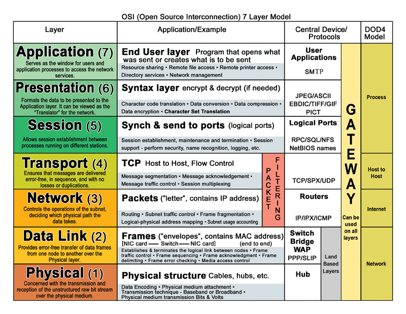

<nav id="table-of-contents">
<h2>Table of Contents</h2>

<ul>
<li><a href="#orgheadline1">1. 前言</a></li>
<li><a href="#orgheadline3">2. how to 成为hacker大神</a>
<ul>
<li><a href="#orgheadline2">2.1. 理解下列网络术语</a></li>
</ul>
</li>
<li><a href="#orgheadline5">3. 如何监听网络: wireshark和OSI模型简介</a>
<ul>
<li><a href="#orgheadline4">3.1. wireshark</a></li>
</ul>
</li>
<li><a href="#orgheadline6">4. hacker基础: 双标记</a></li>
<li><a href="#orgheadline7">5. 参考资料</a></li>
</ul>

</nav>

# 前言

本文的内容主要和网络相关，更加偏底层hacker的那种性质。

本文的写作没有特别阅读某个书籍，主要来自互联网。由于较为散乱，某些知识点可能在互联网上是到处都是，那么读者请认为该知识点来自互联网。其中某些我觉得写的很好的文章会另外单独写出来的。

# how to 成为hacker大神

本小节主要参看了 [这个网页](http://null-byte.wonderhowto.com/how-to/essential-skills-becoming-master-hacker-0154509/) 。

## 理解下列网络术语

-   **NAT:** 网络地址转换协议，内网里面的计算机通过一个公共网关访问Internet，内网里面的计算机可以向Internet上的其他计算机发送请求，但是Internet上的其他计算机不能向内网的计算机发送连接请求。

我们通常设置本地连接使用 静态IP地址 时遇到的 IP地址，子网掩码，默认网关这些概念就和这个NAT协议相关。

-   **DHCP:** Dynamic Host Configuration Protocol

-   **Subnetting:** 

-   **IPv4:** 

-   **Ipv6:** 

-   **Public v Private IP:** 

-   **DNS:** 

-   **Routers Switches:** 

-   **VLANS:** 

-   **OSI model:** 

-   **MAC addressing:** 

-   **ARP:** 

提升你的linux技能

熟练 Wireshark 和 Tcpdump 工具

使用VirtualBox或者VMWare来虚拟你的hack环境使其更加安全。

熟悉密钥领域相关知识，如: PKI, SSL, IDS firewall 等。

无线网络相关知识: 如加密算法 WEP WPA WPA2 等。

# 如何监听网络: wireshark和OSI模型简介

本小节主要参看了 [这个网页](http://null-byte.wonderhowto.com/how-to/spy-your-buddys-network-traffic-intro-wireshark-and-osi-model-0133807/) 。

主要是理解OSI模型，请看下图（图片来自网络）:

第一层是物理层，比如具体的以太链路电缆链接设备等。第二层是数据链路层，在数据链路层里面的所有网络包都是二进制形式，然后他们将送入物理层进行传输。这一层也有一个最基本的寻址框架，Media Access Control address，也就是人们常说的MAC地址。

第三层是网络层，决定数据如何在网络中传播的，它也把电脑名字翻译为了MAC地址。并且路由器也在网络层进行工作。路由器理解IP地址就是网络层工作的过程。

第四层是传输层，传输层把从会话层接受的数据分解成为一个个包，然后把这些包发送给网络层。 Transport Layer Security 也和传输层有关。

第五层是会话层，第六层是表示层，第七层是应用层，后面这些我们在套接字编程那里接触得比较多了。

## wireshark

在ubuntu下安装wireshark很简单:

    sudo apt-get install wireshark

不过在使用上，如果我们坚持其建议的不要以root用户来运行，那么其推荐的使用方法是:

1.  用root运行 `dumpcap` 命令

2.  将获取到的网络封包文件改变所有者，然后用 `wireshark` 来查看。

这里我们看到很多协议，比如ARP，DNS，HTTP之类的，似乎基本上网络上的一切运动封包都被抓过来了。

# hacker基础: 双标记

本小节主要参看了 [这个网页](http://null-byte.wonderhowto.com/inspiration/hacker-fundamentals-tale-two-standards-0133727/) 。

# 参考资料

互联网，并没有特别阅读某个书籍。