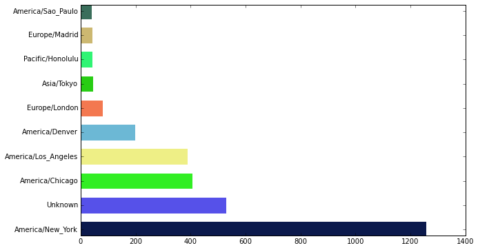

<nav id="table-of-contents">
<h2>Table of Contents</h2>
<div id="text-table-of-contents">
<ul>
<li><a href="#orgheadline4">1. 简介</a>
<ul>
<li><a href="#orgheadline1">1.1. 前言</a></li>
<li><a href="#orgheadline2">1.2. 感谢</a></li>
<li><a href="#orgheadline3">1.3. 引入惯例</a></li>
</ul>
</li>
<li><a href="#orgheadline11">2. 第一个例子</a>
<ul>
<li><a href="#orgheadline5">2.1. 从collections模块出发</a></li>
<li><a href="#orgheadline10">2.2. pandas模块的解决方案</a>
<ul>
<li><a href="#orgheadline6">2.2.1. value_counts方法</a></li>
<li><a href="#orgheadline7">2.2.2. fillna方法</a></li>
<li><a href="#orgheadline8">2.2.3. 修改空字符串值</a></li>
<li><a href="#orgheadline9">2.2.4. plot方法</a></li>
</ul>
</li>
</ul>
</li>
<li><a href="#orgheadline12">3. pandas基础</a></li>
<li><a href="#orgheadline18">4. 附录</a>
<ul>
<li><a href="#orgheadline16">4.1. ipython3 notebook</a>
<ul>
<li><a href="#orgheadline13">4.1.1. matplotlib的inline模式</a></li>
<li><a href="#orgheadline14">4.1.2. 运算耗时计算</a></li>
<li><a href="#orgheadline15">4.1.3. 引用当前目录</a></li>
</ul>
</li>
<li><a href="#orgheadline17">4.2. 参考资料</a></li>
</ul>
</li>
</ul>
</div>
</nav>


# 简介<a id="orgheadline4"></a>

## 前言<a id="orgheadline1"></a>

本文主要讨论了如何利用python来进行数据处理，具体是在熟悉 [numpy模块](numpy模块.html) 的基础上进一步讨论pandas模块，然后涉及到的作图部分请读者参看 [matplotlib模块](matplotlib模块.html) 一文。

## 感谢<a id="orgheadline2"></a>

感谢游静借给我的两千块钱提供的作业电脑支持。

## 引入惯例<a id="orgheadline3"></a>

```python
import numpy as np
import pandas as pd
import matplotlib.pyplot as plt

from pandas import Series, DataFrame
```

# 第一个例子<a id="orgheadline11"></a>

该例子数据来自Python for data analysis 一书提供的材料。 点击 [这里](backups/usagov_bitly_data.txt) 也可以下载。

## 从collections模块出发<a id="orgheadline5"></a>

在统计学那篇文章讲过 statistics的众数函数和collection的Counter，这里我们就是利用collections模块的Counter类封装来进行统计计数功能。

首先我们这样开始，具体文件位置读者需要调试下。这里就是简单的将数据提取出来了。最后time\_zones就是一个大型列表。里面有很多blabla的数据。

```python
%matplotlib inline
import json
path = 'datas/usagov_bitly_data.txt'
records = [json.loads(line) for line in open(path)]
time_zones = [rec['tz'] for rec in records if 'tz' in rec]
```

大概是这样的：

    'America/New_York',
     'America/Denver',
     'America/New_York',
     'America/Sao_Paulo',
     'America/New_York',
     'America/New_York',
     'Europe/Warsaw',
     '',
     '',
     ''
    ......

然后我们用python内置模块collections的Counter类来进行封装：

```python
from collections import Counter
c = Counter(time_zones)
tz_counts = c.most_common(10)
```

tz\_counts的输出如下所示：

    [('America/New_York', 1251),
     ('', 521),
     ('America/Chicago', 400),
     ('America/Los_Angeles', 382),
     ('America/Denver', 191),
     ('Europe/London', 74),
     ('Asia/Tokyo', 37),
     ('Pacific/Honolulu', 36),
     ('Europe/Madrid', 35),
     ('America/Sao_Paulo', 33)]

然后我写了一个棒状图绘图的封装函数，这样可以简单如下就画出图形来了：

```python
from wanze.plot import barplot

barplot(tz_counts,fillna='Unknown')
```

具体图片效果如下所示：


这个barplot函数具体代码如下所示：

```python
import matplotlib.pyplot as plt
import random
def randrgb():
    '''Generate a random rgb color.'''
    return (random.random(), random.random(), random.random())

def barplot(lst,fillna=''):
    labels = []
    counts = []
    for i in lst:
        label,count = i
        labels.append(label)
        counts.append(count)
    def fillna_fun(x,a):
        if x:
            return x
        else:
            return a

    labels = [fillna_fun(i,fillna) for i in labels]
    plt.figure(figsize=(10,6))
    plt.yticks(range(len(lst)),labels)
    bar = plt.barh(range(len(lst)), counts,height = 0.5,align="center", linewidth = 5)
    for i in range(len(lst)):
        bar[i].set_color(randrgb())
    return plt.show()
```

就是一些matplotlib棒状图绘图的细节问题，读者请参看我写的matplotlib模块一文理解之，这里就不赘述了。

## pandas模块的解决方案<a id="orgheadline10"></a>

如果我们利用pandas模块，那么我们的解决方案就会变得更简洁实用了。具体就是用pandas模块的DataFrame类来封装数据，然后调用各个实用的方法。

读者可以运行下面的代码看一下DataFrame对象内部的数据结构情况，其有点类似于excel表格数据。

```python
from pandas import DataFrame , Series
import pandas as pd
frame = DataFrame(records)
frame
```

DataFrame类接受列表或者numpy的nparray对象等，然后将其转换成为这样的表格形式。引用其内某一列属性使用这样的语法 `frame['tz']` ；引用某几行的数据使用这样的语法 `frame[:10]` 。然后你可以混合使用来引用某几行某几列的数据 `frame['tz'][10]` 或者 `frame[:10]['tz']` ，值得一提的是引用某一行不能采用这样的语法 `frame[10]` 。

如果我们使用type命令查看我们会发现某一列的数据是属于pandas的 **Series** 对象，理解这点很重要，后面谈到的很多方法都是Series对象的。

### value\_counts方法<a id="orgheadline6"></a>

value\_counts方法有点类似于前面谈及的collections模块的Counter类的功能，不过注意这里只是Series对象自己的方法，而且它返回的也是Series对象。读者可以在ipython3 notebook下看一下这个tz\_counts变量、

```python
tz_counts = frame['tz'].value_counts()
```

### fillna方法<a id="orgheadline7"></a>

fillna方法用于把Series对象里面没有值（和空字符值不同，其对应的是什么np.nan值）。fillna方法接受一个参数，从而将Series对象里面的nan值都替换为该值。

### 修改空字符串值<a id="orgheadline8"></a>

```python
tz_counts[tz_counts == ''] = 'Unknown'
```

按照上面显示的语法就可以修改Series对象里面的空字符串为'Unknown'值，这种语法看起来好怪异，还不很理解。

现在这条线路所有代码汇总如下所示，其中records数据就是最前面讨论生成的那个数据。

```python
from pandas import DataFrame , Series
import pandas as pd
frame = DataFrame(records)
tz_counts = frame['tz'].fillna('missing')
tz_counts[tz_counts == ''] = 'Unknown'
tz_counts = tz_counts.value_counts()
```

### plot方法<a id="orgheadline9"></a>

pandas模块很方便的一个功能就是Series对象有一个plot方法，可以直接做出效果还行的棒状图出来。

```python
tz_counts[:10].plot(kind='barh',rot=0)
```

# pandas基础<a id="orgheadline12"></a>

Series
DataFrame
Pane

# 附录<a id="orgheadline18"></a>

## ipython3 notebook<a id="orgheadline16"></a>

Wes Mckinney认为python最好的作业环境就是ipython加上一个好的编辑器，我很是赞同，对于python这门短小灵活的语言来说，似乎大型IDE只会显得拘束。

如果你熟悉python语法的话，其实关于ipython并没有好多的了，其最大的优点就是好看好用，打开终端，输入 `ipython3 notebook` 然后看到那令人爱不释手的界面，其实不需要其他更多的理由了。ipython有很多有用的功能，下面只介绍我觉得真的非常有用需要了解的东西。

### matplotlib的inline模式<a id="orgheadline13"></a>

加上这一句，matplotlib的图片都inline显示，这个真的很有用。

```python
%matplotlib inline
```

### 运算耗时计算<a id="orgheadline14"></a>

    %timeit func(50000)
    
    1 loops, best of 3: 4.06 s per loop

### 引用当前目录<a id="orgheadline15"></a>

```python
path = %pwd
```

对应的是shell的pwd命令，其输出传递给了path变量，这个有时会很方便。

## 参考资料<a id="orgheadline17"></a>

1.  Python for Data Analysis ，作者：Wes McKinney 。 该书所用到的一些材料在这里 <http://github.com/pydata/pydata-book>