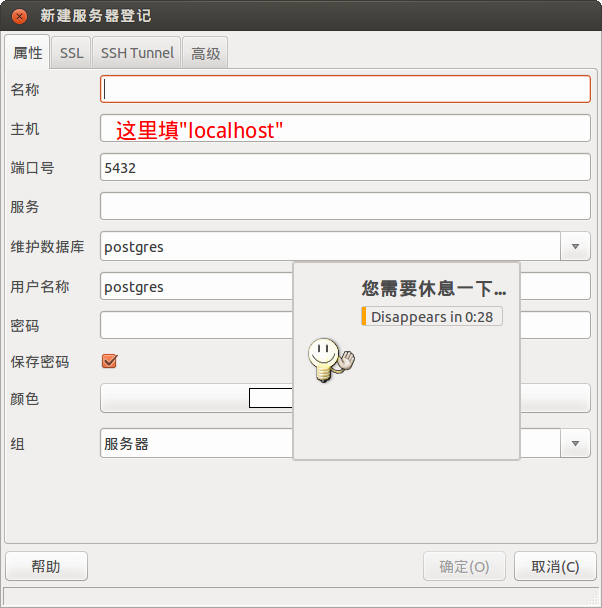
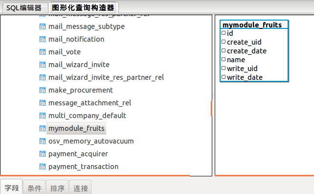

<nav id="table-of-contents">
<h2>Table of Contents</h2>
<div id="text-table-of-contents">
<ul>
<li><a href="#orgheadline2">1. 前言</a>
<ul>
<li><a href="#orgheadline1">1.1. 安装postgresql</a></li>
</ul>
</li>
<li><a href="#orgheadline11">2. 用户群组权限管理</a>
<ul>
<li><a href="#orgheadline3">2.1. 修改postgres的密码</a></li>
<li><a href="#orgheadline4">2.2. postgres这个用户的其他信息</a></li>
<li><a href="#orgheadline5">2.3. 查看当前有多少用户</a></li>
<li><a href="#orgheadline6">2.4. 新建用户</a></li>
<li><a href="#orgheadline7">2.5. 删除用户</a></li>
<li><a href="#orgheadline8">2.6. 改变用户的权限</a></li>
<li><a href="#orgheadline9">2.7. 改变用户密码</a></li>
<li><a href="#orgheadline10">2.8. 新建一个群组</a></li>
</ul>
</li>
<li><a href="#orgheadline17">3. 使用工具初探</a>
<ul>
<li><a href="#orgheadline12">3.1. psql</a></li>
<li><a href="#orgheadline16">3.2. pgadmin3</a>
<ul>
<li><a href="#orgheadline13">3.2.1. 安装</a></li>
<li><a href="#orgheadline14">3.2.2. 连接服务器</a></li>
<li><a href="#orgheadline15">3.2.3. 图形化查询</a></li>
</ul>
</li>
</ul>
</li>
<li><a href="#orgheadline22">4. 第一个例子</a>
<ul>
<li><a href="#orgheadline18">4.1. 创建数据库</a></li>
<li><a href="#orgheadline19">4.2. 备份和还原</a></li>
<li><a href="#orgheadline20">4.3. 改变某个数据库的所有者</a></li>
<li><a href="#orgheadline21">4.4. postgresql字段数据类型</a></li>
</ul>
</li>
<li><a href="#orgheadline25">5. 附录</a>
<ul>
<li><a href="#orgheadline23">5.1. 配置文件在那里</a></li>
<li><a href="#orgheadline24">5.2. 重启postgresql服务</a></li>
</ul>
</li>
<li><a href="#orgheadline26">6. 参考资料</a></li>
</ul>
</div>
</nav>


# 前言<a id="orgheadline2"></a>

本文是在 [sql数据库入门](sql数据库入门.html) 一文基础之上的，一些基本的SQL概念将不会再赘述了。PostgreSQL是很有名的一个开源数据库，最初由加州大学伯克利分校的计算机系开发。有名的openerp框架使用的就是postgresql数据库，其内在也继承了postgresql的client/server模型。

## 安装postgresql<a id="orgheadline1"></a>

在ubuntu下可以这样简单安装之：

```sh
sudo  apt-get install postgresql
```

但是这样安装之后，你需要牢记一点的是，新安装的PostgreSQL数据库还只有 **postgres** 这个用户有新建role（或说用户）和新建数据库的权限。你需要通过postgres这个用户来执行 `createuser` 或 `createdb` 命令。这里我们先不急着学习SQL语句，因为postgresql里面关于用户群组权限的设置稍微有点复杂，而要使用postgresql，这一块是必须有个基本的了解的。

# 用户群组权限管理<a id="orgheadline11"></a>

postgresql处理我们通常所谓的登录用户或者其他用户概念的术语是Rules（英文的意思是一系列的规则），后面都称之为用户（rules），可以理解为为这个用户确立的一系列访问修改数据库的规则。然后rules是可以包含其他rules的，这个包含其他rules的rules我们通常称之为群组（group rules），然后群组也可以包含群组，但一般都推荐简单分为用户（rules）和群组用户（group rules）这两类。然后用户如果有登录权限的话则可以称之为登录用户（login rules），群组用户也可以赋予登录权限，但处于简单的考虑没谁这么做。所以现在rules简单的划分就分为这三类:

1.  一般用户，这里主要指没有登录权限的一般用户。
2.  登录用户，或叫做一般登录用户，其属于一般用户，但有登录权限。
3.  群组用户，包含一般用户的rules。

此外postgresql还提供 **superuser** 超级用户这一类型，其默认不能登录（更确切的说是不可以连接，也不能通过psql来连接。），但对于数据库几乎拥有所有的权限——比如创建数据库，创建用户，对于数据库的查增删改等。实际上superuser也可以加上 `login` 属性，但非常不推荐这么做，最好是不使用超级用户，而是对于具体的用户具体的数据库权限进行分配。

默认创建的postgres这个用户是可以连接的，而且我们看到其至少对postgres这个数据库具有所有权限，但是我还不太确定其是不是superuser，因为其可能对其他数据库并没有权限，这个后面再谈。按照 [这篇网页](http://serverfault.com/questions/110154/whats-the-default-superuser-username-password-for-postgres-after-a-new-install) 的描述，系统默认自建的postgres这个用户最好也在系统中锁定:

    passwd -l postgres

这样你就不能通过 `login` 登录进去了，而只能通过TCP/IP的方式来登入postgresql数据库了。然后推荐如下通过sudo命令以postgres身份来连接postgres数据库。

## 修改postgres的密码<a id="orgheadline3"></a>

    sudo -u postgres psql postgres
    
    postgres=# \password postgres
    Enter new password: 
    Enter it again:

这里需要强调一点的是这里通过psql来进行连接（postgres）然后输入 `\password` 修改postgres的密码是具体通过 TCP/IP 方式连接postgresql数据库的密码，不是系统passwd管理的那个密码。

## postgres这个用户的其他信息<a id="orgheadline4"></a>

postgres这个用户的一些信息如下所示:

    postgres:x:121:131:PostgreSQL administrator,,,:/var/lib/postgresql:/bin/bash

然后还有新建的postgres这个群组:

    postgres:x:131:

这里的121是uid，131是gid，然后后面 `/var/lib/postgresql` 这个文件夹就是postgres该用户的主文件夹。你可能会遇到保存 `.psql_history` 这个文件的权限问题，参看 [这个网页](http://dba.stackexchange.com/questions/68705/could-not-save-history-to-file-var-lib-postgresql-psql-history-no-such-file) ，这个时候需要确认该文件夹的所有用户和所有群组都是postgres。

## 查看当前有多少用户<a id="orgheadline5"></a>

按照 [这篇网页](http://stackoverflow.com/questions/32151288/how-is-there-a-pg-roles-table-in-postgres-before-a-database-is-created) 的介绍， `pg_roles` 是一个view视图，其只是一个对 `pg_authid` 的简单可读的视图封装，如下面所示，两者目前来说没有差异，然后我们看到postgres其是为superuser，也是login user。

    select rolname,rolsuper,rolcreaterole,rolcreatedb,rolcanlogin from pg_roles;
    
     rolname  | rolsuper | rolcreaterole | rolcreatedb | rolcanlogin 
    ----------+----------+---------------+-------------+-------------
     postgres | t        | t             | t           | t

    select rolname,rolsuper,rolcreaterole,rolcreatedb,rolcanlogin from pg_authid;
    
     rolname  | rolsuper | rolcreaterole | rolcreatedb | rolcanlogin 
    ----------+----------+---------------+-------------+-------------
     postgres | t        | t             | t           | t

## 新建用户<a id="orgheadline6"></a>

新建一个用户:

    create role the_name;

但最起码要有登录login权限吧:

    create role the_name login;

在使用postgresql时，如果某个用户不存在，那么PostgreSQL将会报错: 

    createdb: could not connect to database template1: FATAL:  role "wanze" does not exist

## 删除用户<a id="orgheadline7"></a>

    drop role the_name;

或者该用户名不存在也不会报错的写法:

    drop role if exists the_name;

## 改变用户的权限<a id="orgheadline8"></a>

如下所示就改变一个用户的权限了。

    alter role the_name createdb;

参照手册，后面的关键词有:

    SUPERUSER | NOSUPERUSER
    CREATEDB | NOCREATEDB
    CREATEROLE | NOCREATEROLE
    CREATEUSER | NOCREATEUSER
    INHERIT | NOINHERIT
    LOGIN | NOLOGIN
    REPLICATION | NOREPLICATION

## 改变用户密码<a id="orgheadline9"></a>

在新建用户的时候，我们可以如下:

    create role the_name password "the_password";

后面也可以通过 `alter role` 来:

    alter role the_name password "the_password";

---

## 新建一个群组<a id="orgheadline10"></a>

    CREATE ROLE royalty INHERIT;

给群组用户增加登录用户

    GRANT royalty TO leo;
    GRANT royalty TO regina;

# 使用工具初探<a id="orgheadline17"></a>

## psql<a id="orgheadline12"></a>

这里参考了 [这个网页](http://dba.stackexchange.com/questions/1285/how-do-i-list-all-databases-and-tables-using-psql) 。

-   **`\l` 或 `\list`:** 列出所有的数据库
-   **`\du`:** 列出所有的用户
-   **`\dt *`:** 列出当前数据库所有的表格
-   **`\c` 或者 `\connect`:** 切换数据库

## pgadmin3<a id="orgheadline16"></a>

pgadmin3是针对PostgreSQL数据库很有名的一个管理员工具，里面的经很多，这里只是简单谈论一下。

### 安装<a id="orgheadline13"></a>

在ubuntu下可以用apt-get简单安装之。

```sh
sudo apt-get install pgadmin3
```

### 连接服务器<a id="orgheadline14"></a>

刚进入软件需要连接服务器，如下图所示:



目前我已经确认的就是名称随意填，然后主机不能填127.0.0.1，而只能填"localhost"这个字符串。然后后面的应该不用更改什么了，如果你给你的postgres数据库设置密码了，那么这个密码也需要填上。

连接好服务器了，我们就可以双击或点击查看你的PostgreSQL数据库的信息了。

### 图形化查询<a id="orgheadline15"></a>

在工具那里有很多有用的工具，比如查看服务器状态工具等。然后我们点击查询工具，会弹出一个窗口，看到图形化查询那个子选单，如下图所示:



这里我找到了前面我们新建的那个fruits模型，可以看到所有的fruits模型是放在一个名字叫做 `mymodule_fruits` 的SQL表格里的。然后它的表头有:id, create\_uid, create\_date, name等。

然后我们切换到SQL编辑器子选单。这个工具会根据你的图形化查询选择结果自动生成对应的SQL查询语句:

    SELECT 
      * 
    FROM 
      public.mymodule_fruits;

所以在我们这个odoo数据库里面，我们新建的模型fruits的各个对象，具体存入的table名是 `public.mymodule_fruits` 。

然后我们点击 查询→执行 ，来具体执行这个SQL语句，输出结果如下所示:


# 第一个例子<a id="orgheadline22"></a>

## 创建数据库<a id="orgheadline18"></a>

    CREATE DATABASE mydb;

有 CREATEDB 权限的用户可以新建数据库。

然后创建一个数据库，并指定这个数据库的owner。

    CREATE DATABASE mydb WITH owner = mydb_admin;

然后以mydb\_admin登录开始进行数据库的其他操作。

## 备份和还原<a id="orgheadline19"></a>

两个backup方法  pg\_dump 和 pg\_dumpall
用pg\_restore 来还原，

## 改变某个数据库的所有者<a id="orgheadline20"></a>

首先你需要以postgres的身份连接postgres数据库，因为你要进行更改某个数据库的所有者，就必须是目前该数据库的所有者。

    wanze@wanze-ubuntu:~$ sudo -u postgres psql postgres
    psql (9.3.8)
    Type "help" for help.
    
    postgres=# ALTER DATABASE mydb OWNER TO learner;
    ALTER DATABASE
    postgres=# \q

这里ALTER DATABASE语句里面 mydb 是具体你要更改的数据库名字，然后后面的learner是具体更改为的所有者名字。

类似上面谈及的，还有 **dropdb** 用于删除数据库， **dropuser** 用于删除用户。

CREATE TABLE语句我们都熟悉了，不过具体到数据类型上，还需要详细讨论一番。

## postgresql字段数据类型<a id="orgheadline21"></a>

int , smallint , real , double precision ,
char( N ) , varchar( N ) , date , time , timestamp , and interval ,

而postgresql支持的数据类型就多了，有：int，smallint，real，boolean，date，time，integer，text，char(N)，varchar(N) 甚至还有json。这个可以后面慢慢了解，更多细节请具体参看官方文档第八章 Data Types，这是 [版本9.3的网页链接](http://www.postgresql.org/docs/9.3/static/datatype.html) 。

其中对于整数简单的就用integer，字符串简单的就用text，然后小数简单的就用real，布尔值就用boolean，此外还有一些特殊用途的数据类型值得引起我们的注意，如uuid，json，arrays，money，bytea，还有日期和时间的date，time；几何类型支持的point，line等等，

    INSERT INTO weather VALUES (’San Francisco’, 46, 50, 0.25, ’1994-11-27’);

    COPY weather FROM ’/home/user/weather.txt’;

    SELECT city, (temp_hi+temp_lo)/2 AS temp_avg, date FROM weather;

SELECT \*
    FROM weather , cities
    WHERE city=name;

CURRENT\_DATE 目前的日期 可用于默认值。

CURRENT\_TIME

# 附录<a id="orgheadline25"></a>

## 配置文件在那里<a id="orgheadline23"></a>

    sudo -u postgres psql postgres
    
    psql> SELECT name,setting FROM pg_settings WHERE category = 'File Locations';
           name        |                 setting                  
    -------------------+------------------------------------------
     config_file       | /etc/postgresql/9.3/main/postgresql.conf
     data_directory    | /var/lib/postgresql/9.3/main
     external_pid_file | /var/run/postgresql/9.3-main.pid
     hba_file          | /etc/postgresql/9.3/main/pg_hba.conf
     ident_file        | /etc/postgresql/9.3/main/pg_ident.conf
    (5 rows)

但这些配置文件初级用户还不需要太关心。

## 重启postgresql服务<a id="orgheadline24"></a>

在linux下可以运行如下命令行来达到目的:

    sudo service postgresql restart

或者

    sudo service postgresql reload

# 参考资料<a id="orgheadline26"></a>

1.  PostgreSQL官方参考文档
2.  PostgreSQL Up and Running, 2nd Edition