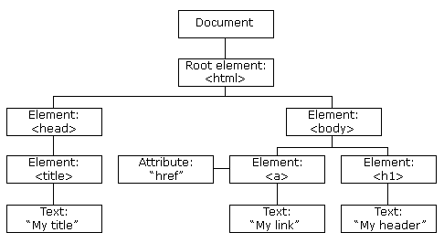

<nav id="table-of-contents">
<h2>Table of Contents</h2>
<div id="text-table-of-contents">
<ul>
<li><a href="#orgheadline1">1. 安装</a></li>
<li><a href="#orgheadline2">2. xml文档结构</a></li>
<li><a href="#orgheadline5">3. 往里面加入内容</a>
<ul>
<li><a href="#orgheadline3">3.1. Element类</a></li>
<li><a href="#orgheadline4">3.2. SubElement类</a></li>
</ul>
</li>
<li><a href="#orgheadline6">4. 参考资料</a></li>
</ul>
</div>
</nav>


# 安装<a id="orgheadline1"></a>

首先确认你的系统已经安装了如下软件包：

```sh
sudo apt-get install libxml2-dev libxslt-dev python-dev
```

如果你使用的python3，那么确认安装了python3-dev。

然后推荐用pip安装lxml：

```sh
sudo pip install lxml
```

如果你使用的python3，那么用 **pip3** 命令来安装。

# xml文档结构<a id="orgheadline2"></a>

这点参考资料 [1](#orgtarget1) 第二节介绍的比较好。不管html还是xhtml等，其都属于xml文档系，理论上lxml模块是能够处理所有的xml系文档的，不过下面的讨论只局限于html5文档。对于xml文档概念不熟悉的读者请简单看一下维基百科参考资料 [2](#orgtarget2) 即可。

下面是一个简单的html5文档样例：

```html
&lt;!DOCTYPE html&gt;
&lt;html&gt;
&lt;head&gt;
&lt;meta charset="utf-8" /&gt;
&lt;link rel="stylesheet"  href="main.css"/&gt;
&lt;title&gt;your awesome website&lt;/title&gt;
&lt;/head&gt;

&lt;body&gt;
&lt;header&gt;
&lt;h1&gt;your awesome title&lt;/h1&gt;
&lt;/header&gt;

&lt;/body&gt;
&lt;/html&gt;
```

这里不会深入讨论html文档的概念，而直接进入lxml模块的学习。

一般使用

```python
from lxml import etree
```

然后使用etree子模块的parse某个html文档:

```python
tree = etree.parse('index.html')
```

这个tree数据结构如下图所示（图片来源[w3schools](http://www.w3schools.com)）



其中tree变量很重要的一个方法是 **getroot** ：

```python
root = tree.getroot()
```

这个root变量对应的正是上图的Root Element。这里需要说一下，lxml模块将html文档里面的各个标签，也就是上图的Root下面的方框Element都视作Node，父元素和子元素之间是列表包含关系。你可以用 `root[0]` ， `root[1]` 来查看一下。

其对应的就是head元素和body元素，可用python数据结构如下近似表示之：

    root[head[meta[], link[], title[]], body[head[]...]...]

然后每一个元素都有很多属性，比如 **tag** 存储这个元素（标签）的名字， **text** 存储这个元素标签包围着的文本内容，比如

    <title>your awesome title</title>

这里title这个元素的 **text** 就是文本：your awesome title。 还有一个 **tail** 属性似乎没什么用处。

然后还有一个很重要的属性 **attrib** ，其对应的就是该元素标签的属性，是一个字典值： 

```python
attr = link.attrib
```

比如上面的link元素可以近似如下表示：

    link[{'rel':'stylesheet', 'href':'main.css'}]

然后我试着将root变量的数据结构简单表示（显然元素是一个类结构，这里只是简单将其名字提出来，属性作为字典加进去。）如下：

    root[head[meta[{'charset': 'utf-8'}],
        link[{'rel':'stylesheet', 'href':'main.css'}], ...]

# 往里面加入内容<a id="orgheadline5"></a>

一般没有必要完全从零开始新建一个xml文档了，继续上面的讨论我们用 **parse** 函数接受一个html文档模板之后，然后往里面加入一些内容或者做出一些修改，然后将其保存到一个新的文件即完成了一个新的html文档创建过程。

如下所示: 

    with open(filename,'w') as html:
        ......
        bstring = etree.tostring(tree)
        string  = bstring.decode('utf-8')
        print(string,file=html)

这里值得一提的在python3.4下（lxml version:3.3.3）， **tostring** 是输出的bytes类型，需要将其decode成为字符串才行。

## Element类<a id="orgheadline3"></a>

前面提到每一个元素都是一个类，其是通过 **Element** 类初始化函数来创建的。

```python
title = etree.Element("title")
```

这样对应的是<aside />，这个元素已经有tag属性了，但还没有其他字典属性或text属性，所以是一个简单的闭括号结构。之前谈到你可以通过 `title.text` 来索引该闭括号所包含的文本，同样你可以如此赋值修改：

```python
title.text = "your awesome title"
```

现在你可以用 **etree.tostring** 函数查看一下这个title对象成什么样子了，大致如下：

    b'<title>your awesome title</title>'

类似的应该也可以通过 `title.attrib` 来设置元素的字典属性，不过推荐使用元素的 **set** 方法：

```python
title.set("style","color:red;")
```

现在title变成这样了：

    >>> etree.tostring(title)
    b'<title style="color:red;">your awesome title</title>'

在创建元素的时候你可以如下所示更快捷地加入某些字典属性：

    >>> a = etree.Element("a",href="index.html")
    >>> etree.tostring(a)
    b'<a href="index.html"/>'

不过似乎text属性并不能这样做。

## SubElement类<a id="orgheadline4"></a>

SubElement类和Element类很类似，除了其初始化函数第一个参数必须指明父元素是谁，然后后面的参数都和Element类一样，再必填一个tag属性。

    SubElement(_parent, _tag, attrib=None)

那么我们必须需要依靠SubElement类的初始化函数来指定html文档中元素的父子继承关系吗？一般情况没必要这么。在平行级别下，就是常规的列表append和insert操作处理各个子元素之间的关系，然后你可以通过给具体的某个父元素命名，然后将某个子元素append或者insert进这个父元素列表中，即指明了其父子关系。而前面的SubElement说白了也只是一个简单的append操作罢了。SubElement类相当于一个高级封装，集大成者，有时很便捷，有时会很不灵活，看读者的使用喜好了。

# 参考资料<a id="orgheadline6"></a>

1.  [python xml processing with lxml](http://infohost.nmt.edu/tcc/help/pubs/pylxml/web/index.html) <a id="orgtarget1"></a>
2.  [xml维基](http://zh.wikipedia.org/zh/XML) <a id="orgtarget2"></a>