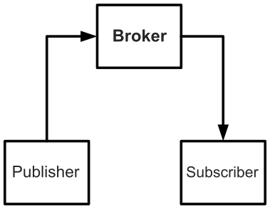
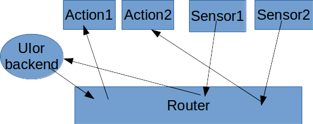

<nav id="table-of-contents">
<h2>Table of Contents</h2>
<div id="text-table-of-contents">
<ul>
<li><a href="#orgheadline1">1. 什么是WebSocket协议</a></li>
<li><a href="#orgheadline4">2. 什么是统一应用分发(Unified Application Routing)</a>
<ul>
<li><a href="#orgheadline2">2.1. PubSub机制</a></li>
<li><a href="#orgheadline3">2.2. RPC机制</a></li>
</ul>
</li>
<li><a href="#orgheadline5">3. 什么是WAMP协议</a></li>
<li><a href="#orgheadline7">4. 构建wamp程序子元</a>
<ul>
<li><a href="#orgheadline6">4.1. 安装autobahn</a></li>
</ul>
</li>
<li><a href="#orgheadline8">5. 构建router层</a></li>
<li><a href="#orgheadline9">6. 参考资料</a></li>
</ul>
</div>
</nav>


# 什么是WebSocket协议<a id="orgheadline1"></a>

本小节主要参考了 [这个网页](http://www.ibm.com/developerworks/cn/web/1112_huangxa_websocket/index.html) 。

WebSocket协议是html5提出来的，其可以让浏览器和服务器之间搭建起一个基于TCP连接的信息双向通道。Web应用，如果信息交互不是很频繁的，则是通过服务器端的接受请求，再处理完之后再返回给客户端的方式来进行的，更频繁的实时交互目前使用的是AJAX的轮询和comet技术，而WebSocket协议就是要取代这两种技术的。因为这两种有太多的网络废信息，而过多的网络废信息不仅浪费了网络带宽资源，而且也减慢了web应用的实时互动速度。

WebSocket协议是基于TCP协议的，然后web应用和服务器互连是通过HTTP协议进行的，只是和一般的HTTP请求有点区别，比如其加上了这个头信息:

    Upgrade: WebSocket

这个HTTP请求的目的就是希望将web应用和服务器之间的HTTP协议升级为WebSocket协议，此外还有其他的一些信息。

最后就建立起WebSocket连接了，具体细节讨论略过。一旦这个连接建立之后，web应用和服务器之间就可以通过这个通道双向传输数据了。

# 什么是统一应用分发(Unified Application Routing)<a id="orgheadline4"></a>

所谓统一应用分发是指各个应用子件之间的事件分发（PubSub机制）和调用分发（RPC机制）都通过一个协议来完成。

## PubSub机制<a id="orgheadline2"></a>



publish-subscribe机制是publisher根据某个主题(topic)提交某些信息，然后送入Broker(中介)，Broker存储着一些subscriber的信息，比如谁谁谁对某个topic感兴趣等。然后Broker具体把这些信息送给这些subscriber。

## RPC机制<a id="orgheadline3"></a>

RPC也就是所谓的远程过程调用，在原始的模型中，直接是caller对接callee。现在加入了dealer作为（经销商）。具体caller要调用那个callee这些细节不需要指明了，caller只需要将调用请求送给dealer即可，然后再由dealer去实际调用callee，同样结果的返回和错误处理也由dealer来处理。 


# 什么是WAMP协议<a id="orgheadline5"></a>

这里所谓的WAMP(Web Application Messaging Protocol)协议就是前面讲的统一应用分发模型具体用WebSocket协议来实现。我们看到上面的PubSub机制模型和RPC机制模型结构是很类似的，在WAMP协议中，dealer和broker都统称为router（分发器），然后我们看到PubSub机制和RPC机制的区别就是一个分发信息给多个目标，一个只分发给一个目标。



这里应用的Action子元对应RPC的具体被调用过程，这里应用的Sensor子元对应PubSub中的Publisher，用sensor传感器更形象地描述了这是一个事件发射器。这里的UI可以是终端用户界面，也可能是后端接口。

更抽象的讨论是假设我们要构建是一个智能系统，那么这个智能系统所有的动作对象都应该属于Action类，其包括具体该系统的从网络抓取获取信息动作到某个数学运算等等，只要是最终被执行的某个动作概念就应该使用这里的Action子元概念，其含义就是接受某个事件被触发或者发生某个信号被调用等。而Sensor类都应该属于智能系统对外的传感器或者内部的某些事件信号释放，这些都将对智能系统内部发送某个事件信号，从而对UI用户界面层或者某个Action子元产生调用关系。Router类属于中央枢纽层，谁调用了谁，发生了什么事件，发生了什么信号，都应该经过他的处理信号分发之后才能采取对应的动作。UI层的定位就不那么明确了，实际上其也可以对智能系统发送某个事件信号，相当于手工触发某个事件，这个时候UI相当于一个Sensor，然后UI也可以被Router调用从而产生某个UI层的动作效果，这个时候UI又有点类似于Action。

然后Action子元内部也可以含有更复杂的工作流概念，不一定是某一个简单的动作。实际上Router也承担了很大一部分工作流控制的细节，比如某个Action如果被执行，则释放某个信号，也就是Action和Sensor合并在了一起，这里简称为As，这个As在Router安排下，可以很多AsAs&#x2026;串联在一起形成一个工作流。这些以后再慢慢探讨吧。

具体的构建wamp应用程序，Action子元和Sensor子元将合并统称为wamp application子元。

# 构建wamp程序子元<a id="orgheadline7"></a>

wamp程序子元在python中可借助 [这个项目](https://github.com/tavendo/AutobahnPython/) 来编写。注意: wamp协议并限定具体实现层要使用那个编程语言。python3.4以后asyncio模块进入标准模块了，本文的讨论主要基于asyncio模块。

## 安装autobahn<a id="orgheadline6"></a>

autobahn的意思是高速公路，该模块支持pip安装。

```sh
pip install autobahn
```

你还可以如下指定具体后端为twisted依赖或asyncio依赖。

    pip install autobahn[twisted]  
    or ...
    pip install autobahn[asyncio]

# 构建router层<a id="orgheadline8"></a>

具体构建router层在python中可借助 [这个项目](https://github.com/crossbario/crossbar/) 来编写。

# 参考资料<a id="orgheadline9"></a>

1.  [wamp.ws](http://wamp.ws/) ，还不太清楚这个是不是WAMP协议的官网。
2.  更多WAMP协议规范请参看 [这个网页](https://github.com/tavendo/WAMP/blob/master/spec/basic.md) 。参考规范内容很多，建议读者粗略看一下了解一个大概。