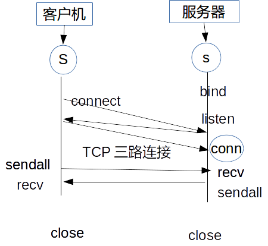

<nav id="table-of-contents">
<h2>Table of Contents</h2>
<div id="text-table-of-contents">
<ul>
<li><a href="#orgheadline1">1. 前言</a></li>
<li><a href="#orgheadline13">2. 应用层</a>
<ul>
<li><a href="#orgheadline2">2.1. TCP协议</a></li>
<li><a href="#orgheadline3">2.2. UDP协议</a></li>
<li><a href="#orgheadline7">2.3. HTTP协议</a>
<ul>
<li><a href="#orgheadline4">2.3.1. HTTP报文格式</a></li>
<li><a href="#orgheadline5">2.3.2. cookie技术</a></li>
<li><a href="#orgheadline6">2.3.3. web缓存器</a></li>
</ul>
</li>
<li><a href="#orgheadline8">2.4. FTP协议</a></li>
<li><a href="#orgheadline9">2.5. SMTP协议</a></li>
<li><a href="#orgheadline10">2.6. DNS协议</a></li>
<li><a href="#orgheadline11">2.7. TCP套接字编程</a></li>
<li><a href="#orgheadline12">2.8. UDP套接字编程</a></li>
</ul>
</li>
<li><a href="#orgheadline16">3. 其他</a>
<ul>
<li><a href="#orgheadline14">3.1. 端口号</a></li>
<li><a href="#orgheadline15">3.2. github pages自定义域名</a></li>
</ul>
</li>
<li><a href="#orgheadline17">4. 参考资料</a></li>
</ul>
</div>
</nav>


# 前言<a id="orgheadline1"></a>

TCP（Transmission Control Protocol）传输控制协议和IP（Internet Protocol）网际协议是因特网中两个最重要的协议。IP协议定义了路由器和端系统（这里的端系统指电脑，手机，服务器等终端计算设备）之间的通信协议。整个网络世界可以简单认为是由两种设备组成的，一种是端系统或叫主机，也就是终端计算设备，其和具体交互什么数据直接相关；另一种是路由器或交换机，其并不关心具体处理的是什么数据或者谁发的数据，其只负责数据分发。

本文对于路由器这一块并不怎么关心，主要讨论端系统之间的通信协议问题。那么什么是计算机之间的通信协议？简单来说就好比两个人之间对话的某种规范，或者两个国家进行外交协商的某种特定交互流程。比如一个人对另外一个人说"你好"，另外一个人收到则回应"你好"，表明我已经收到了，然后第一个如果收到这个回应，则表明协议牵手成功，然后继续进行其他会话，比如"今天星期几"，发送过去，然后另外一个人收到之后回应"今天星期一"&#x2026;&#x2026;就是类似这样的交互方式。有的连接是双向的，连接为持续存在，一般最后需要发送goodbye来关闭协议，而有的协议是单向的，也叫做无状态协议，比如HTTP协议，信息发送了完了连接就算自动关闭了。

# 应用层<a id="orgheadline13"></a>

各个端系统之间通过应用程序和不同的应用协议来继续信息交互，这个前面说过了。你心里想要编写一个应用程序，第一件事是要选择一个应用程序体系结构，目前主要就是两种: 一种是client/server体系结构；另一种peer to peer，也就是P2P体系结构。

选择客户机/服务器体系结构，你的应用程序会有两个命令两种工作模式，一个启动本地客户机进程，一个启动服务器进程，很多应用程序都是这样的。P2P目前主要是BitTorrent下载软件为大家熟知，这个以后应该还有更多的应用是基于P2P体系结构。

程序之间具体是进程和进程之间进行通信，一般是一个是客户机进程，另一个是服务器进程，这两个进程之间进行通信。前面谈到的P2P体系结构，也可以这样理解，只是具体某一个进程其既可以是客户机也可以是服务器。我们有如下定义:

> 在给定的一对进程之间进行通信，我们称发起通信的进程为客户机进程，在会话中等待联系的进程是服务器进程。（也可以理解为被动等待通信信号）

两个进程之间具体是用 **套接字** (socket)来发送和接受报文的。套接字是一个主机内应用层和传输层之间的接口，应用程序开发者可以控制套接字在应用层面上的所有东西，而对于套接字在传输层可以控制的东西非常有限，就仅限于: 选择传输层协议和设定几个传输层参数（如最大缓存最大报文长度等）。

目前TCP/IP网络上的应用就使用了两个传输协议: UDP协议和TCP协议。软件开发者在创建新的应用程序时，首先应该决定传输层是用TCP协议还是UDP协议。

## TCP协议<a id="orgheadline2"></a>

TCP协议是面向连接的和可靠数据传输的。所谓的面向连接是指客户机和服务器之间一开始要进行握手过程好建立TCP连接，然后结束之后需要拆除连接。所谓的可靠数据传输是指TCP协议保证数据是无差错的按顺序交付发送的。此外TCP协议还具有拥塞控制机制。SMTP（电子邮件）协议，Telnet协议，HTTP协议，FTP协议多用TCP协议实现。

## UDP协议<a id="orgheadline3"></a>

UDP是一种不提供不必要服务的轻量级传输层协议，它仅提供最小的服务。UDP是无连接的，两个进程之间没有握手过程。UDP协议并不保证报文能够被接受进程收到，也不保证数据是按顺序到达的。UDP也没有拥塞控制机制。因特网电话和流媒体多用UDP协议实现。

## HTTP协议<a id="orgheadline7"></a>

HTTP（HyperText Transfer Protocol）超文本传输协议是网络世界一个为大家熟知的协议，其属于应用层，为应用层协议。HTTP定义了两个端系统，一个客户机，一个服务器，两个之间如何进行报文交换和这些报文的格式。Web浏览器就是HTTP协议的客户机端，Web服务器就是HTTP协议的服务器端。

HTTP协议使用TCP协议作为其传输层的协议，当用户请求一个Web页面时，浏览器或其他HTTP客户机将首先和服务器建立起一个TCP连接，等连接建立之后，浏览器和服务器就可以通过套接字来交流了。然后客户机经由其套接字向服务器发送一个HTTP请求报文，随后服务器接受到了这个HTTP请求报文，其内部经过某些处理，比如找到html文件即其他资源文件或者其他数据运算之后，也经由套接字回应了一个HTTP响应报文给客户机。然后HTTP服务器进程通知TCP可以断开TCP连接了，然后TCP那边大概等到客户机完整接受这个HTTP响应报文之后，TCP连接就真正断开了。HTTP客户机那边接受到HTTP响应报文，TCP连接断开了，这一次HTTP请求算是完了。

然后这个Web页面还包含有其他图片引用或者javascript引用，每一个引用浏览器客户机那边都将产生一个HTTP请求，类似上面的继续处理。因此基于HTTP协议的TCP协议只进行了一个请求报文和一个响应报文的传输，一个Web页面，可能要发送十几个HTTP请求，那么就要建立十几个TCP连接。（整个过程大抵如此，而现在客户机一般都会打开5-10个并行的TCP连接。）

上面描述的是HTTP协议初始版本的情况，自HTTP/ 1.1起HTTP协议加入了持久连接特性，而且默认就采用持久连接的方式。持久连接可以减少新开TCP连接的消耗，现在HTTP不会每送一个报文就请求断开TCP连接了，而是如果该连接长时间未使用，HTTP服务器才关闭该连接。

然后我们说HTTP协议本身是无状态的，因为HTTP服务器并没有记忆关于客户机的任何信息，但现在有cookie和session，cookie是客户机保存状态信息，session是服务器保存状态信息，这个后面再说。

### HTTP报文格式<a id="orgheadline4"></a>

HTTP报文就分为两种，一种是请求报文，一种是响应报文。

比如下面就是一个HTTP请求

    GET / HTTP/1.1
    Host: www.google.com
    User-Agent: Mozilla/5.0 (X11; Ubuntu; Linux x86_64; rv:40.0) Gecko/20100101 Firefox/40.0
    Accept: text/html,application/xhtml+xml,application/xml;q=0.9,*/*;q=0.8
    Accept-Language: zh-CN,zh;q=0.8,en-US;q=0.5,en;q=0.3
    Accept-Encoding: gzip, deflate
    Connection: keep-alive

第一个是方法字段，HTTP有GET、POST、PUT、DELETE等方法，然后HOST是请求的主机名字，然后User-Agent是用户使用的浏览器，然后Connection这里设置为keep-alive正是前面说的建立持久连接。

然后响应如下:

    HTTP/1.1 200 OK
    Cache-Control: private
    Content-Length: 231
    Content-Type: text/html; charset=UTF-8
    Date: Wed, 02 Sep 2015 08:47:52 GMT
    Location: https://www.google.com/?gws_rd=ssl
    P3P: CP="This is not a P3P policy! See http://www.google.com/support/accounts/bin/answer.py?hl=en&answer=151657 for more info."
    Server: gws
    Set-Cookie: PREF=ID=1111111111111111:FF=0:TM=1441183672:LM=1441183672:V=1:S=9N60lh1DBbEQEXoJ; expires=Thu, 31-Dec-2015 16:02:17 GMT; path=/; domain=.google.com
    NID=71=iZec5Icr10MWlzS7tdY9M4qAgq1k6QcnqlitXCf2Wz-kT-213DJVuBysEmSn9cxnwzCgue9JDabZ4CU8YhTdErPK5fvuQRV2qZ9vxFCBpw3mQkAngnQfSpnjYczu09ee; expires=Thu, 03-Mar-2016 08:47:52 GMT; path=/; domain=.google.com; HttpOnly
    X-Frame-Options: SAMEORIGIN
    x-xss-protection: 1; mode=block

这个响应的那个200就是大家熟知的HTTP响应状态码。关于HTTP协议后面还需要进一步讨论，这里先略过了。

### cookie技术<a id="orgheadline5"></a>

cookie的作用原理如下，用户首先登录一个网站，然后该网站的服务器返回一个HTTP响应，其中有一行

    Set-cookie: whatwhatwhat

这个HTTP响应被用户的浏览器接受之后，其将在特定的cookie文件中添加一行，其中有该服务器的名字（HOST）和这个Set-cookie还有后面的标识码信息。然后以后浏览器再访问这个网站的时候，其将自动在HTTP请求上加上这么一行:

    Cookie: whatwhatwhat

那个网站的服务器看到HTTP请求的这么一行之后，就说，唉，张三又回来了。然后之后该用户在这个网站上的操作记录都被这个网站的数据库统一管理起来了，什么张三点击了那个页面，什么张三买了什么东西等等。

### web缓存器<a id="orgheadline6"></a>

web缓存器又叫代理服务器，其能够代表初始服务器来满足用户的HTTP请求。其过程如下:

1.  首先是用户那边的浏览器与we缓存器建立TCP连接，然后对其发送一个HTTP请求。
2.  web缓存器会检查自己本地是否缓存了目标对象的备份，如果有，则web缓存器用HTTP响应回应用户浏览器。
3.  如果web缓存器没有该目标对象的缓存，则其就会向初始服务器打开一个TCP连接，发送一个HTTP请求，获得该目标对象，并将该对象缓存在自己本地，当然还有向用户浏览器回应一个HTTP响应好把新获得的对象也发给用户浏览器。

web缓存器本地虽然可能有目标对象缓存了，但可能这个缓存过于陈旧了。缓存器必须证实本地的缓存内容是最新的，其利用的是HTTP协议的 **If-modified-since** 这一行。web缓存器将发送一个非常短小的HTTP请求，其中就包含这样一行:

    If-modified-sine: Wed, 4 Jul 2007 09:23:24

这个日期是web缓存器存储上一次该缓存对象是获得的HTTP响应头上就有的 **Last-Modified** 这一行。

然后Web服务器会回应一个很短小的HTTP响应，就是最简短的HTTP状态码和其他几个必要的信息，比如304,Not Modified。

## FTP协议<a id="orgheadline8"></a>

先暂时略过

## SMTP协议<a id="orgheadline9"></a>

先暂时略过

## DNS协议<a id="orgheadline10"></a>

这个马上补充。

## TCP套接字编程<a id="orgheadline11"></a>

整个TCP套接字编程的过程如下所述:

1.  客户机负责发起连接，其将新建一个套接字对象（在python中是通过socket函数来创建的），就好比在一个封闭的黑箱子里开了一个门，在创建这个套接字对象的过程中，你需要指定具体要连接的那个服务器的IP地址和端口号（connect方法）。
2.  接下来是进行TCP的三路握手过程，具体在传输层最底层的东西，客户机应用程序还是服务器应用程序都不用操心，其应该是是操作系统程序负责的。服务器程序需要关心的是在这三路握手期间，其类似于听到了敲门声，其需要开出一个门出来。服务器程序要听到这个敲门声，其应该处于监听该端口的状态。首先服务器程序需要创建一个套接字对象，然后bind某个端口号，然后调用listen方法开始监听这个端口。

3.  然后服务器那边的监听套接字调用accept方法，并形成阻塞，接下来就是听到了敲门声，这个敲门声是TCP三路握手第一路信号发送过来了，这后面TCP三路握手还有两路，这我们暂时不需要太关心了。等到TCP三路握手完成了，服务器之前的那个accept方法将创建一个套接字对象。这个套接字对象称之为连接套接字。我们在这里把服务器那边的连接套接字调用accept方法可以理解为接受了客户机的敲门，如果一切顺利的话，其将为客户机新开一个套接字，也就是一个新门。

4.  对于客户机那边只有一个套接字，情况稍微简单点，其往套接字里面塞信息（sendall方法）就是发送信息过去了，然后从套接字那里读（recv方法），就是读信息了。而服务器那边，实际上和客户机对等的来看的话，第二个新建的连接套接字可以看作看作类似客户机那边的第一个套接字，往里面读就是读信息，往里面写就是发送信息。之所以服务器那边要新开一个套接字，我们可以猜到，是因为服务器要同时处理多个客户机请求，可以把第一个监听套接字理解为总大门，然后后面开启的连接套接字理解为小门，其才是真正和具体那个客户机的一对一管道连接。

上面的简要描述太过于抽象，我们再来看一个最简单的实际代码，其就是python官方文档socket模块的第一个例子，可能有些地方稍作改动。

下面是服务器端server.py的代码:

```python
import socket

HOST = 'localhost'
PORT = 50007
s = socket.socket(socket.AF_INET, socket.SOCK_STREAM)
s.bind((HOST, PORT))
s.listen(1)
conn, addr = s.accept()
print('Connected by', addr)
while True:
    data = conn.recv(1024)
    if not data:break
    conn.sendall(data)
conn.close()
```

首先我们运行server.py，如前所述，其首先需要根据socket函数来创建一个监听套接字，这个套接字具体监听的端口由bind方法指定，然后这个监听套接字开始监听（调用listen方法）。然后调用这个监听套接字的accept方法，其如果收到TCP连接请求，其将返回一个连接套接字，这里是conn。然后程序进入主循环，在这里连接套接字用recv方法来读，然后用sendall方法来写。最后是通过close方法来关闭本连接套接字。

下面是客户机端client.py的代码:

```python
import socket

HOST = 'localhost'
PORT = 50007
s = socket.socket(socket.AF_INET, socket.SOCK_STREAM)
s.connect((HOST, PORT))
s.sendall(b'Hello, world')
data = s.recv(1024)
s.close()
print('Received', repr(data))
```

这里客户机那边首先新建一个套接字，这个套接字可以直接用connect方法来拨号某个服务器，然后用sendall方法来写，用recv方法来读。整个过程大抵如此，其中一切参数设置和更多的套接字编程细节请看到 [套接字编程入门](套接字编程入门.html) 一文。

最后以一副图画来加深对本小节的印象把。



## UDP套接字编程<a id="orgheadline12"></a>

略过很长一段时间

# 其他<a id="orgheadline16"></a>

## 端口号<a id="orgheadline14"></a>

## github pages自定义域名<a id="orgheadline15"></a>

内容是放在github上的，下面重点说一下自定义域名的问题。域名及其相关概念请参看 [这个网站](http://www.pchou.info/web-build/2013/01/05/build-github-blog-page-03.html) ，后面适时我还会提到一些 。

1.  首先是购买域名，推荐到 [godaddy](https://www.godaddy.com/) 上购买。买好的域名就可以在网页浏览器上刷了，只是还没有任何内容。

2.  如果你面向的浏览者主要是国外用户，那么就在godaddy上设置好dns，和接下来要讲的在 [dnspot](https://www.dnspod.cn/) 上是类似的。如果你要使用dnspot的域名解析服务，又是在godaddy上买的域名，那么需要在godaddy上把dns服务器更改一下。

如下图所示：


1.  github pages 的根目录上新建一个 `CNAME` 文件，比如我的域名是 `www.cdwanze.org` ，那么就写上 `www.cdwanze.org` 。

这个时候过了一会儿你如果点击你原来的github pages，那么就会转到对 `http://www.cdwanze.org` 的请求上。

1.  你还需要在dnspot上设置好A和CNAME，你的网页才能正常工作。

其中 **A** 是域名转IP地址，然后 **CNAME** 是什么域名请求转成什么域名请求。如下图所示这样设置<sup><a id="fnr.1" class="footref" href="#fn.1">1</a></sup>。


我们可以理解为对 `www.cdwanze.org` 的请求到了godaddy那里，然后godaddy说dns服务在dnspot那边，然后又跑到dnspot这里，遇到了这个CNAME设置，说转成 `a358003542.github.io.` 的域名请求，然后这里的A设置就是 `a358003542.github.io.` 这个域名请求送入这两个IP地址那里，这两个IP地址就是github pages的域名解析服务点。

1.  还要等上几分钟，才会生效。

# 参考资料<a id="orgheadline17"></a>

1.  计算机网络自顶向下方法 , Author: James F. Kurose , Keith W. Ross ,陈鸣译 。

这本书作为入门了解有关计算机网络相关知识还是很不错的，文档有点大，只好放在 [google drive](https://drive.google.com/open?id=0ByWxOeitx54Pbk40MkU2a0VOUE0) 那里了。

1.  Unix网络编程卷1: 套接字联网API , Author: W. R. Stevens , Bill Fenner 等著 , version: 第三版

<div id="footnotes">
<h2 class="footnotes">Footnotes: </h2>
<div id="text-footnotes">

<div class="footdef"><sup><a id="fn.1" class="footnum" href="#fnr.1">1</a></sup> <div class="footpara">请参看[这个网页](http://pigerla.com/github-pages/2014-11-17/setting-up-a-custom-domain-with-github-pages/)。</div></div>


</div>
</div>